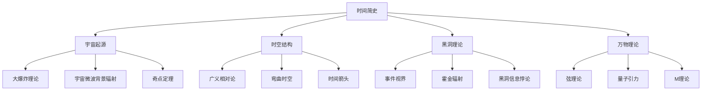
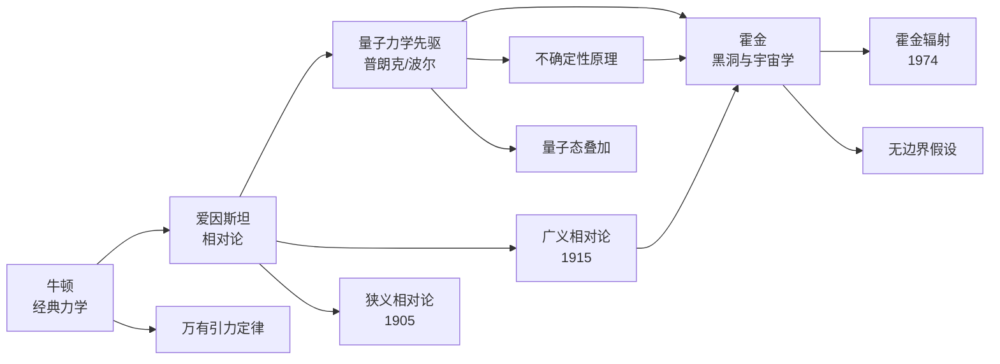
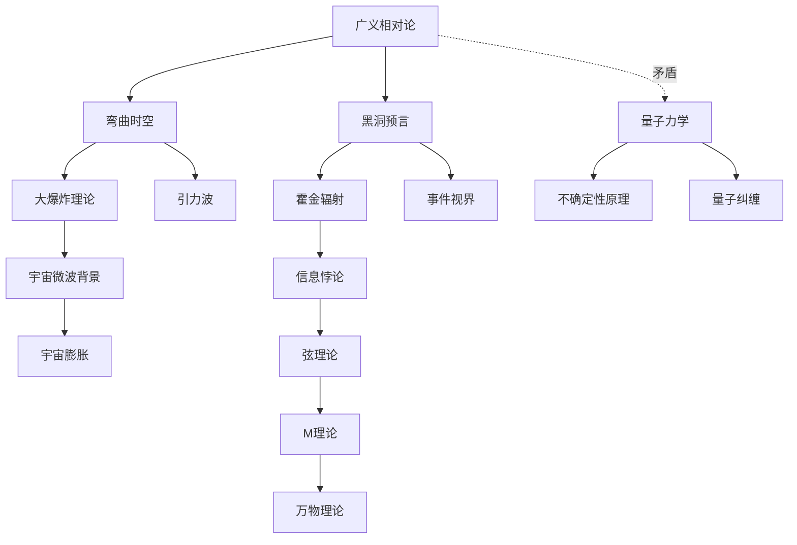

# 《时间简史》图谱逻辑：一张图看懂138亿年的宇宙故事

> 知识图谱不是冰冷的概念罗列，而是人类理解宇宙的认知地图。当我们把《时间简史》中的理论编织成网，会看到一幅令人震撼的宇宙全景。

---

## ○ 宇宙学核心概念：从大爆炸到万物理论

让我们先来看这张概念分类树——它揭示了《时间简史》的知识骨架。

### 四大支柱

霍金的宇宙观建立在四大理论支柱之上：

**● 宇宙起源**——大爆炸理论告诉我们，宇宙并非永恒存在，而是有一个明确的起点。宇宙微波背景辐射则是大爆炸留下的"余温"，至今仍然可以在宇宙各处被探测到。

**● 时空结构**——爱因斯坦的广义相对论颠覆了我们对时空的认知。时间和空间不是独立的背景舞台，而是被质量和能量弯曲的动态织锦。

**● 黑洞理论**——黑洞是广义相对论最极端的预言。在黑洞内部，时空弯曲到连光都无法逃脱。但霍金发现，黑洞并非完全黑暗，它会通过量子效应辐射能量。

**● 万物理论**——这是物理学的终极梦想，一个能够统一所有基本力和基本粒子的理论框架。



### 逻辑线索

这四个分支并非孤立存在，它们共同指向一个更深层的问题：**宇宙为什么是这个样子？**

大爆炸解释了宇宙的起点，时空结构解释了宇宙的运行方式，黑洞揭示了时空的极限状态，而万物理论则是所有这一切的终极归宿。

---

## ◇ 物理学传承：站在巨人的肩膀上

霍金从来不是孤军奋战。他的思想建立在几个世纪以来物理学家的积累之上。

### 从牛顿到霍金



这张图最关键的线索在最后一行：**广义相对论与不确定性原理共同指向霍金。**

为什么？因为霍金辐射正是这两个看似矛盾的理论碰撞出的火花。广义相对论描述宏观引力，量子力学描述微观不确定性，霍金在黑洞的事件视界处找到了两者的交汇点。

### 一场未完成的革命

牛顿发现了万有引力，爱因斯坦发现了时空的本质，量子力学先驱们发现了微观世界的奇异法则。霍金试图将这些碎片拼成一幅完整的图画。

这场革命至今尚未完成，而这也正是科学最迷人的地方。

---

## ◆ 时间之旅：从大爆炸到《时间简史》

如果说概念树是知识的骨架，那么时间轴就是知识的血脉。

### 138亿年的旅程


看这张图的时候，请注意一个细节：

**从大爆炸到第一束光，只用了38万年。而从人类文明到《时间简史》出版，我们用了不到一万年。**

138亿年对38万年，一万年对一瞬间。宇宙的绝大部分时间里，没有光，没有恒星，没有生命。我们所知的"正常世界"，不过是宇宙漫长历史中一个短暂的片段。

---

## ○ 理论之网：物理学概念如何相互关联

最后这张网络图，是整组图谱的灵魂所在。它展示了《时间简史》中各种理论之间的内在联系。



### 网络的核心矛盾

请注意图中那条标注"矛盾"的虚线——**广义相对论与量子力学之间的矛盾，是整个现代物理学最大的悬案。**

广义相对论告诉我们，时空是光滑且连续的。量子力学告诉我们，在微观尺度上，一切都是不确定的、离散的、充满涨落的。

两种理论各自在自己的领域内完美无缺，但当它们相遇——比如在黑洞中心或大爆炸奇点——就会产生无法调和的矛盾。

### 统一之路

弦理论和M理论试图弥合这个裂痕。它们认为，基本粒子不是零维的点，而是振动的弦。这种看似简单的改变，可能正是通向万物理论的关键钥匙。

---

## ◇ 理解图谱的三个层次

读懂这些知识图谱，可以经历三个层次：

**第一层：认知的震撼**——原来人类已经发现了这么多关于宇宙的秘密。

**第二层：逻辑的敬畏**——这些理论之间有着严密的逻辑关联，不是杂乱无章的知识点。

**第三层：谦卑与好奇**——尽管我们已经知道了这么多，但未知的领域远比已知的更加广阔。

---

## ◆ 互动话题

**这四张图谱中，哪一张最让你感到震撼？**

在评论区告诉我们你的选择，并说说为什么。

---

## ○ 系列导航

```
┌──────────────────────────────────────┐
│     📚 人类文明经典阅读计划          │
│                                      │
│  上一篇：《时间简史》读后感          │
│  下一篇：《时间简史》核心思想        │
│                                      │
│  ◆ 宇宙觉醒 ◆ 时空探求              │
│  ◆ 科学启蒙 ◆ 万物理论              │
└──────────────────────────────────────┘
```

**标签：** #时间简史 #知识图谱 #宇宙学 #物理学 #万物理论 #科学启蒙
