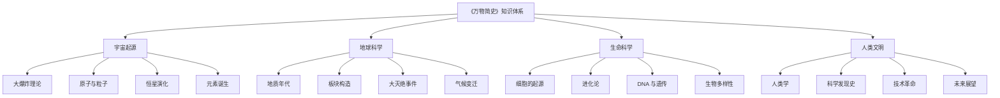
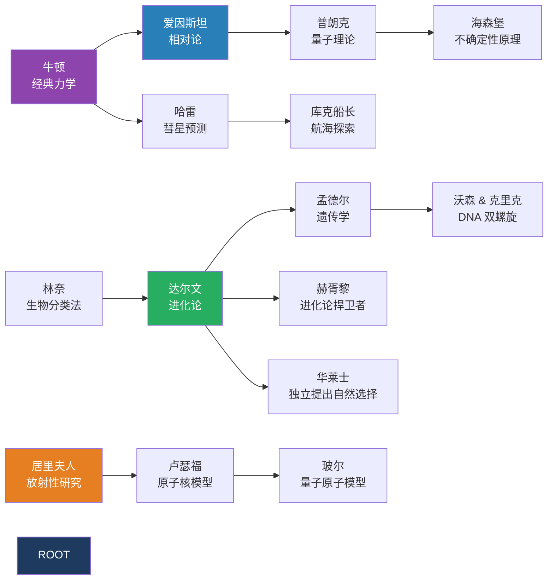
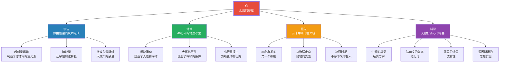

# 《万物简史》知识图谱图片描述

> 本文档描述《万物简史》系列知识图谱的 4 张核心图片内容，包含 Mermaid 图表源码及图片说明。

---

## 图片一：科学知识分类树

### 图片描述

一张纵向的知识分类树状图，展示《万物简史》涵盖的主要学科领域及其分支。整体配色为深蓝到浅蓝渐变，风格简洁现代。

### Mermaid 源码

### 排版建议

- 尺寸：1080 x 1600 像素
- 字体：思源黑体
- 主色调：深蓝色 #1E3A5F，分支使用不同深浅的蓝色
- 顶部标题字号 28px，节点字号 16px

---

## 图片二：科学家人物关系图谱

### 图片描述

一张横向展开的人物关系网络图，展示《万物简史》中提到的关键科学家及其关联。人物头像用圆形色块代替，连线表示师承、合作或竞争关系。

### Mermaid 源码

### 排版建议

- 尺寸：1080 x 1400 像素
- 不同学科用不同颜色标记：物理学(蓝)、生物学(绿)、化学(橙)、数学(紫)
- 连线粗细表示关系强度
- 关键人物使用加粗边框

---

## 图片三：从大爆炸到人类文明的时间路径

### 图片描述

一条从左到右的时间轴路径图，标注了从宇宙大爆炸到现代文明的关键节点。时间刻度不均匀——越近的时间段越详细，体现"近大远小"的视觉效果。

### Mermaid 源码

### 排版建议

- 尺寸：1080 x 1200 像素
- 时间轴用金色线条贯穿
- 灭绝事件用红色标记，生命诞生用绿色标记
- 每个节点配一个简约图标（星体、地球、细胞、恐龙、人类等）

---

## 图片四：万物互联网络图

### 图片描述

一张中心辐射式的网络关系图，中心节点是"你"，向外辐射连接到宇宙、地球、生命、科学等各个维度，展示万物之间的深层联系。

### Mermaid 源码

### 排版建议

- 尺寸：1080 x 1800 像素
- 中心节点"你"使用醒目的红色
- 四个主分支使用不同色系
- 子节点用浅灰色背景，保持视觉层次
- 连线使用虚线表示间接关联

---

## 通用设计规范

### 色彩体系

| 用途 | 色值 | 说明 |
|------|------|------|
| 主标题 | #1E3A5F | 深蓝，稳重专业 |
| 强调色 | #E74C3C | 红色，用于重点 |
| 宇宙主题 | #2980B9 | 天蓝 |
| 地球主题 | #27AE60 | 翠绿 |
| 生命主题 | #F39C12 | 暖橙 |
| 科学主题 | #8E44AD | 紫色 |
| 背景灰 | #F5F5F5 | 浅灰背景 |
| 正文灰 | #333333 | 文字颜色 |

### 字体规范

- 标题：思源黑体 Bold，28-32px
- 副标题：思源黑体 Medium，20px
- 正文：思源黑体 Regular，16px
- 注释：思源黑体 Light，14px

### 图标风格

- 使用简约线性图标
- 统一 2px 线宽
- 圆角处理，避免尖锐转角
- 图标尺寸 24x24 像素

---

**标签：** #科学史趣闻 #万物认知 #知识图谱 #幽默科普
