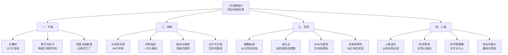

# 一张图看懂《万物简史》：宇宙、地球与你的关系

> "所有事物都与其他事物相关联——只是有些关联，比你想的要近得多。"

---

## 一、为什么需要一张图谱

《万物简史》这本书有一个特点：**它的内容太散了**。

前一章还在讲原子结构，下一章就跳到了地质年代，再过几章又开始讨论 DNA。如果你没有一个整体的框架，很容易看了一半就迷失在细节里。

所以这篇文章，我想用一张知识图谱，帮你把整本书的骨架搭起来。

---

## 二、图谱的核心逻辑：从大到小，从远到近

整本书的结构，可以概括为四个层次：

### 第一层：宇宙

这是最大的尺度。布莱森从大爆炸开始讲起，告诉你：

- 宇宙是怎么开始的
- 原子是怎么形成的
- 恒星是怎么诞生又死亡的
- 我们身体里的每一个重元素，都来自一颗死去的恒星

> "你是一个由恒星灰烬组成的生物。这不是诗意的比喻，这是物理学的结论。"

### 第二层：地球

镜头拉近到我们的星球：

- 地球是怎么形成的
- 月球是怎么来的（答案是被另一颗星球撞出来的）
- 地球内部是什么样的（我们其实对地核的了解还不如对火星表面多）
- 板块构造是怎么工作的
- 恐龙为什么灭绝了

### 第三层：生命

再拉近，到生物层面：

- 生命是怎么从无机物变成有机物的
- 细胞是怎么诞生的
- 进化论到底说了什么（很多人其实误解了达尔文）
- DNA 是怎么被发现的（过程比你想的戏剧化得多）

### 第四层：人类

最后，到我们自己：

- 人类是怎么从一群非洲草原上的灵长类动物变成今天这样的
- 科学是怎么发展起来的
- 那些伟大的科学家，其实都是什么性格的人
- 我们为什么幸运到不可思议

---

## 三、图谱全景：知识分类树

---

## 四、关键连接：那些你想不到的关联

这张图谱最有价值的部分，不是各个分支，而是**分支之间的连接**。

让我举几个例子：

### 连接一：超新星和你的血液

你血液里的铁原子，来自一颗在 46 亿前爆炸的超新星。

如果没有那颗恒星的死亡，就不会有铁元素。没有铁，就不会有血红蛋白。没有血红蛋白，你就不能呼吸。

**宇宙的死亡，成就了你的生命。**

### 连接二：恐龙灭绝和你的存在

6600 万年前，一颗小行星撞上了地球。

如果那颗小行星早来或晚来几分钟，或者轨道稍微偏一点——恐龙可能就不会灭绝。

如果恐龙没有灭绝，哺乳动物就不会有机会崛起。

如果哺乳动物没有崛起——就不会有人类。

**一颗石头，决定了你今天能不能读到这篇文章。**

### 连接三：大氧化事件和你的一口呼吸

24 亿年前，地球上出现了一种叫蓝藻的微生物。

它们做了一件"可怕"的事——开始释放氧气。

对当时的厌氧生物来说，氧气是毒药。这场"大氧化事件"导致了地球上第一次大规模灭绝。

但是，正是因为这次灭绝，才为后来所有需要氧气的生命（包括你）铺平了道路。

**你吸的每一口氧气，都要归功于 24 亿年前的一群细菌。**

---

## 五、图谱的价值：从碎片到整体

布莱森写这本书的方式，是先从一个具体的点出发，讲到另一个点，再跳到第三个点。读的时候觉得很有意思，但读完后如果不去整理，很容易只记住一些零散的故事。

这张图谱的意义就在于——**它帮你把散落的珍珠串成了一条项链。**

当你有了这个框架之后，再去看书里的每一个故事，你都会知道它属于哪个层次、和哪些层次有关联。

> 知识不是孤立存在的。每一个事实都和其他事实相连。理解这些连接，才是真正理解了知识。

---

## 六、时间尺度上的图谱

除了知识分类，还有一个维度值得单独拿出一张图来——**时间**。

注意这个时间尺度的"不均衡"——

如果把 137 亿年压缩成一天（24 小时），那么：

- 地球在大约 16 点形成
- 生命在大约 17 点出现
- 恐龙在 23 点 40 分登场，23 点 58 分灭绝
- 智人在 23 点 59 分 56 秒出现
- 整个人类文明（从农业革命开始），只占了最后 0.3 秒

**你在宇宙时间尺度上，只是一个瞬间。但正是这个瞬间，能够理解整个宇宙的历史。**

---

## 七、写在最后

这张图谱不是《万物简史》的全部，但它是一个很好的起点。

建议你在读这本书的时候，把这张图放在旁边。每读完一章，就在图上找到它的位置，看看它和哪些章节有关联。

慢慢地，你会发现自己不再是在"读一本书"，而是在**重新认识整个世界**。

---

> **■ 系列导航**
>
> ◇ 上一篇：《人类简史》—— 从认知革命到智人统治全球
> ◆ 下一篇：《时间简史》—— 霍金带你探索宇宙的终极奥秘
> ○ 返回总目录：人类文明经典阅读计划

---

> **■ 互动话题**
>
> 上面提到的三个"意想不到的关联"中，哪一个最让你惊讶？
> 你还知道哪些万物之间的奇妙联系？
> 欢迎在评论区分享。
>
> ◇ 如果觉得有启发，点个"在看"，让更多人看到 ◆

---

**标签：** #科学史趣闻 #万物认知 #知识图谱 #幽默科普 #幸运存在
