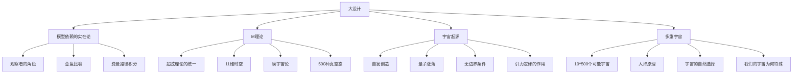
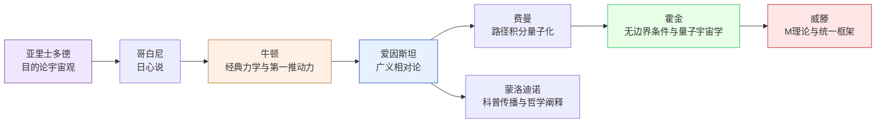
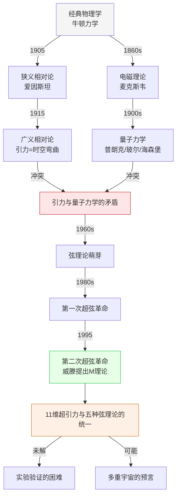
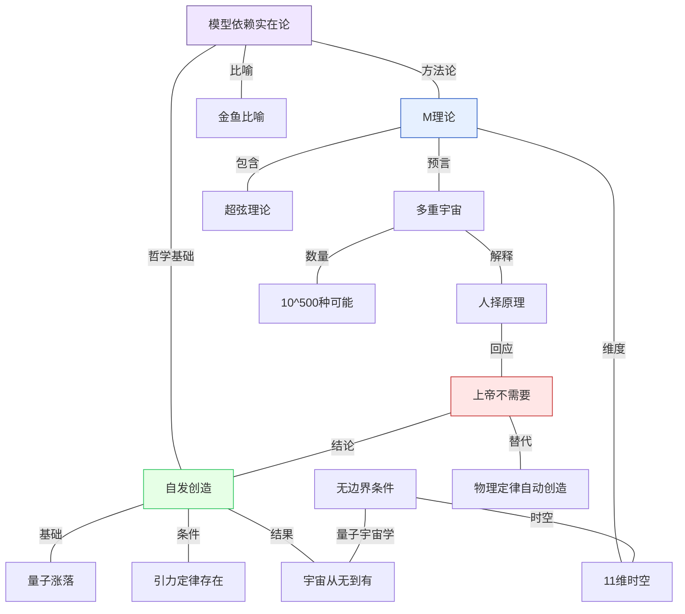

# 知识图谱 | 《大设计》核心概念全景图

> ◆ 经典重温系列 · 科学探索第 03 期

---

## ◇ 使用说明

本文档包含 4 张知识图谱的 Mermaid 源码，可直接用于渲染为图片嵌入微信公众号。每张图谱对应书中一个核心维度的知识组织。

---

## ◆ 图谱一：核心概念分类树

展示《大设计》中主要科学概念的层级关系。

> ◇ 说明：从"大设计"出发，分为四大核心概念，每个概念向下展开为具体子概念。

---

## ◆ 图谱二：关键人物思想传承图

展示从古希腊到现代物理学家的思想传承脉络。

> ◇ 说明：横向展示物理学思想的传承链，颜色区分不同时代的贡献者。

---

## ◆ 图谱三：从经典到M理论的路径图

展示物理学走向统一理论的历史进程。

> ◇ 说明：纵向时间轴展示物理学从经典走向M理论的关键节点和内在逻辑。

---

## ◆ 图谱四：核心概念关系网络图

展示各核心概念之间的交叉关联。

> ◇ 说明：网络图展示核心概念之间的交叉关系，颜色区分概念类别：蓝色=M理论，绿色=自发创造，紫色=实在论，红色=哲学结论。

---

## ◇ 渲染建议

| 图谱 | 建议尺寸 | 配色风格 |
|------|----------|----------|
| 分类树 | 竖版 1080x1920 | 冷色调，层级分明 |
| 人物图 | 横版 1920x1080 | 暖色调，时代感 |
| 路径图 | 竖版 1080x1920 | 渐变色调，时间轴感 |
| 网络图 | 方版 1080x1080 | 多色区分，连接清晰 |

---

## ◆ 系列导航

| 上一篇 | 下一篇 |
|--------|--------|
| [01-读后感](01-公众号排版文稿_读后感.md) | [03-图谱逻辑](03-公众号排版文稿_图谱逻辑.md) |

> ◇ 人类文明经典阅读计划 · 科学探索系列
> ● 本期主题：M理论探求 · 自发创造 · 多重宇宙 · 宇宙设计

---

*本文系"人类文明经典阅读计划"系列第 06-03 期，聚焦科学探索领域的经典著作。*
