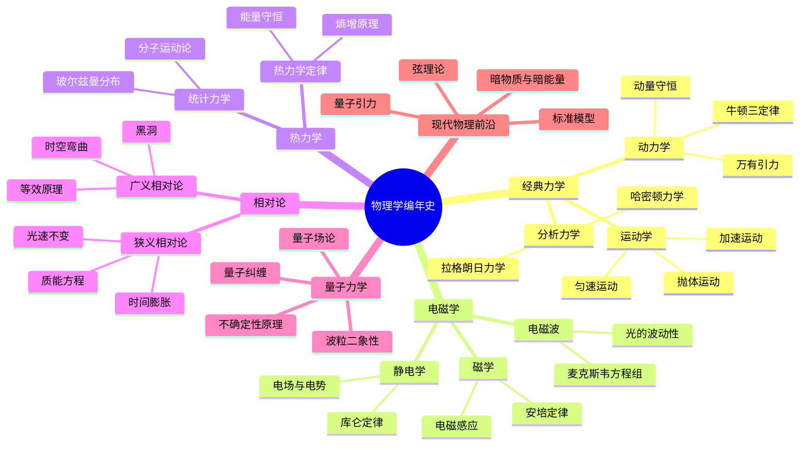
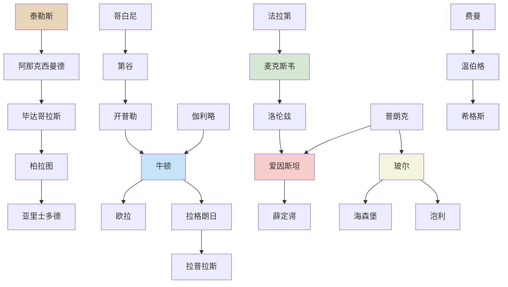
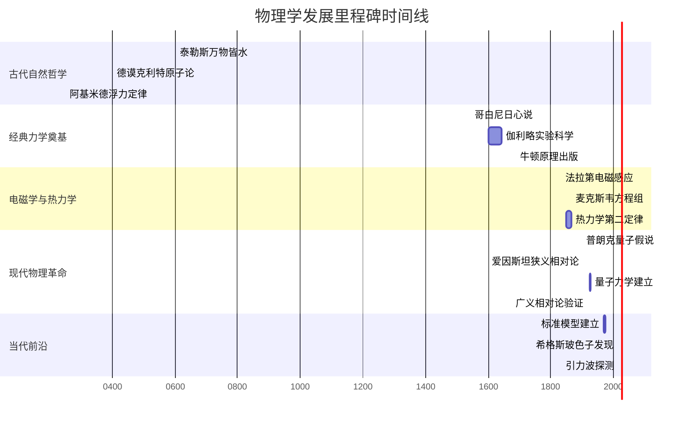
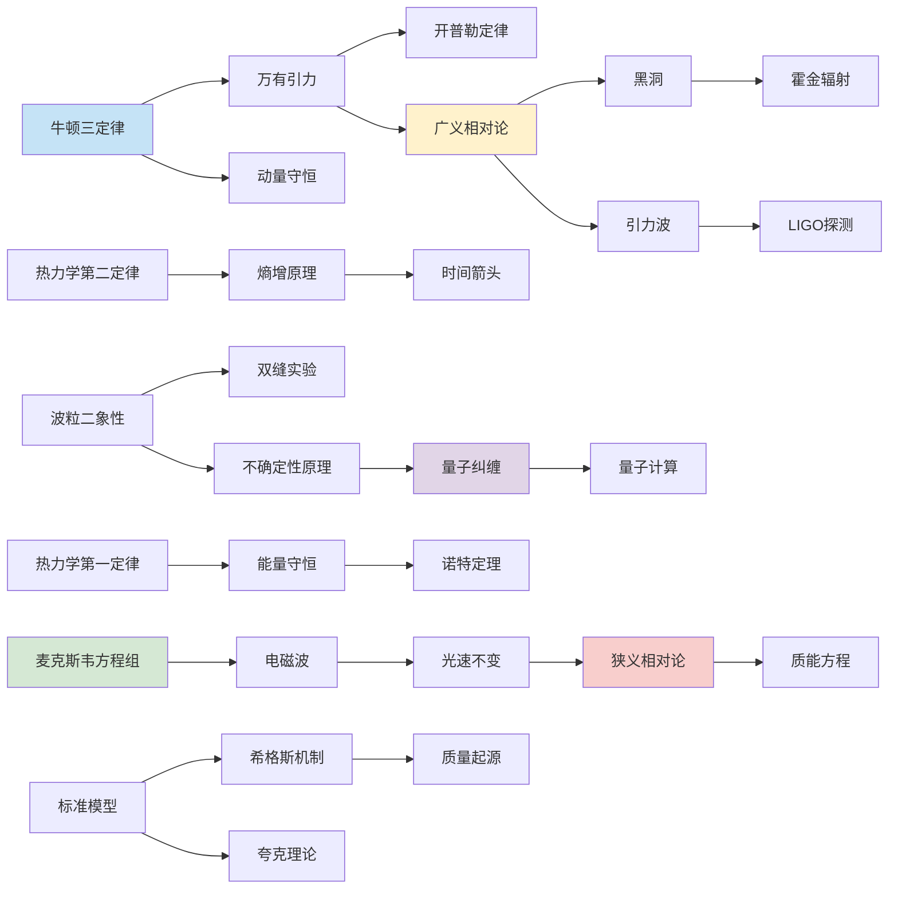
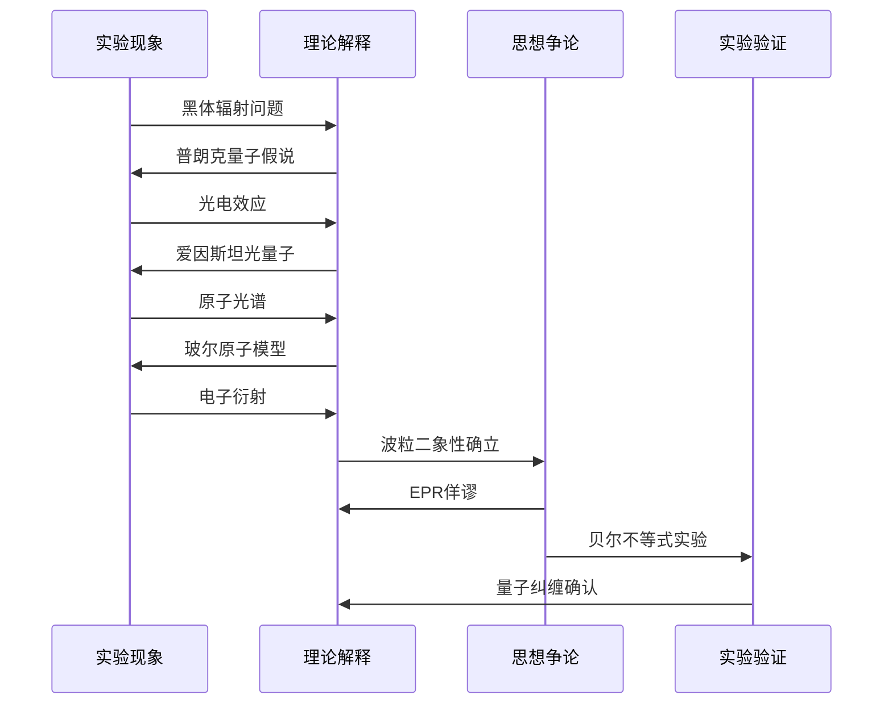
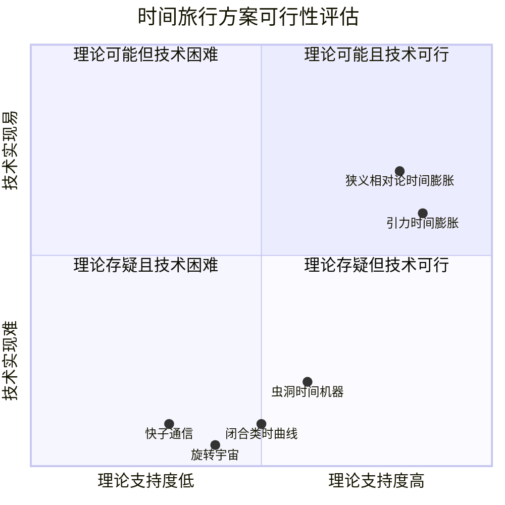

# 02-知识图谱图片描述

---

> **系列导航** | 人类文明经典阅读计划 | 科学探索系列
>
> ◆ 本篇：物理之书知识图谱
> ◆ 用途：公众号文章配图说明与 Mermaid 图表代码

---

## 知识图谱图片描述

### 图一：物理学分类树

**用途**：公众号文章首图，展示《物理之书》250个条目的宏观分类结构。

**Mermaid 代码**：

**视觉说明**：
- 中心节点"物理学编年史"使用深色圆形
- 六大分支（经典力学、电磁学、热力学、相对论、量子力学、现代前沿）使用不同颜色
- 子节点逐层展开，颜色饱和度递减
- 适合宽屏展示，建议比例 16:9

---

### 图二：物理学家人物图谱

**用途**：展示物理学家之间的师承关系与学术传承。

**Mermaid 代码**：

**视觉说明**：
- 从左到右按时间线排列
- 古代哲学家使用暖黄色背景
- 经典力学时期使用蓝色背景
- 电磁学时期使用绿色背景
- 现代物理时期使用红色和米色背景
- 箭头表示学术影响方向，非严格师承

---

### 图三：物理学发展路径图

**用途**：展示从古希腊自然哲学到当代前沿的关键转折点。

**Mermaid 代码**：

**视觉说明**：
- 甘特图形式，横轴为时间，纵轴为学科分支
- 五个色块区分不同历史阶段
- 关键节点加粗标注
- 建议比例 16:9，适合横屏阅读

---

### 图四：物理学概念网络图

**用途**：展示250个物理条目之间的关联关系。

**Mermaid 代码**：

**视觉说明**：
- 概念节点用不同颜色区分学科领域
- 箭头表示理论推导或实验验证关系
- 核心概念节点加粗边框
- 适合展示物理学知识的内在逻辑关联

---

### 图五：量子效应路径图

**用途**：专门展示量子力学发展的关键节点和思想实验。

**Mermaid 代码**：

**视觉说明**：
- 时序图形式，展示实验与理论的交替推进
- 四列分别代表实验现象、理论解释、思想争论、实验验证
- 适合展示量子力学"实验-理论-争论-验证"的螺旋上升过程

---

### 图六：时间旅行可能性评估图

**用途**：对比不同时间旅行方案的理论可行性。

**Mermaid 代码**：

**视觉说明**：
- 四象限图，横轴为理论支持度，纵轴为技术实现难度
- 第一象限为最可行方案，第三象限为最不可行方案
- 气泡大小表示公众关注度
- 适合引发读者讨论

---

### ◇ 图片使用建议

| 图片 | 使用场景 | 尺寸建议 | 格式 |
|---|---|---|---|
| 图一 分类树 | 文章首图/封面 | 1080x608px | PNG |
| 图二 人物图谱 | 正文中部插图 | 1080x1200px | PNG |
| 图三 路径图 | 时间线专题配图 | 1080x608px | PNG |
| 图四 网络图 | 概念关联说明 | 1080x1080px | PNG |
| 图五 量子路径 | 量子力学专题 | 1080x800px | PNG |
| 图六 时间旅行 | 互动话题配图 | 1080x1080px | PNG |

---

**◆ 标签**：`#知识图谱` `#Mermaid图表` `#物理编年` `#可视化`

**◇ 生成说明**：以上 Mermaid 代码可在支持 Mermaid 的 Markdown 编辑器或在线工具中渲染为图片。
