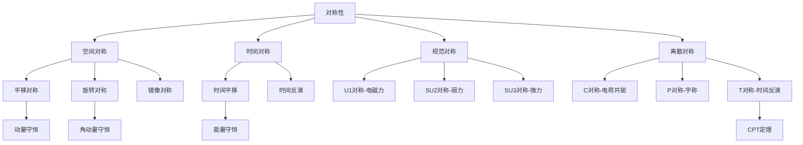
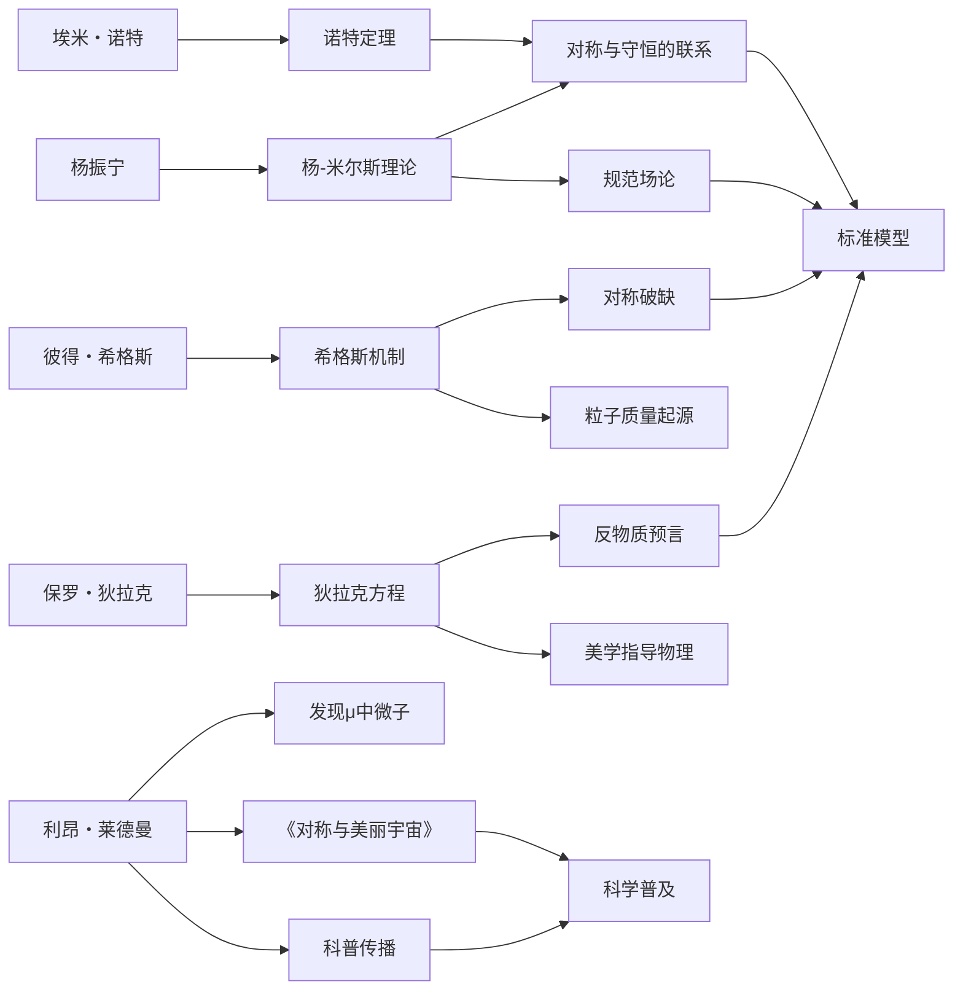
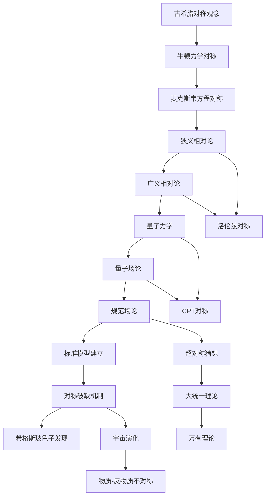
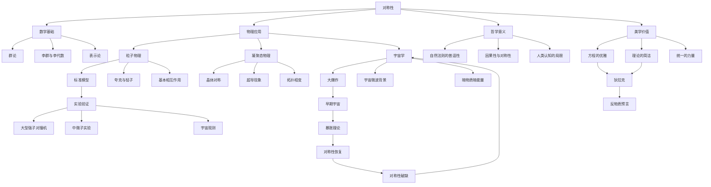

# 对称与美丽宇宙：知识图谱全景解析

> ◆ 一图读懂对称性物理学的知识版图 ◆

---

## 图谱说明

本文通过四组 Mermaid 图表，全景展示《对称与美丽宇宙》的知识体系。从概念分类到人物关系，从思想演进到知识网络，帮助读者建立系统认知。

---

## 一、对称性分类树

### 图谱解读

**空间对称**是最直观的对称类型。平移对称意味着物理定律在宇宙任何位置都相同，旋转对称意味着方向不影响物理规律。

**时间对称**揭示了能量守恒的根源。无论昨天、今天还是明天，物理定律始终如一。

**规范对称**是现代粒子物理的核心。电磁力、弱力、强力都可以从规范对称性推导出来。

**离散对称**包括电荷共轭、宇称和时间反演。CPT 定理告诉我们，三种对称同时操作时，物理定律保持不变。

---

## 二、人物关系图谱

### 图谱解读

这张图谱展示了对称性物理学发展中的关键人物及其贡献。

**埃米・诺特**奠定了理论基础。她的定理将对称性与守恒定律联系起来，是整棵知识树的根基。

**杨振宁**的杨-米尔斯理论将规范对称性推广到非阿贝尔群，为标准模型奠定了数学基础。

**莱德曼**既是贡献者也是传播者。他的实验发现验证了理论预测，他的科普作品让大众理解了对称之美。

**希格斯**的机制解释了对称破缺如何赋予粒子质量，这是理解宇宙为何如此丰富的关键。

**狄拉克**展示了美学在物理学中的指导作用。他对美的追求引领他预言了反物质。

---

## 三、思想演进路径

### 图谱解读

这条路径展示了对称思想如何贯穿物理学发展史。

**古希腊时期**，毕达哥拉斯学派就认识到对称与和谐的关联。

**牛顿力学**隐含了空间和时间的平移对称性，但当时人们还没有意识到这一点。

**麦克斯韦方程**展现出优美的对称结构，启发了后来的理论发展。

**相对论**将对称性提升到了核心地位。洛伦兹对称成为现代物理的基石。

**量子力学与场论**的结合，让规范对称性成为理解基本力的关键。

**标准模型**是对称性思想的巅峰之作，但对称破缺让理论更加丰富。

**未来方向**包括超对称、大统一理论和万有理论，这些都在追求更深层的对称性。

---

## 四、知识网络图

### 图谱解读

这张网络图展示了对称性概念的多维度展开。

**数学基础**方面，群论是描述对称性的语言。李群和李代数则处理连续对称性，这是规范场论的数学工具。

**物理应用**横跨三个尺度：微观的粒子物理，介观的凝聚态物理，宏观的宇宙学。对称性在每个尺度都发挥着核心作用。

**哲学意义**涉及自然法则的普适性、因果性与对称性的关系，以及人类认知的边界。

**美学价值**是物理学家追求对称性的内在动力。狄拉克的故事证明了美的指引作用。

**实验验证**是理论最终必须面对的检验。大型强子对撞机发现了希格斯玻色子，中微子实验揭示了宇称不守恒，宇宙观测检验了早期宇宙的对称性假设。

---

## 图谱使用建议

### 学习路径

1. 先看**分类树**，建立概念框架
2. 再看**人物图谱**，理解历史脉络
3. 然后看**演进路径**，把握发展逻辑
4. 最后看**网络图**，融会贯通

### 延伸思考

- 对称性分类是否完备？还有哪些对称类型？
- 人物之间的关系还有哪些值得挖掘？
- 思想演进的每个节点，背后的驱动力是什么？
- 知识网络的边缘，还有哪些未解之谜？

---

## 互动话题

> ◆ 今日思考 ◆

**这四张图谱中，哪一张最让你有收获？为什么？**

欢迎在评论区分享你的学习心得。

---

## 系列导航

| 上一篇 | 下一篇 |
|:------:|:------:|
| [01-读后感](./01-公众号排版文稿_读后感.md) | [03-图谱逻辑](./03-公众号排版文稿_图谱逻辑.md) |

---

> ◇ 核心标签：#对称之美 #诺奖视角 #物理美学 #宇宙规律

> ○ 本文是"人类文明经典阅读计划"系列文章之一

> ● 关注我们，获取更多经典阅读深度解读
