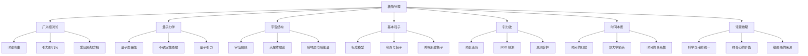
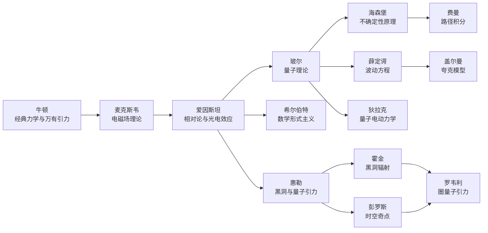
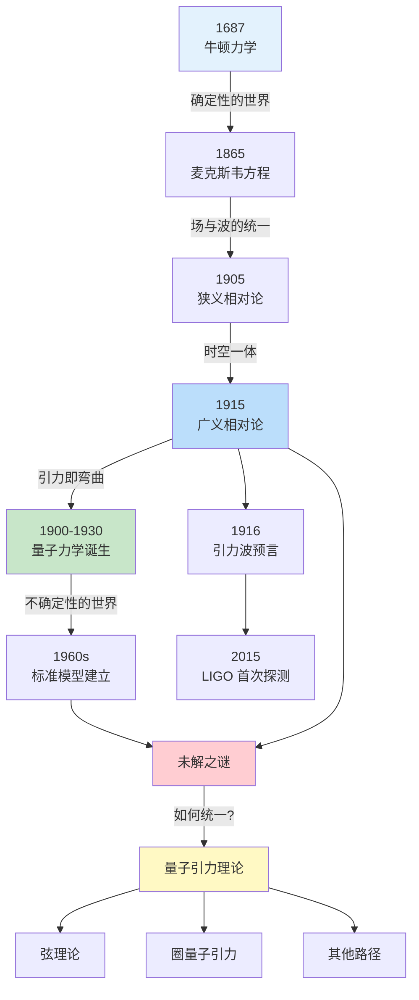
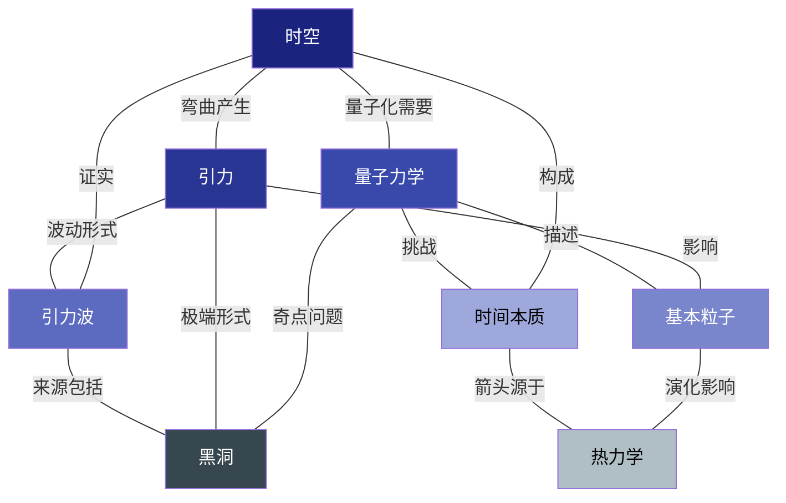

# 知识图谱图片描述：《七堂极简物理课》核心概念全景图

> 本文档为公众号推文配图提供详细的知识图谱结构描述，包含 Mermaid 图表代码和对应的文字说明。

---

## 图一：物理概念分类树

### 图表描述

这是一张从《七堂极简物理课》核心主题出发的分类树状图。中心节点为"极简物理"，向下展开为七大主题分支，每个分支进一步细分为核心概念和关键发现。

整体采用自上而下的层级结构，适合竖屏阅读。

### Mermaid 代码

### 配色建议

- 中心节点：深蓝色 #1a237e
- 一级分支：渐变蓝紫色系
- 二级节点：浅灰色背景，深色文字
- 连线：细线，颜色与父节点一致

---

## 图二：物理学家人物图谱

### 图表描述

展现与本书核心理论相关的关键物理学家及其贡献之间的关联。采用横向布局，左侧为经典物理学奠基人，右侧为现代物理学家，中间通过理论传承关系连接。

### Mermaid 代码

### 配色建议

- 经典物理学家：暖色调 #ff7043
- 量子物理学家：冷色调 #42a5f5
- 现代物理学家：紫色调 #ab47bc
- 罗韦利节点：高亮金色 #ffc107，作为图谱的终点

---

## 图三：从牛顿到量子引力的认知路径图

### 图表描述

展示人类对物理世界认知的演进路径，从经典力学到量子引力理论。采用时间轴与概念节点相结合的形式，标注关键转折点和未解之谜。

### Mermaid 代码

### 配色建议

- 经典物理阶段：浅蓝色系
- 相对论阶段：中蓝色系
- 量子力学阶段：绿色系
- 未解之谜：浅红色背景
- 量子引力：高亮黄色背景

---

## 图四：物理概念网络关系图

### 图表描述

以网状结构展示七大物理概念之间的内在关联。采用无向图形式，概念之间的连线表示理论上的关联或相互影响。适合展示物理学作为一门学科的整体性。

### Mermaid 代码

### 配色建议

- 节点颜色从深蓝到浅蓝渐变，表示概念的抽象程度
- 黑洞节点使用深灰背景，突出其特殊性
- 连线使用半透明灰色，宽度表示关联强度

---

## 使用建议

1. **图一分类树** 适合作为文章开头的总览图，帮助读者建立全局认知
2. **图二人物图谱** 适合放在介绍理论发展历程的段落旁
3. **图三路径图** 适合放在讨论物理学演进和未解之谜的部分
4. **图四网络图** 适合作为文章结尾的概念总结图

所有图表建议使用 2x 分辨率导出，确保移动端显示清晰。
