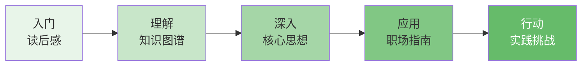

# 图谱逻辑：《七堂极简物理课》的知识地图与阅读指南

> 理解物理，从理解物理学家如何思考开始。

---

## 引子：为什么需要一张知识图谱

罗韦利的书很薄，但信息密度极高。七堂课，每一堂都承载着人类几个世纪的思考。

如果没有一张地图，读者很容易在这些宏大的概念中迷失方向。

这篇文章的目的，就是为你绘制一张知识地图——不是为了让你记住所有知识点，而是为了帮你理解这些知识是如何相互关联的。

---

## ◆ 整体架构：七堂课的逻辑链条

```
广义相对论 ──→ 量子力学 ──→ 宇宙结构
     │              │             │
     ▼              ▼             ▼
  时空弯曲      概率与关系     暗物质与暗能量
     │              │             │
     └──────┬───────┘             │
            ▼                     │
      量子引力 ←──────────────────┘
            │
            ▼
       引力波 ──→ 时间的本质
            │
            ▼
        诗意物理
```

### 逻辑解读

**第一步：从最成功的理论开始**

广义相对论是人类理解宇宙最精确的理论之一。它解释了引力、黑洞、宇宙膨胀。但它有一个致命缺陷——在极小的尺度上，它失效了。

**第二步：引入另一个极端的理论**

量子力学在微观尺度上无比精确，但它与广义相对论在根本上是不相容的。一个说时空是光滑连续的，一个说世界是离散概率的。

**第三步：直面矛盾**

宇宙结构、基本粒子、引力波——这些概念都在提醒我们：两个理论必须统一。而统一的路径，指向了"量子引力"。

**第四步：追问本质**

当我们在量子引力的层面思考时，"时间"这个概念本身开始瓦解。时间可能不是基本的，而是从更底层的结构中涌现出来的。

**第五步：回归人文**

物理学的最终目的，不是计算，而是理解。罗韦利用诗意的语言告诉我们：**科学最深刻的价值，是让我们对世界保持敬畏和好奇。**

---

## ◇ 核心概念的三层结构

### 第一层：现象层（我们能感知的）

- 苹果落地
- 星星发光
- 黑洞吞噬
- 引力波荡漾

这是我们日常经验可以触及的层面，也是物理学出发的地方。

### 第二层：理论层（我们用来解释的）

- 牛顿的万有引力定律
- 爱因斯坦的场方程
- 薛定谔方程
- 标准模型

这是人类智慧的结晶，是用数学语言写成的宇宙说明书。

### 第三层：哲学层（我们用来反思的）

- 时空是真实的还是幻象？
- 时间是单向的吗？
- 世界是确定的还是概率的？
- 我们是谁，在这个宇宙中扮演什么角色？

这是罗韦利最想带我们到达的地方。

---

## ○ 阅读路线图



### 各阶段重点

| 阶段 | 重点 | 推荐阅读顺序 |
|-----|------|------------|
| 入门 | 感受物理的诗意之美 | 先读读后感，建立兴趣 |
| 理解 | 建立概念之间的关联 | 对照知识图谱阅读 |
| 深入 | 理解核心思想的深层含义 | 精读核心思想篇 |
| 应用 | 将物理思维迁移到工作中 | 思考职场启示 |
| 行动 | 将认知转化为实际改变 | 完成行动挑战 |

---

## ● 概念之间的隐藏关联

### 关联一：弯曲与不确定

广义相对论说时空是弯曲的，量子力学说世界是不确定的。这两个概念看似矛盾，但它们有一个共同点：**都在打破我们的直觉。**

我们直觉认为空间是平的，世界是确定的。物理学告诉我们：直觉是进化的产物，它适合在非洲草原上生存，但不适合理解宇宙。

### 关联二：引力波与时间

2015 年 LIGO 首次探测到引力波，证实了爱因斯坦 100 年前的预言。这个发现的意义不仅在于技术突破，更在于它让我们"听到"了时空的振动。

而时间的本质，恰恰隐藏在时空的振动之中。罗韦利认为，**在量子引力的层面上，时间这个概念可能根本就不存在。**

### 关联三：暗物质与好奇心

宇宙中 95% 的物质和能量是我们不了解的。这意味着什么？

意味着物理学远没有结束。意味着我们依然站在未知的边缘。意味着**好奇心依然是人类最珍贵的品质。**

---

## ◆ 互动话题

> 在这七堂课中，哪一个概念最让你感到震撼？为什么？
>
> A. 时空可以弯曲
> B. 世界本质上是概率的
> C. 我们只了解宇宙的 5%
> D. 时间可能是一种幻觉
>
> 欢迎在留言区选择并分享你的理由。

---

## ◇ 系列导航

| 上一篇 | 下一篇 |
|-------|-------|
| [01-读后感](./01-公众号排版文稿_读后感.md) | [03-核心思想](./04-公众号排版文稿_核心思想.md) |

---

*知识图谱的价值不在于展示复杂性，而在于揭示简洁。物理学最终告诉我们：宇宙的运行法则，可能比我们想象的更加优雅。*
