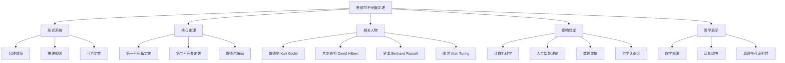
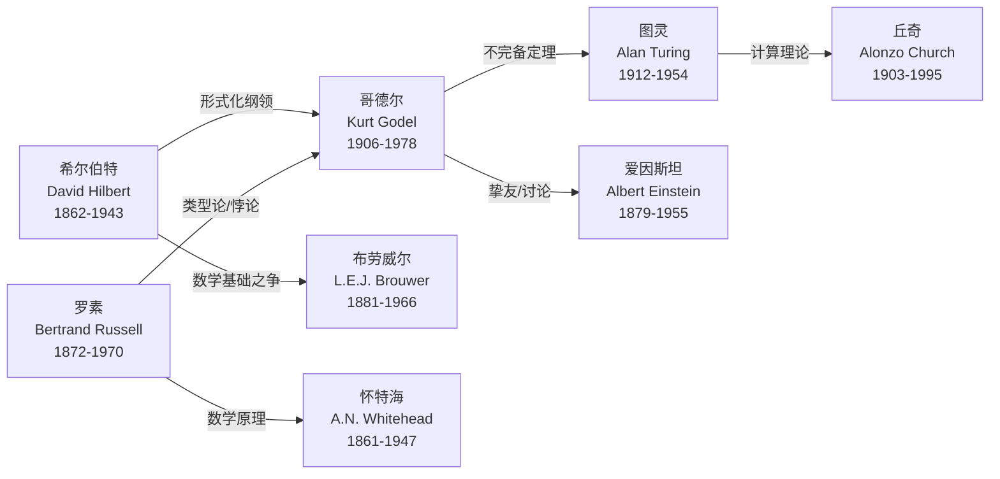
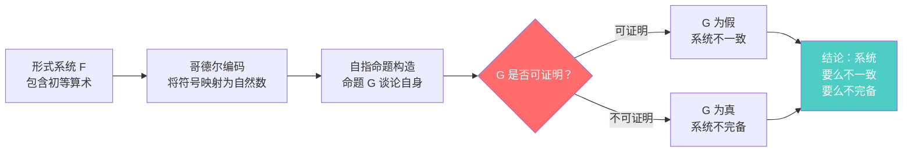
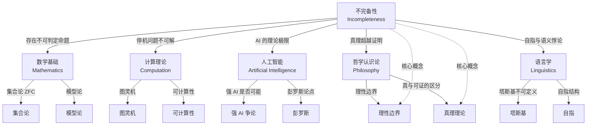

# 知识图谱图片描述：哥德尔不完备定理

---

## ○ 图谱一：不完备定理知识分类树

### 图片描述

一张层次分明的知识分类树状图，从顶部根节点"哥德尔不完备定理"向下分叉为五个主要分支，每个分支再细分为具体的知识点。整体采用深色背景，节点使用渐变蓝紫色调，连接线为半透明灰色。

### Mermaid 图表代码

---

## ◆ 图谱二：关键人物关系图谱

### 图片描述

一张中心辐射式的人物关系图谱。中心是库尔特·哥德尔，周围环绕希尔伯特、罗素、图灵、爱因斯坦等人物。节点之间用不同颜色的连线表示师承关系、学术争论或思想继承。整体布局呈现星空般的深邃感，背景为暗蓝色渐变，节点为发光圆形。

### Mermaid 图表代码

---

## ● 图谱三：不完备定理证明路径图

### 图片描述

一张横向展开的证明路径流程图，从左到右展示哥德尔如何从数学公理出发，通过哥德尔编码，构造自指命题，最终推导出不完备定理的完整逻辑链条。每个步骤配有简短说明，关键转折点用醒目的红色标记。整体风格简洁严谨，类似学术论文中的流程图。

### Mermaid 图表代码

---

## ◇ 图谱四：不完备性影响网络图

### 图片描述

一张复杂的网络关系图，中心是"不完备性"概念，向外辐射连接到数学基础、计算理论、AI 理论、哲学认识论、语言学等多个领域。每条连线上标注了影响的具体内容。节点大小表示影响程度，整体呈现类似神经元网络的有机形态，背景为深邃的宇宙蓝。

### Mermaid 图表代码

---

## ◆ 图谱使用说明

### 适用场景

1. **分类树**：适合作为文章开篇的导读图，帮助读者快速了解不完备定理的知识框架
2. **人物图谱**：适合在介绍历史背景时使用，展现 20 世纪数理逻辑领域的关键人物及其思想传承
3. **证明路径图**：适合在讲解定理核心逻辑时使用，将复杂的证明过程简化为清晰的步骤
4. **网络图**：适合作为文章结尾的总结图，展示不完备定理对各领域的深远影响

### 设计建议

- 配色方案：主色调建议使用深蓝、紫、青色系，营造深邃、严谨的学术氛围
- 字体选择：中文推荐使用思源黑体或苹方，英文推荐使用 JetBrains Mono 或 Source Code Pro
- 节点样式：重要节点可适当放大，次要节点保持统一尺寸
- 连接线：使用不同颜色或粗细表示不同类型的关系（如师承、争论、继承等）
