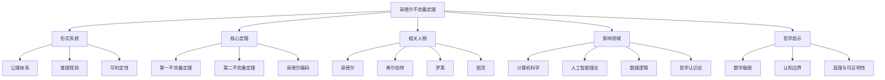
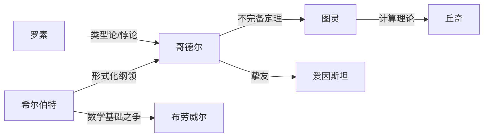
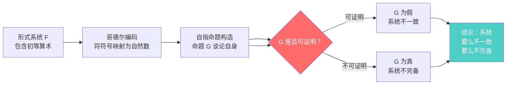
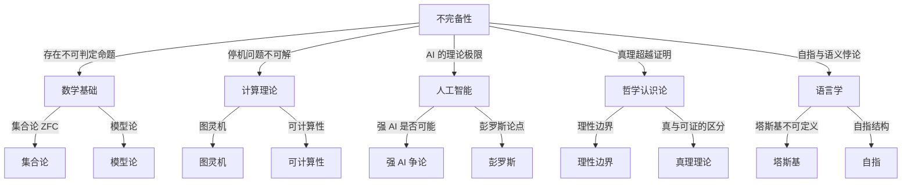

# 从形式系统到认知边界：不完备定理的图谱逻辑

> 每一个系统都有其无法触及的真相。理解这一点，是逻辑觉醒的开始。

---

## ◆ 系列导航

━━━━━━━━━━━━━━━━━━━━━
◆ 人类文明经典阅读计划 ◆
第六期 · 科学探索系列
━━━━━━━━━━━━━━━━━━━━━

◆ 上一篇：《熵增定律：宇宙为何走向无序》
● 当前位置：哥德尔不完备定理
◇ 下一篇：《量子力学：观测如何改变现实》

---

## ○ 引言：系统之外的真相

我们生活在一个由系统构成的世界中。

法律是一个系统，用规则和判例来定义正义。
编程语言是一个系统，用语法和语义来定义计算。
科学是一个系统，用实验和理论来描述世界。

我们习惯于相信，只要系统足够完善，就能解释一切。

但哥德尔不完备定理告诉我们一个令人不安的事实：**任何足够复杂的系统，都存在它无法解释的真相。**

这篇文章，我们将通过四张知识图谱的逻辑线索，带你理解不完备定理背后的深层结构。

---

## ◆ 图谱逻辑一：知识的分类树

### 逻辑解读

这棵分类树揭示了不完备定理的五个核心维度：

**形式系统**：定理的前提条件。不完备性不是针对某个具体的数学理论，而是针对所有"足够强大"的形式系统。

**核心定理**：包含两条不完备定理和哥德尔编码方法。第一定理说"存在不可判定的命题"，第二定理说"系统无法证明自身的一致性"。

**相关人物**：从希尔伯特的梦想，到罗素的悖论，再到哥德尔的证明和图灵的延伸，这是一条清晰的思想传承链。

**影响领域**：不完备性的影响从数学溢出，进入计算机科学、AI 理论和哲学。它不再只是一个数学定理，而是一个跨学科的核心概念。

**哲学启示**：这是分类树的终点，也是思考的起点。数学极限、认知边界、真理与可证明性的区分，这些概念指向了人类理性的根本处境。

---

## ● 图谱逻辑二：人物的思想网络

### 逻辑解读

这张人物图谱展示了一场持续半个世纪的学术争论：

**希尔伯特 vs 布劳威尔**：这是 20 世纪数学基础之争的核心。希尔伯特代表形式主义，相信数学可以被完全形式化。布劳威尔代表直觉主义，认为数学的本质在于构造性证明。

**罗素 → 哥德尔**：罗素的悖论暴露了集合论的裂缝，他的《数学原理》试图用类型论来修补。哥德尔的不完备定理则证明了这种修补注定无法达到完备性。

**哥德尔 → 图灵**：图灵受到哥德尔不完备定理的启发，提出了图灵机模型和停机问题。他将"不可证明性"转化为"不可计算性"，为计算机科学奠定了理论基础。

**哥德尔与爱因斯坦**：两人在普林斯顿高等研究院成为挚友。据说爱因斯坦晚年曾说："我自己的工作已经意义不大，我只是来陪哥德尔散步的。"这段友谊象征着两位天才对宇宙终极真理的共同追问。

---

## ◇ 图谱逻辑三：证明的逻辑链条

### 逻辑解读

这个证明路径图展示了哥德尔如何通过精巧的逻辑构造，将数学引向了一个自指的深渊：

**第一步：形式系统**。哥德尔考虑的是包含初等算术的形式系统，例如皮亚诺算术（Peano Arithmetic）。这类系统足够强大，可以表达关于自然数的各种命题。

**第二步：哥德尔编码**。这是证明的关键技巧。哥德尔将系统中的每个符号、每个公式、每个证明都映射为一个唯一的自然数，称为"哥德尔数"。这使得数学命题可以"谈论"其他命题，因为谈论命题变成了谈论数字。

**第三步：自指构造**。哥德尔构造了一个特殊的命题 G，其含义等价于"G 不能被证明"。这是一个自指命题，类似于"说谎者悖论"，但哥德尔巧妙地避开了悖论，转而构造了一个不可判定的命题。

**第四步：两难推理**。如果 G 可以被证明，那么系统就产生了矛盾（因为 G 声称自己不能被证明）。如果 G 不能被证明，那么 G 就是一个真命题但系统无法证明它，系统是不完备的。

**结论**：系统要么不一致，要么不完备。不存在既一致又完备的形式系统。

---

## ○ 图谱逻辑四：不完备性的影响网络

### 逻辑解读

这张网络图展示了不完备性概念如何从数学核心向外辐射，影响了多个学科的发展：

**数学基础**：不完备定理终结了希尔伯特计划，但催生了集合论和模型论的繁荣。数学家们接受了不完备性，转而研究不同公理系统下的数学结构。

**计算理论**：图灵将不完备性转化为不可计算性，提出了图灵机模型和停机问题。这直接奠定了计算机科学的理论基础。

**人工智能**：不完备定理暗示了 AI 的理论极限。如果人类思维可以被形式化，那么它也会受到不完备性的限制。彭罗斯据此论证人类意识不可能是纯粹的计算过程。

**哲学认识论**：不完备定理挑战了"理性万能"的信念。它表明，即使在最严谨的逻辑系统中，也存在永远无法触及的真理。

**语言学**：塔斯基（Alfred Tarski）在哥德尔的基础上提出了真理不可定义定理，进一步揭示了自指结构在语言中的核心地位。

---

## ◆ 总结：逻辑觉醒

不完备定理的图谱逻辑，揭示了一个贯穿数学、计算机科学和哲学的核心主题：

**任何系统都有其边界。**
**任何规则都有其例外。**
**任何理性都有其极限。**

认识到这一点，不是悲观，而是觉醒。

只有当我们理解了系统的局限，才能真正理解系统的价值。只有当我们接受了不完备性，才能在不完备中寻找意义。

---

## ○ 互动话题

━━━━━━━━━━━━━━━━━━━━━

**思考：你的"形式系统"是什么？**

每个人都有自己的认知框架和信念系统。
它们帮助你理解世界，但也可能限制你的视野。

你是否有过这样的体验：
某些真相，只有跳出原有系统才能看见？

在评论区分享你的"逻辑觉醒"时刻。
━━━━━━━━━━━━━━━━━━━━━

---

## ◆ 系列导航卡片

┌─────────────────────────────────┐
│    人类文明经典阅读计划          │
│    第六期 · 科学探索系列         │
├─────────────────────────────────┤
│ ◆ 上一篇：《熵增定律》           │
│ ● 当前：哥德尔不完备定理         │
│ ◇ 下一篇：《量子力学》           │
├─────────────────────────────────┤
│  关注我们，一起阅读人类文明的    │
│  经典之作，拓展认知的边界。      │
└─────────────────────────────────┘

---

**核心标签**：数学极限 | 认知边界 | 逻辑觉醒 | 形式系统
