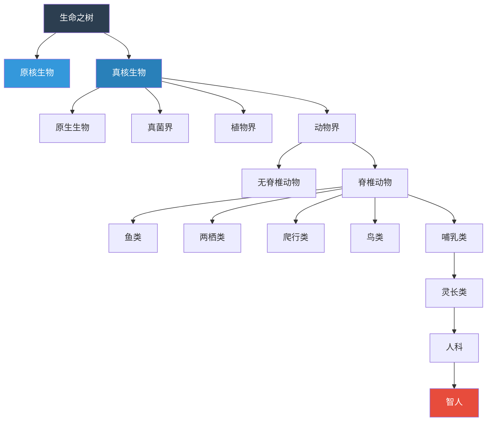
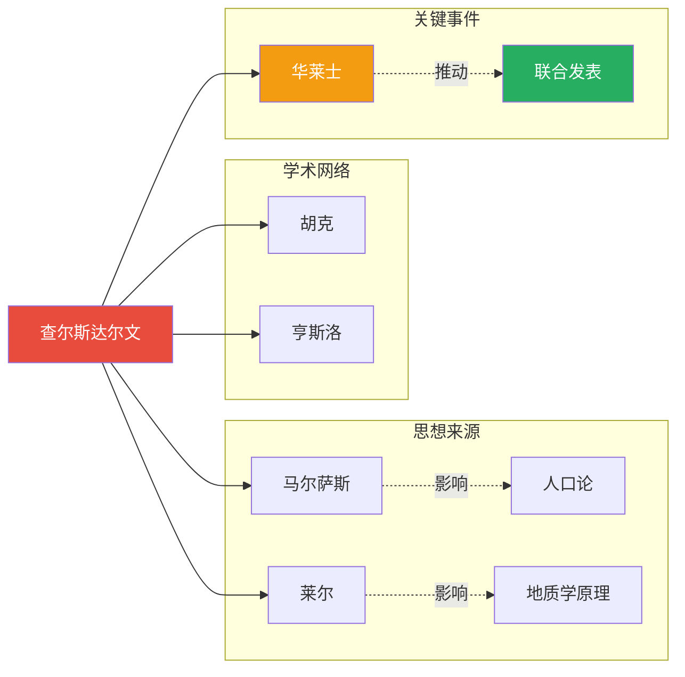
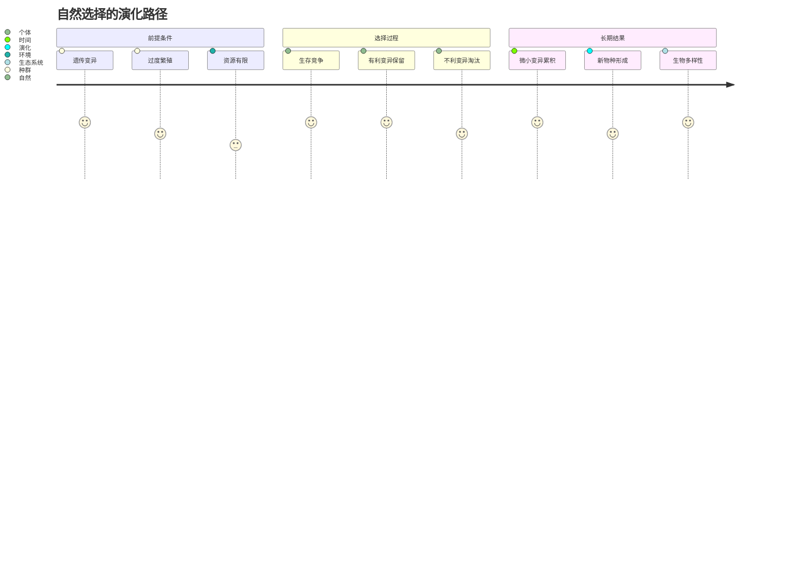
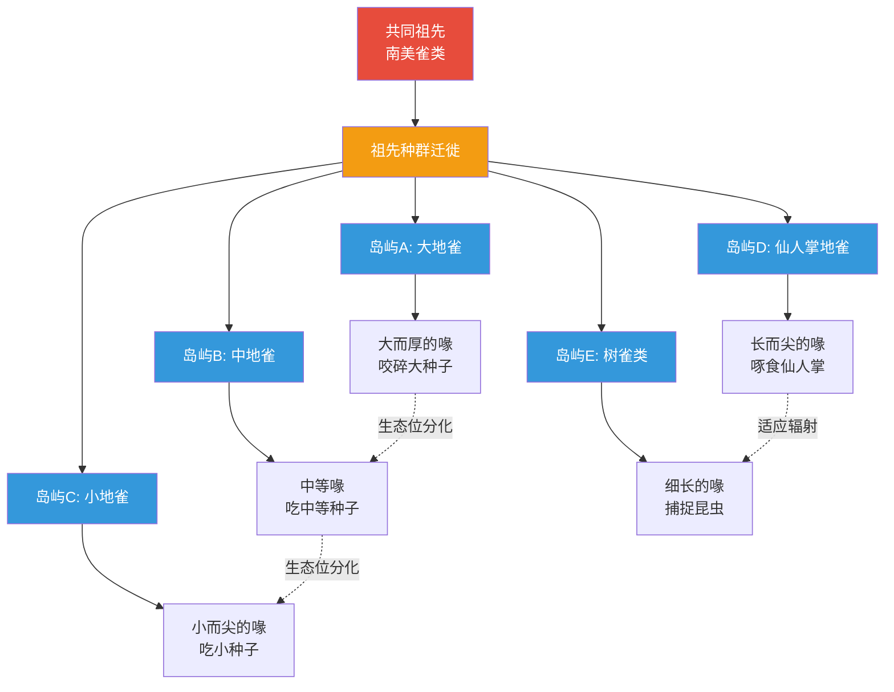

# 知识图谱图片描述

> ◆ 本文包含四张 Mermaid 知识图谱，分别展示物种分类体系、达尔文研究历程、演化路径图和物种关系网络。

---

## 图谱一：物种分类树

**图片描述**：

这是一张展示生命分类层级的树状图。顶部是"生命之树"根节点，向下分为"原核生物"和"真核生物"两大分支。真核生物继续分化为四个界：原生生物界、真菌界、植物界和动物界。动物界向下分为无脊椎动物和脊椎动物，脊椎动物进一步分为鱼类、两栖类、爬行类、鸟类和哺乳类。哺乳类分支中，灵长类人科最终指向"智人"。

整体布局从上到下呈树形展开，颜色从深蓝逐渐过渡到红色，暗示从远古到现代的演化方向。"智人"节点使用醒目的红色标注，突出人类在生命之树中的位置——既普通又特殊。

**用途**：用于展示所有生命之间的亲缘关系，帮助读者理解"共同祖先"的概念。

---

## 图谱二：达尔文研究历程人物图谱

**图片描述**：

这是一张展示达尔文学术关系网络的横向图谱。中心人物是"查尔斯达尔文"，他与六位关键人物产生关联：

**思想来源**：马尔萨斯的《人口论》启发了"生存竞争"的概念；莱尔的《地质学原理》提供了"均变论"思想，暗示地球历史足够漫长，为演化提供了时间基础。

**学术网络**：植物学家胡克是达尔文的挚友和坚定的支持者；亨斯洛是达尔文在剑桥大学的导师，推荐他参加"小猎犬号"航行。

**关键事件**：华莱士独立提出了与达尔文相似的自然选择理论，这一事件直接推动了达尔文加快发表《物种起源》的进程，最终两人论文在1858年林奈学会上联合发表。

图谱使用子图将关系分为"思想来源"、"学术网络"和"关键事件"三组，帮助读者快速理解每种关系的性质。

**用途**：用于说明科学发现不是孤立的个人行为，而是建立在前人基础和学术共同体之上的成果。

---

## 图谱三：自然选择演化路径图

**图片描述**：

这是一张展示自然选择完整过程的旅程图，分为三个阶段：

**前提条件阶段**：种群内部存在遗传变异，个体之间不完全相同；生物倾向于过度繁殖，产生的后代数量远超环境承载力；环境资源（食物、空间、配偶等）是有限的。

**选择过程阶段**：由于资源有限，个体之间必然产生生存竞争；拥有有利变异的个体更可能在竞争中存活；拥有不利变异的个体更可能被淘汰。

**长期结果阶段**：经过世代更替，微小的有利变异不断累积；当累积的差异足够大时，新物种形成；最终表现为地球上丰富的生物多样性。

每个步骤右侧标注了"难度评分"（1-5），暗示该步骤在演化过程中的重要程度。

**用途**：用于将抽象的"自然选择"理论拆解为可理解的具体步骤，帮助读者建立清晰的因果链条。

---

## 图谱四：加拉帕戈斯雀类关系网络

**图片描述**：

这是一张展示加拉帕戈斯群岛雀类适应辐射演化的网络图。

图的顶部是"共同祖先——南美雀类"，一个祖先种群通过迁徙到达加拉帕戈斯群岛的不同岛屿。在不同岛屿上，由于食物来源和生态环境的差异，雀类的喙形发生了不同的适应性变化：

大地雀演化出大而厚的喙，用于咬碎坚硬的大种子；中地雀的喙大小适中，适合吃中等大小的种子；小地雀的喙小而尖，专门取食小种子；仙人掌地雀的喙长而尖，能够啄食仙人掌的花和果实；树雀类的喙细长，适合从树皮缝隙中捕捉昆虫。

图的下半部分用虚线连接标注了"生态位分化"和"适应辐射"，强调这些雀类虽然形态各异，但本质上是通过适应不同生态位而从同一祖先分化而来。

**用途**：这是演化生物学最经典的案例图，用于直观展示"同一祖先在不同环境下如何演化出不同形态"，是理解自然选择的核心示例。

---

> ◇ **使用指南**
>
> 以上四张图谱可用于微信公众号排版中的知识可视化环节。建议：
>
> 1. 每张图配合对应的文字解读，避免单独使用
> 2. 图注需要标明"示意图"字样，因为这是概念性展示而非精确的科学数据
> 3. 移动端显示时，建议将图裁剪为合适的宽度比例

---

**核心标签**：#演化觉醒 #自然选择 #生命之树 #适者生存 #知识图谱 #Mermaid
