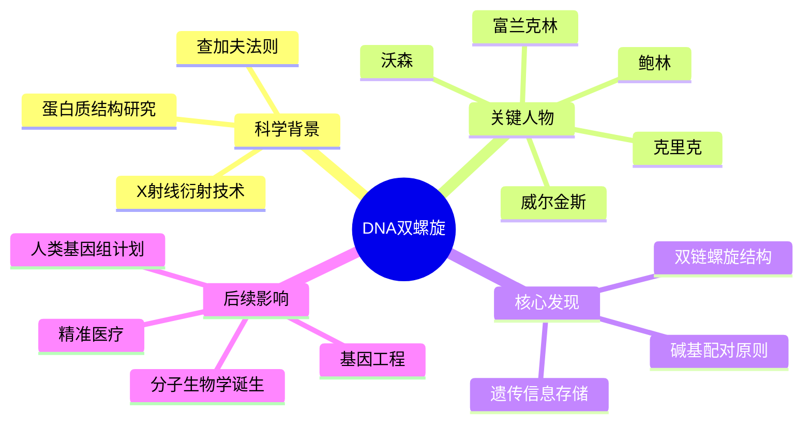
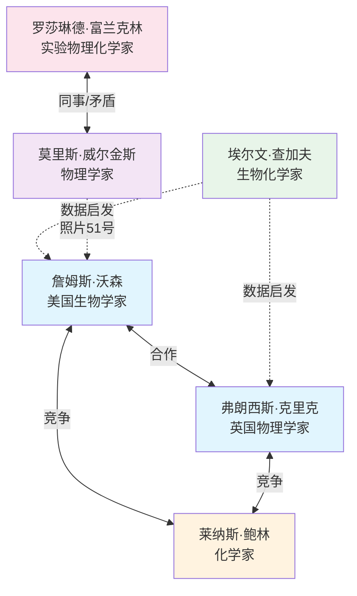
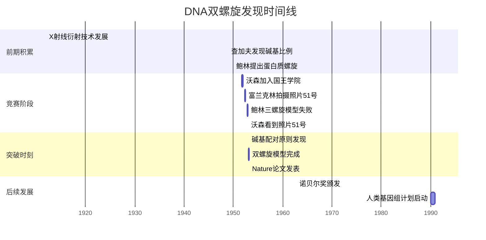
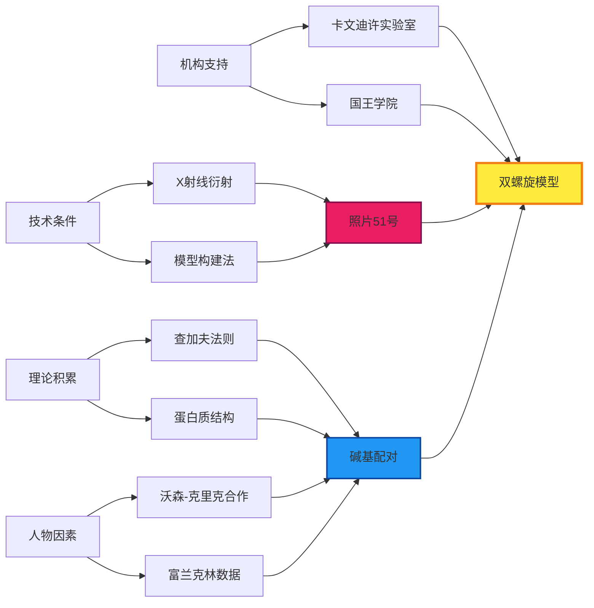

# DNA双螺旋 · 知识图谱图片描述

> 本文包含 4 张知识图谱的 Mermaid 图表描述，用于公众号配图生成。

---

## 图谱一：DNA 双螺旋发现 · 分类树

### 图表类型：思维导图 / 分类树

### 用途说明
展示 DNA 双螺旋发现涉及的核心知识体系，帮助读者建立整体认知框架。

### Mermaid 代码

### 视觉建议
- 中心节点用深色高亮
- 四个主分支用不同颜色区分
- 整体布局呈放射状
- 适合作为系列开篇的总览图

---

## 图谱二：关键人物关系图谱

### 图表类型：人物关系网络图

### 用途说明
展现 DNA 双螺旋发现过程中各科学家之间的合作、竞争与关联关系。

### Mermaid 代码

### 视觉建议
- 沃森和克里克用同一色系，强调合作
- 富兰克林用独立色系，突出其独特地位
- 实线表示直接关系，虚线表示间接影响
- 适合配合人物故事章节使用

---

## 图谱三：双螺旋发现时间路径

### 图表类型：时间轴 / 路径图

### 用途说明
按时间顺序梳理从 X 射线研究到双螺旋模型完成的关键节点。

### Mermaid 代码

### 视觉建议
- 用不同颜色区分"前期积累""竞赛阶段""突破时刻""后续发展"
- 关键节点加粗标注
- 适合展现科学竞赛的紧张感

---

## 图谱四：科学发现要素网络

### 图表类型：概念网络图

### 用途说明
展示促成双螺旋发现的各类要素及其相互关系，揭示科学发现的系统性。

### Mermaid 代码

### 视觉建议
- 最终成果"双螺旋模型"用最醒目的颜色和加粗边框
- "照片 51 号"和"碱基配对"作为关键中间节点突出显示
- 从左到右的流向体现"多因素汇聚→最终突破"的逻辑
- 适合配合深度分析章节使用

---

## 使用建议

1. **发布节奏**：四张图谱可分四期发布，也可合并为一篇"知识图谱特辑"
2. **配色方案**：建议统一使用蓝紫色系，与"科学""探索"主题呼应
3. **图注格式**：每张图下方添加简短说明，如"图：DNA 双螺旋发现人物关系图谱"
4. **互动设计**：可在文末发起投票，让读者选择最想了解哪位科学家的故事

---

**核心标签**：科学发现 双螺旋 分子生物学 生命密码

*本文为「人类文明经典阅读计划」配套知识图谱系列*
