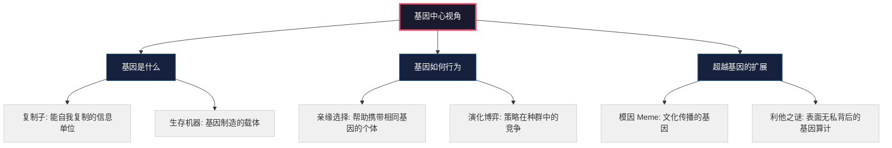
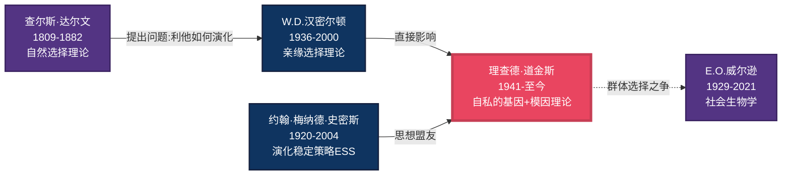
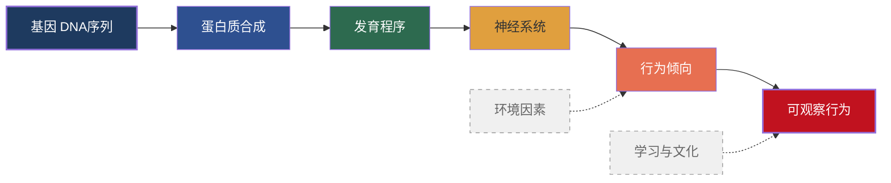
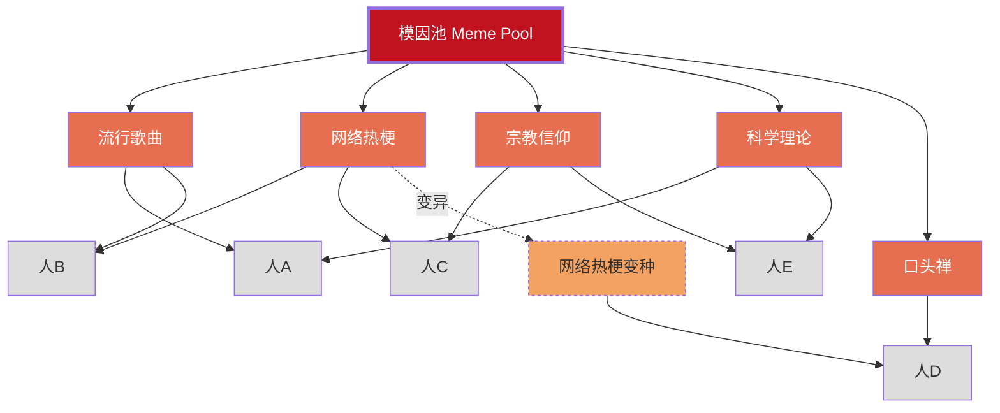

# 02-知识图谱图片描述.md

---

# 《自私的基因》知识图谱 · 图片描述

---

## 图一：核心理论分类树

### 图片用途
作为文章开篇的总览图，展示《自私的基因》全书六大核心概念之间的层级关系。

### 视觉描述

一棵倒置的树形图，根部在最上方，枝叶向下展开。

**根节点**（最顶端，居中，大号字体）：
"基因中心视角" -- 用深色实心圆标记

**第一层分支**（三个主干节点，用菱形标记）：
- 左："基因是什么"
- 中："基因如何行为"
- 右："超越基因的扩展"

**第二层节点**（每个主干下两个子节点，用小圆圈标记）：

"基因是什么" 下方：
- "复制子 -- 能自我复制的信息单位"
- "生存机器 -- 基因制造的载体"

"基因如何行为" 下方：
- "亲缘选择 -- 帮助携带相同基因的个体"
- "演化博弈 -- 策略在种群中的竞争"

"超越基因的扩展" 下方：
- "模因 Meme -- 文化传播的基因"
- "利他之谜 -- 表面无私背后的基因算计"

### Mermaid 分类树代码

---

## 图二：关键人物思想谱系图

### 图片用途
展示与"基因中心论"相关的关键人物及其思想传承与争论关系，帮助读者理解这一理论并非道金斯一人之功，而是几代学者思想的结晶。

### 视觉描述

一张从左到右展开的人物关系图，用连线标注人物之间的关系。

**时间轴从左到右排列**：

1. **达尔文（1809-1882）** -- 最左侧，奠基者
   - 贡献：自然选择理论
   - 与下一位的连线标注："提出问题：利他行为如何演化？"

2. **汉密尔顿（1936-2000）** -- 左中，关键突破
   - 贡献：亲缘选择理论、广义适合度
   - 与达尔文的连线：继承发展
   - 与道金斯的连线：直接影响

3. **道金斯（1941- ）** -- 居中，核心人物，节点最大
   - 贡献：《自私的基因》、模因理论
   - 与汉密尔顿的连线标注："受其亲缘选择启发"

4. **梅纳德·史密斯（1920-2004）** -- 右中，并行贡献
   - 贡献：演化稳定策略（ESS）、演化博弈论
   - 与道金斯的连线标注："思想盟友，共同推广基因视角"

5. **威尔逊（1929-2021）** -- 最右侧，争论者
   - 贡献：社会生物学、群体选择
   - 与道金斯的连线标注："学术对手，群体选择之争"
   - 连线样式用虚线表示争论关系

### Mermaid 人物图谱代码

---

## 图三：从基因到行为的逻辑路径图

### 图片用途
展示基因如何通过多层机制最终影响可观察的行为，帮助读者理解"基因决定论"的误解 -- 基因并非直接控制行为，而是通过复杂的中间层间接影响。

### 视觉描述

一条从左到右的流程路径图，每个环节用不同颜色标注。

**路径节点**：

1. "基因（DNA 序列）" -- 起点，蓝色
   - 说明：遗传信息的基本载体

2. "蛋白质合成" -- 第二层，浅蓝
   - 说明：基因通过编码蛋白质发挥作用

3. "发育程序" -- 第三层，绿色
   - 说明：蛋白质构建身体和神经系统

4. "神经系统" -- 第四层，黄色
   - 说明：大脑的硬件基础

5. "行为倾向" -- 第五层，橙色
   - 说明：趋利避害、求偶、抚育等

6. "可观察行为" -- 终点，红色
   - 说明：最终展现出的具体行为

**旁注箭头**：
- 从"环境"指向"行为倾向"，标注"环境可以覆盖基因倾向"
- 从"学习/文化"指向"可观察行为"，标注"人类独有的超越路径"

### Mermaid 路径图代码

---

## 图四：模因传播网络图

### 图片用途
展示模因（文化基因）如何在人群中传播、变异和竞争，用网络可视化的方式让抽象概念具象化。

### 视觉描述

一个由节点和连线组成的网络图。

**节点类型**：

1. **中心模因节点**（大圆形，红色）：
   - "模因池" -- 所有文化信息的集合

2. **具体模因实例**（中等圆形，橙色）：
   - "一首流行歌"
   - "一个网络梗"
   - "一种宗教信仰"
   - "一个科学理论"
   - "一句口头禅"

3. **宿主节点**（小圆形，灰色）：
   - "人A"、"人B"、"人C"、"人D"、"人E"

**连线类型**：
- 实线箭头：模因从一个人传播到另一个人
- 虚线箭头：模因在传播过程中发生变异
- 节点大小：模因传播范围越大，节点越大

**关键展示**：
- 有些模因（如"一个网络梗"）传播迅速但消亡也快
- 有些模因（如"一种宗教信仰"）传播缓慢但持久
- 模因之间会竞争宿主的注意力

### Mermaid 网络图代码

---

## 排版建议

- 四张图建议分为上下两组展示
- 图一和图二放在上半部分，作为理论和人物概览
- 图三和图四放在下半部分，作为机制和扩展展示
- 每张图下方配一行简要说明文字
- 移动端显示时，确保 Mermaid 图表宽度不超过屏幕
