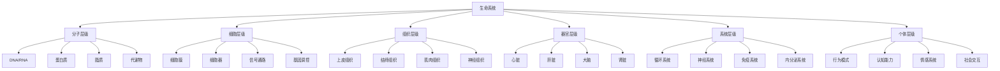
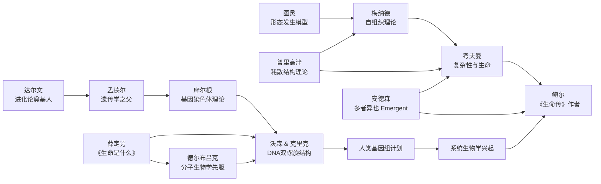
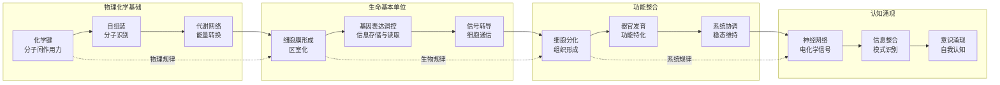
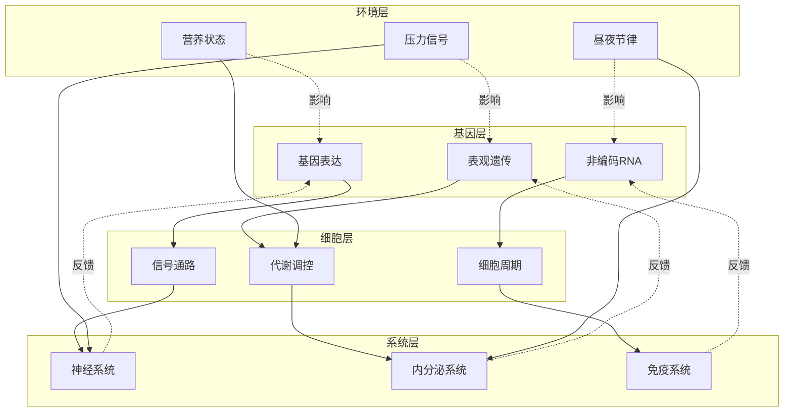

# 知识图谱图片描述 |《生命传》：生命复杂性的全景图

> 本文描述《生命传》知识图谱中的核心图表，帮助读者建立对生命多层级系统的结构化认知。

---

## ○ 图谱一：生命层级分类树

### 图表类型：分类树（Tree Diagram）

### 结构描述

这是一棵自上而下的层级分类树，展示了生命系统从基本构成到高级功能的七个主要层级。

### 设计说明

- 根节点"生命系统"位于顶部中央
- 七个主层级水平排列，从左到右依次展开
- 每个层级下方展开 4 个子节点，用不同颜色区分
- 连接线采用渐变色，表示层级间的涌现关系
- 右侧标注箭头，标明"自下而上涌现"和"自上而下约束"两个方向

### 视觉元素

- 分子层级：蓝色系，象征微观世界
- 细胞层级：绿色系，象征生命的基本单位
- 组织层级：橙色系，象征分化与协作
- 器官层级：红色系，象征功能的核心
- 系统层级：紫色系，象征整合与调控
- 个体层级：金色系，象征完整的人格与意识

---

## ○ 图谱二：关键人物关系图谱

### 图表类型：人物网络图（Network Graph）

### 结构描述

展示了对生命复杂性研究做出关键贡献的思想家和科学家之间的学术传承与影响关系。

### 设计说明

- 人物节点按时间轴从左到右排列
- 实线箭头表示直接的学术影响
- 虚线箭头表示间接的思想启发
- 节点大小代表影响力权重
- 背景按世纪分段，标注关键时间节点

### 色彩方案

- 19 世纪先驱：深褐色，象征奠基时代
- 20 世纪中叶：深蓝色，象征分子生物学革命
- 20 世纪后期：翠绿色，象征复杂性科学兴起
- 21 世纪：亮蓝色，象征系统生物学时代

---

## ○ 图谱三：从分子到意识的涌现路径

### 图表类型：路径图（Path Diagram）

### 结构描述

展示信息和复杂性如何从分子层级逐步涌现，最终产生意识和认知能力。

### 设计说明

- 四个子图从左到右排列，代表复杂性的递增
- 每个子图内部有 3 个递进节点
- 子图之间有虚线连接，标注涌现出的新规律
- 底部有渐变箭头，标明"复杂性增加"方向
- 顶部标注"还原论解释力递减"的渐变提示

### 关键标注

- 物理化学基础：可用物理化学原理解释
- 生命基本单位：需要生物学概念介入
- 功能整合：需要系统论和控制论
- 认知涌现：需要信息科学和认知科学

---

## ○ 图谱四：生命系统的调控网络

### 图表类型：网络图（Network Diagram）

### 结构描述

展示生命系统中多层级调控的复杂网络，包括基因调控、细胞通信、神经调控和内分泌调控之间的交互。

### 设计说明

- 四个子图呈环形布局，象征循环调控
- 实线箭头表示主要的调控方向（自上而下）
- 虚线箭头表示反馈调控（自下而上）
- 中心留白区域标注"稳态维持"
- 节点颜色深浅表示调控强度

### 解读要点

1. **多层级联动**：环境变化可以同时影响基因表达和系统功能
2. **反馈循环**：高层级系统可以反过来调控低层级的活动
3. **冗余设计**：同一功能有多条调控通路，保证系统的鲁棒性
4. **动态平衡**：系统不是静态的，而是在不断调整中维持稳态

---

> **使用建议**
>
> 以上四张图谱可以作为公众号推文的配图使用：
>
> ◆ 图谱一适合作为文章开篇的全景引导图
> ◇ 图谱二适合放在介绍科学史或思想传承的部分
> ○ 图谱三适合解释复杂性涌现的核心概念
> ● 图谱四适合深入讨论生命系统调控机制的部分
>
> 建议每张图配合 200-300 字的解读文字，帮助读者理解图表含义。

---

**系列导航**

- 上一篇：《生命传》读后感 -- 当复杂性从混沌中涌现
- 下一篇：《生命传》图谱逻辑 -- 为什么这样组织知识
- 系列入口：科学探索 -- 从宇宙到生命的认知之旅

---

*标签：复杂性觉醒 | 生命协同 | 系统思维 | 层级认知*
