# 行动挑战 |《生命传》：用系统思维重塑你的认知与行动

> "理解生命，最终是为了理解我们自己。而理解自己，是改变的起点。"
> -- 基于菲利普·鲍尔的思想延伸

---

## ○ 引言：从知道到做到

我们已经阅读了《生命传》的核心内容：

- 理解了生命是复杂性的涌现
- 看到了多层级系统的协同之美
- 学会了用系统思维看待组织和个人

但知识如果不转化为行动，就只是头脑中的装饰。

**今天，我们邀请你参与一个 7 天的行动挑战。**

这个挑战不是要你做一件大事，而是要你在日常生活中，**用生命系统的视角重新审视自己的习惯、关系和决策。**

---

## ○ 挑战总览：7 天系统思维实践

```mermaid
gantt
    title 7天系统思维行动挑战
    dateFormat  D
    axisFormat %d

    section 认知重塑
    第1天: 层级观察    :d1, 1, 1
    第2天: 关系地图    :d2, 2, 1
    第3天: 涌现日记    :d3, 3, 1

    section 行为实验
    第4天: 自组织实验  :d4, 4, 1
    第5天: 反馈循环    :d5, 5, 1
    第6天: 适应性测试  :d6, 6, 1

    section 整合输出
    第7天: 系统复盘    :d7, 7, 1
```

每一天都有一个主题、一个行动任务和一个反思问题。不需要完美的执行，只需要真诚的尝试。

---

## ○ 第 1 天：层级观察

### 今日主题

**看到事物的多层级结构。**

### 行动任务

选择一个你熟悉的系统（可以是你的身体、你的团队、你所在的城市、一个 APP），尝试用至少三个不同的层级来描述它。

例如，描述你的身体：

- **分子层级**：血糖水平、激素浓度、神经递质
- **器官层级**：心脏跳动、肺部呼吸、肠胃消化
- **行为层级**：工作状态、社交互动、运动习惯

### 反思问题

**不同层级之间是如何相互影响的？**

试着找出至少一个"自下而上"的影响和一个"自上而下"的影响。

---

## ○ 第 2 天：关系地图

### 今日主题

**看到关系的网络，而非孤立的个体。**

### 行动任务

画出你工作或生活中的"关系网络图"。

- 在中心写下你的名字
- 在周围写下与你互动最频繁的 10-15 个人
- 用不同粗细的线表示互动的频率和深度
- 用不同颜色表示关系的性质（工作、朋友、家人等）

### 反思问题

**你的网络中有哪些关键节点？**

哪些人是信息流动的枢纽？哪些关系是脆弱的？哪些连接可以加强？

---

## ○ 第 3 天：涌现日记

### 今日主题

**观察"整体大于部分之和"的现象。**

### 行动任务

记录今天观察到的一个"涌现"现象。

涌现现象的特征是：**当你看到组成部分时，无法预测整体的性质。**

可能的例子：

- 一次团队讨论中，某个想法是大家互动后才出现的，没有人单独想到
- 一群人聚在一起时的"氛围"，不是任何一个人的情绪决定的
- 一条街道的"感觉"，不是由单个建筑决定的，而是建筑、人、光、声音的组合

### 反思问题

**你能描述这个涌现现象的"生成规则"吗？**

是什么样的互动方式产生了这个整体性质？如果改变其中一个部分，整体会如何变化？

---

## ○ 第 4 天：自组织实验

### 今日主题

**尝试创造"自下而上"的秩序。**

### 行动任务

在今天的一个协作场景中（会议、群聊、家庭讨论），尝试不用"自上而下"的指令，而是通过**设定简单的规则**，让秩序自然涌现。

例如：

- 在讨论中，设定规则"每个人发言不超过 2 分钟"，观察讨论的自然走向
- 在群聊中，发起一个话题但不主导讨论，观察信息的自然流动
- 在家庭中，设定一个简单的日常规则，让家庭成员的行为自然协调

### 反思问题

**自组织的结果和你预期的有什么不同？**

你是否观察到一些计划之外的模式出现？这些模式是更有序还是更混乱？

---

## ○ 第 5 天：反馈循环

### 今日主题

**识别并利用反馈循环。**

### 行动任务

选择一个你想改变的习惯或行为，分析它的反馈循环。

**正反馈循环**（自我强化）：

- 做得越好，越想去做
- 越想去做，做得越好

**负反馈循环**（自我调节）：

- 做得太多，身体发出警告
- 收到警告，减少行为

尝试为你的目标行为设计一个**正反馈循环**，让它自我强化。

### 反思问题

**你的反馈回路中有什么缺失的环节？**

是什么让好习惯难以维持？是什么让坏习惯难以打破？如何通过调整反馈机制来改变这个循环？

---

## ○ 第 6 天：适应性测试

### 今日主题

**主动跳出舒适区，测试你的适应力。**

### 行动任务

今天做一件你通常会避免的小事。

这不需要是巨大的改变。它可以是：

- 走一条不同的路去上班
- 尝试一种你没吃过的食物
- 和一个你不常交流的人聊天
- 用一种新的方式完成日常工作

关键不是做一件"困难"的事，而是**观察你的系统如何应对变化**。

### 反思问题

**你的"适应曲线"是什么样的？**

初始的不适感持续了多久？你用了什么策略来适应？这次经历让你对变化有什么新的理解？

---

## ○ 第 7 天：系统复盘

### 今日主题

**整合 7 天的观察，形成你的系统思维框架。**

### 行动任务

回顾过去 6 天的记录，回答以下问题：

1. **层级观察**：你对哪个系统的多层级结构有了新的理解？
2. **关系地图**：你的网络图中最重要的发现是什么？
3. **涌现日记**：你观察到的最有趣的涌现现象是什么？
4. **自组织实验**：你创造的自组织结果如何？
5. **反馈循环**：你设计的反馈机制有效吗？
6. **适应性测试**：你对变化的适应能力如何？

将这些发现整合成一段 300-500 字的"我的系统思维心得"。

### 反思问题

**这 7 天的实践，改变了你看世界的方式吗？**

如果有，最大的改变是什么？如果没有，你认为是为什么？

---

## ○ 挑战之后：持续练习的建议

7 天的挑战只是一个起点。系统思维是一种需要持续练习的认知习惯。

**日常练习：**

- 每周选择一个系统，进行层级分析
- 每月更新一次你的关系网络图
- 每季度回顾一次你的反馈循环设计

**进阶阅读：**

- 《复杂》-- 梅拉妮·米歇尔
- 《第五项修炼》-- 彼得·圣吉
- 《系统之美》-- 德内拉·梅多斯
- 《规模》-- 杰弗里·韦斯特

---

## ○ 结语：成为复杂性中的自觉参与者

《生命传》告诉我们，生命系统之所以强大，不是因为它完美，而是因为它能够在复杂性和不确定性中持续适应和演化。

你也是如此。

**你不需要掌控一切，你只需要学会在复杂性中导航。**

你不需要预测未来，你只需要建立足够的适应力来应对变化。

你不需要理解所有细节，你只需要看到层级之间的关系和涌现的规律。

这 7 天的挑战，是你从"知道"走向"做到"的第一步。

**下一步，取决于你。**

---

> **行动承诺**
>
> 在评论区写下你的行动承诺：
>
> "我承诺在接下来的 ___ 天里，每天花 ___ 分钟，用系统思维观察和反思我的 ___。"
>
> 让公开承诺成为你的"正反馈循环"的一部分。
>
> 也欢迎在挑战结束后回来分享你的心得。你的经验可能会启发另一个正在阅读这篇文章的人。

---

**系列导航**

- 上一篇：《生命传》职场指南 -- 从生命系统看组织管理
- 下一篇：本系列完结 -- 欢迎探索其他经典书籍的深度解读
- 系列入口：科学探索 -- 从宇宙到生命的认知之旅
- 系列总览：人类文明经典阅读计划 -- 与伟大思想同行

---

*标签：复杂性觉醒 | 生命协同 | 系统思维 | 层级认知*
