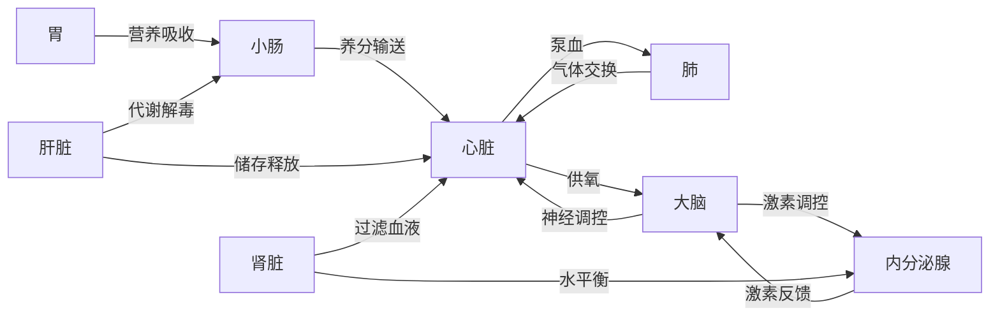
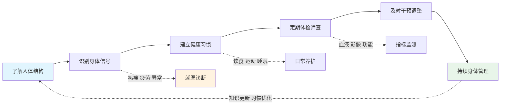
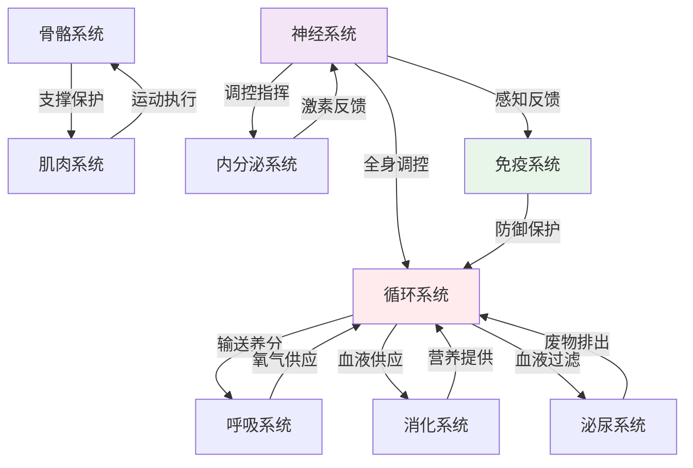

# 人体运转知识图谱：一张图看清身体的奥秘

> 用结构化的方式，梳理人体各大系统的关联与协作。

---

**◆ 图谱概述**

《人体运转手册》的知识体系庞大而精密。为了帮助读者更好地理解人体各系统之间的关系，我们将核心内容整理为以下知识图谱。

这些图谱涵盖：系统分类、器官关联、健康维护路径、以及各系统间的协作网络。

---

**◇ 人体系统分类树**

```mermaid
graph TD
    A["人体系统总览"] --> B["运动系统"]
    A --> C["循环系统"]
    A --> D["呼吸系统"]
    A --> E["消化系统"]
    A --> F["神经系统"]
    A --> G["内分泌系统"]
    A --> H["泌尿系统"]
    A --> I["生殖系统"]
    A --> J["免疫系统"]
    
    B --> B1["骨骼 206块"]
    B --> B2["肌肉 600+块"]
    B --> B3["关节与韧带"]
    
    C --> C1["心脏"]
    C --> C2["动脉"]
    C --> C3["静脉"]
    C --> C4["毛细血管"]
    
    D --> D1["鼻腔与咽"]
    D --> D2["气管与支气管"]
    D --> D3["肺与肺泡"]
    
    E --> E1["口腔与食道"]
    E --> E2["胃"]
    E --> E3["小肠与大肠"]
    E --> E4["肝脏与胰腺"]
    
    F --> F1["中枢神经 脑与脊髓"]
    F --> F2["周围神经"]
    F --> F3["自主神经"]
    
    G --> G1["垂体"]
    G --> G2["甲状腺"]
    G --> G3["肾上腺"]
    G --> G4["性腺"]
    
    H --> H1["肾脏"]
    H --> H2["输尿管"]
    H --> H3["膀胱"]
    
    J --> J1["淋巴系统"]
    J --> J2["白细胞"]
    J --> J3["抗体与免疫因子"]
```



**◇ 器官协作关系图**



**◇ 健康维护路径图**



**◇ 系统协作网络图**



---

**◆ 图谱解读要点**

**一、系统不是孤立的**

从图谱中可以清晰看到，人体没有一个系统是独立工作的。循环系统像高速公路，连接着每一个器官；神经系统像指挥中心，协调着每一次活动。

**二、平衡是关键**

内分泌系统的激素反馈、免疫系统的防御与耐受、泌尿系统的排泄与保留，都体现了人体对平衡的追求。任何系统失衡，都会引发连锁反应。

**三、预防胜于治疗**

健康维护路径图告诉我们：了解身体是第一步，识别信号是第二步，建立习惯是第三步。等到需要就医干预时，问题往往已经发展了一段时间。

---

**◇ 图谱使用建议**

- 将分类树作为学习人体的框架，逐层深入
- 用协作关系图理解器官间的相互影响
- 按健康路径图制定个人健康管理计划
- 通过网络图建立整体思维，而非孤立看待某个器官

---

**○ 系列导航**

```
┌─────────────────────────────────────┐
│     人类文明经典阅读计划            │
│         科学探索系列                │
├─────────────────────────────────────┤
│ 上一篇：人体运转手册_读后感         │
│ 下一篇：人体运转手册_图谱逻辑       │
│                                     │
│ ◆ 核心标签                          │
│ 身体认知 | 医学启蒙                 │
│ 健康觉醒 | 人体奥秘                 │
└─────────────────────────────────────┘
```

---

*本文是人类文明经典阅读计划系列文章之一，转载请注明出处。*
