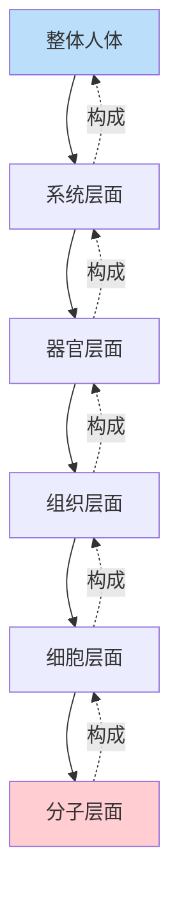
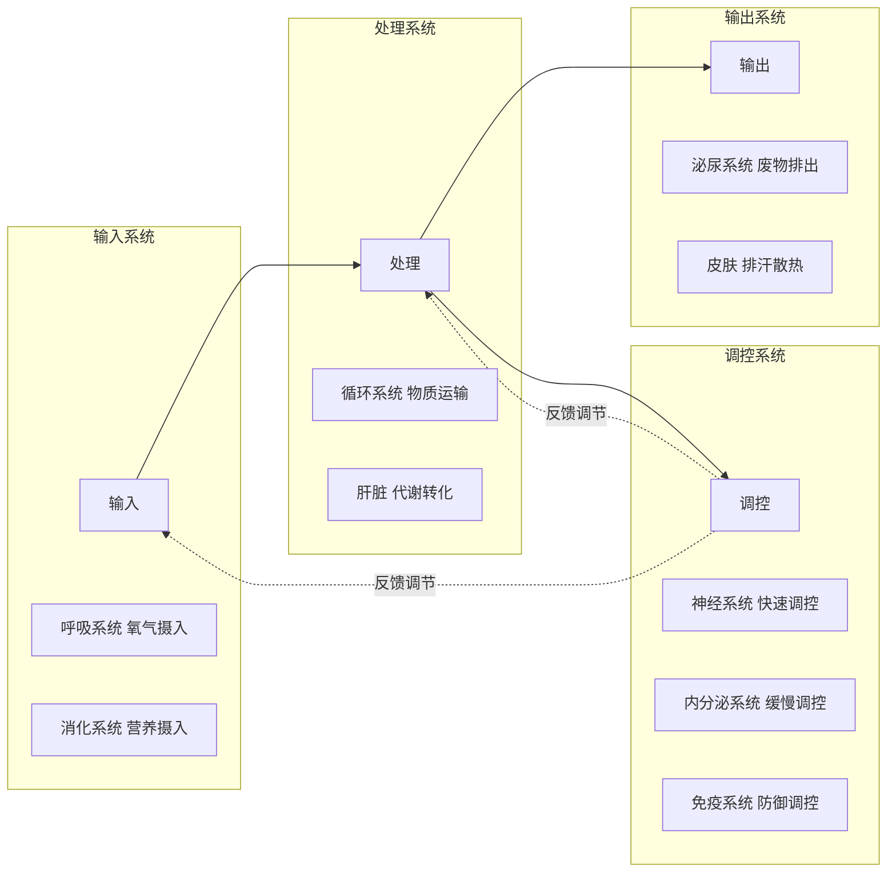
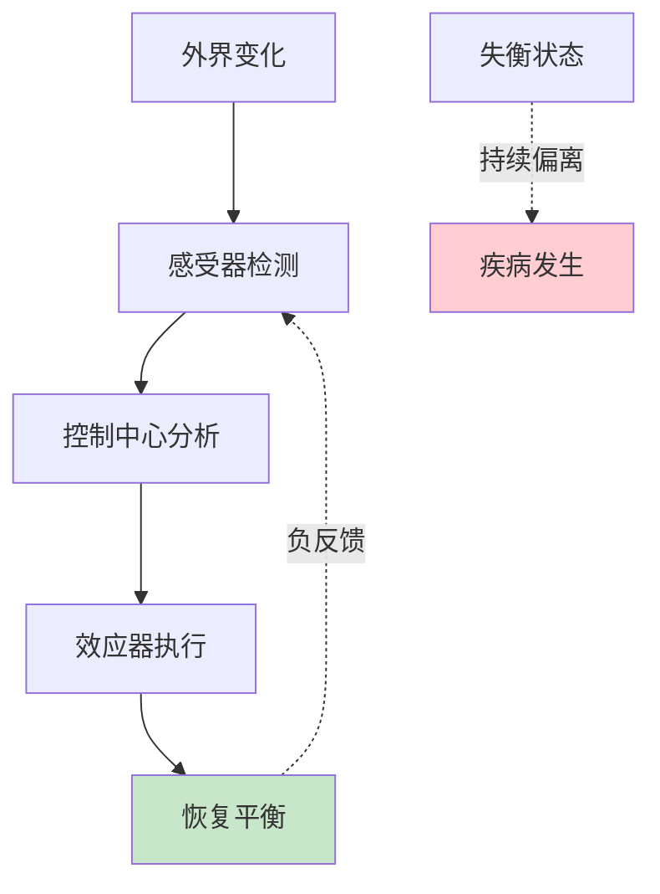

# 人体运转的逻辑：从结构到功能，从微观到宏观

> 理解身体的运作规律，才能更好地守护健康。

---

**◆ 为什么需要了解图谱逻辑**

《人体运转手册》不仅仅是一本解剖图谱，更是一套完整的人体认知体系。

书中1500多张图片不是随意排列的，而是按照严密的逻辑层层展开。理解这套逻辑，能帮助你更高效地吸收知识，也更能体会人体设计的精妙之处。

---

**◇ 从宏观到微观的认知路径**



这条认知路径是全书的核心逻辑。

从你能看到的身体外形开始，逐层深入到肉眼不可见的分子世界。每一层都有其独特的功能，每一层都依赖于下一层的支撑。

**◇ 结构与功能的对应关系**

人体最迷人的地方在于：每一个结构都为功能而生，每一种功能都有结构支撑。

骨骼的中空设计，既保证了强度又减轻了重量；
肺泡的表面积展开可达70平方米，只为更高效地进行气体交换；
小肠内壁的绒毛结构，将吸收面积扩大了数十倍；
心脏瓣膜的单向开合，确保血液不会倒流。

> "结构决定功能，功能塑造结构。"

这种对应关系贯穿全书，也是理解人体运转的关键线索。

**◇ 系统间的协作逻辑**



人体就像一座精密运转的工厂：

呼吸系统是进气口，为身体提供氧气；
消化系统是原料车间，将食物转化为可用的营养；
循环系统是物流网络，将原料送到每一个工位；
泌尿系统是废料处理，将代谢废物排出体外；
而神经系统和内分泌系统，则是这座工厂的指挥中心。

**◇ 动态平衡的底层逻辑**

人体所有系统的终极目标只有一个：维持内环境的稳定。

体温维持在37度左右；
血液pH值保持在7.35到7.45之间；
血糖浓度在一定范围内波动；
水分摄入与排出保持平衡。

这种动态平衡被称为稳态（Homeostasis）。



当稳态被打破，疾病就会发生。而医学的本质，就是帮助身体恢复或重建平衡。

**◇ 临床案例的逻辑链条**

书中每个临床案例都遵循一个清晰的逻辑链：

第一步：正常结构是什么样的？
第二步：病变导致了什么结构改变？
第三步：结构改变如何影响功能？
第四步：功能异常表现出什么症状？
第五步：如何通过干预恢复平衡？

理解这条逻辑链，你就能看懂大多数疾病的来龙去脉。

---

**◆ 图谱逻辑的实际应用**

**一、自我健康评估**

当你了解了正常的人体结构和功能，就能更敏锐地察觉身体的异常信号。不是焦虑，而是有依据地关注。

**二、科学就医**

面对医生的诊断和治疗方案，你能更好地理解其背后的逻辑，做出更明智的医疗决策。

**三、日常养护**

知道了每个系统的需求和弱点，你就可以有针对性地调整生活方式，而不是盲目跟风养生。

---

**◇ 思考题**

1. 你觉得人体哪个系统的设计最精妙？为什么？
2. 你是否有过因为不了解身体而忽视健康信号的经历？
3. 如果让你向别人介绍一个人体系统，你会选哪个？

---

**○ 系列导航**

```
┌─────────────────────────────────────┐
│     人类文明经典阅读计划            │
│         科学探索系列                │
├─────────────────────────────────────┤
│ 上一篇：人体运转手册_图谱逻辑       │
│ 下一篇：人体运转手册_核心思想       │
│                                     │
│ ◆ 核心标签                          │
│ 身体认知 | 医学启蒙                 │
│ 健康觉醒 | 人体奥秘                 │
└─────────────────────────────────────┘
```

---

*本文是人类文明经典阅读计划系列文章之一，转载请注明出处。*
