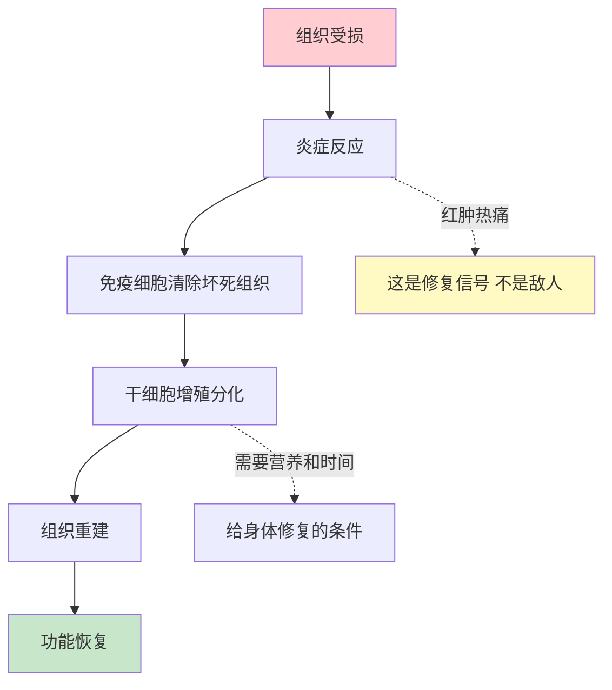
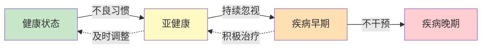
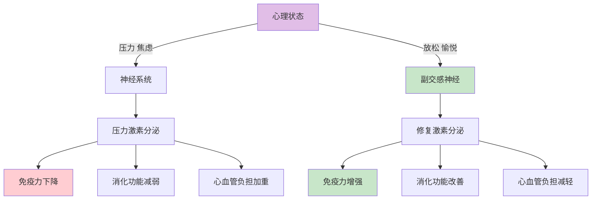
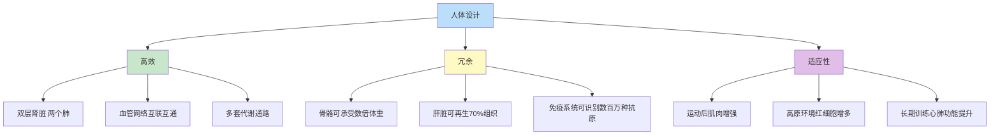
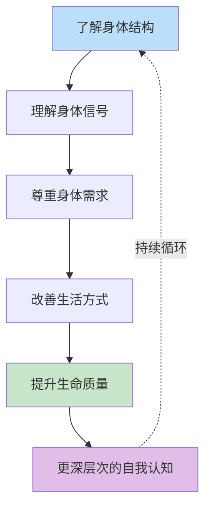

# 人体运转的核心思想：你的身体比你想象的更聪明

> 了解身体的智慧，学会与它合作，而不是对抗。

---

**◆ 核心思想总览**

《人体运转手册》传达了几个贯穿始终的核心思想。这些思想不仅仅是医学知识，更是一种看待生命、看待自身的哲学。

理解这些核心思想，比记住具体的解剖结构更重要。因为它们会改变你与身体的关系。

---

**◇ 核心思想一：身体是自我修复的大师**



你的身体每天都在进行着数以亿计的修复工作。

皮肤划伤了会愈合，骨折了会重新连接，肝脏受损后能再生。这些能力是与生俱来的，不需要你刻意去做什么。

你需要做的，是为身体的自我修复创造条件：

充足的睡眠，让修复系统高效运转；
均衡的营养，为修复提供原材料；
合理的运动，促进血液循环和代谢；
平和的心态，减少压力激素对修复的干扰。

> "最好的医生是你自己的身体，最好的药物是时间和休息。"

**◇ 核心思想二：预防永远优于治疗**



从健康到疾病，从来不是一蹴而就的。

动脉粥样硬化需要十几年才会发展到堵塞血管的程度；
骨质疏松在骨折发生前已经悄然进行了很多年；
大多数癌症从第一个异常细胞到可检测的肿瘤，需要数年时间。

这些时间窗口，就是预防的黄金期。

书中通过大量对比图片展示了这一点：健康的器官与病变的器官之间的差异，往往是从微小的改变开始的。

**◇ 核心思想三：身心是一体的**



《人体运转手册》虽然是一本解剖学著作，但它揭示了一个深刻的事实：心理和身体不是两个独立的部分，而是同一个系统的不同表现。

当你紧张时，胃部会不适；
当你焦虑时，心跳会加速；
当你悲伤时，免疫力会下降；
当你快乐时，身体会分泌有益的内啡肽。

情绪不是虚无的，它有真实的生理基础。

**◇ 核心思想四：人体是进化的杰作**



人体的每一个设计，都经过了数百万年的进化筛选。

你能直立行走，是因为脊椎演化出了独特的生理弯曲；
你能思考创造，是因为大脑皮层发展到了前所未有的复杂度；
你能在极端环境中生存，是因为身体有一套强大的适应机制。

了解这些，不是为了炫耀知识，而是为了学会敬畏。

**◇ 核心思想五：了解身体是自我认知的起点**



古希腊德尔斐神庙上刻着一句话：认识你自己。

这句话的第一层含义，就是认识你自己的身体。

你不了解自己的骨骼，就无法理解为什么久坐会腰痛；
你不了解自己的消化系统，就无法理解为什么饮食不规律会伤胃；
你不了解自己的免疫系统，就无法理解为什么熬夜会让人容易生病。

**认识身体，是认识自己的第一步。**

---

**◆ 核心思想的现实意义**

这些核心思想不是空泛的哲学，而是可以指导日常生活的原则：

学会倾听身体的声音，而不是用意志力去压制；
给身体修复的时间和条件，而不是依赖药物去压制症状；
把预防融入日常习惯，而不是等到生病了才重视；
把身心当作一个整体来照顾，而不是割裂对待；
敬畏身体的智慧，同时用科学知识来辅助它。

---

**◇ 互动话题**

读完这些核心思想，你最有感触的是哪一条？

你有没有曾经忽视身体信号的经历？

欢迎在评论区分享你的故事。

---

**○ 系列导航**

```
┌─────────────────────────────────────┐
│     人类文明经典阅读计划            │
│         科学探索系列                │
├─────────────────────────────────────┤
│ 上一篇：人体运转手册_核心思想       │
│ 下一篇：人体运转手册_职场指南       │
│                                     │
│ ◆ 核心标签                          │
│ 身体认知 | 医学启蒙                 │
│ 健康觉醒 | 人体奥秘                 │
└─────────────────────────────────────┘
```

---

*本文是人类文明经典阅读计划系列文章之一，转载请注明出处。*
