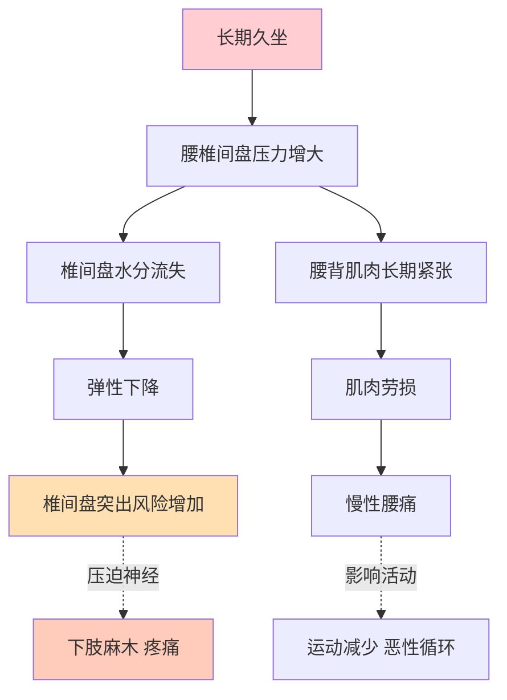
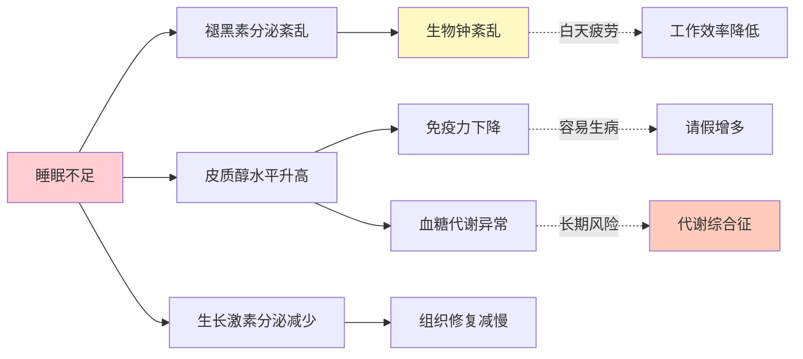
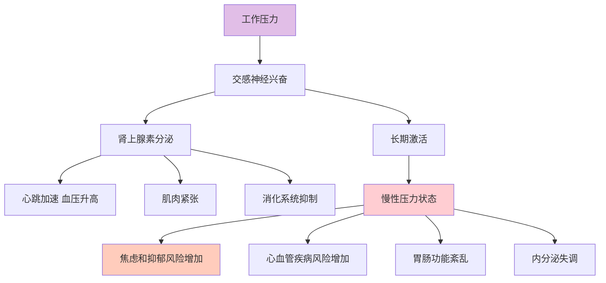
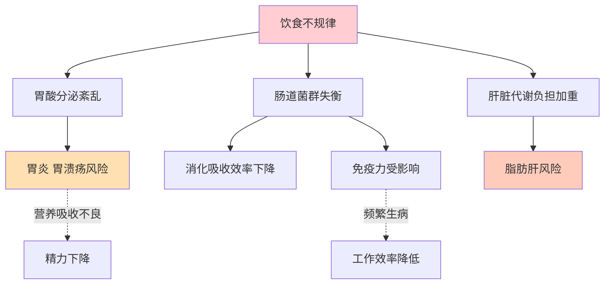

# 读懂身体，才能更好地工作：人体知识给职场人的健康指南

> 久坐、熬夜、压力大？了解身体的底线，你才能走得更远。

---

**◆ 职场人的身体困境**

现代职场人面临着前所未有的身体挑战。

每天坐在电脑前超过8小时；
凌晨还在回复工作消息；
三餐不规律，靠外卖和咖啡续命；
运动量少得可怜，周末只想躺着。

这些习惯的后果，身体正在默默承受。而大多数人，直到体检报告亮红灯才意识到问题。

《人体运转手册》虽然不是一本职场健康指南，但它提供的人体知识，恰恰能帮助我们理解：为什么这些习惯会伤害身体，以及如何科学地调整。

---

**◇ 久坐对脊椎的伤害**



人体脊椎的设计初衷并不是为了长时间坐着。

腰椎间盘在坐姿时承受的压力，是站立时的1.5到2倍。当你的身体前倾看屏幕时，这个压力还会进一步增加。

从解剖学角度看，椎间盘的结构像一个充满凝胶的减震垫。它依赖周围组织的渗透来获取营养和水分。长期受压会阻碍这一过程，导致椎间盘退化。

**职场建议：**

每坐45分钟，站起来活动3到5分钟；
调整座椅高度，让双脚平放地面，膝盖略低于髋部；
屏幕顶部应与眼睛平齐，避免低头；
使用腰靠，维持腰椎的自然生理曲度。

**◇ 熬夜对全身的影响**



睡眠不是可有可无的休息时间，而是身体进行修复和整合的关键时段。

在深度睡眠期间，大脑会清除白天积累的代谢废物；
生长激素主要在睡眠时分泌，负责组织的修复和生长；
免疫系统在睡眠中会释放细胞因子，对抗感染。

长期熬夜，相当于剥夺了身体的自我修复时间。

**职场建议：**

尽量保证每晚7到8小时的睡眠；
睡前一小时减少电子屏幕的使用；
保持规律的作息时间，周末也不要相差太多；
如果必须熬夜，第二天适当补充小睡20到30分钟。

**◇ 压力对身体的连锁反应**



从生理学角度看，压力反应是人类进化出的生存机制。但现代人的压力不再是面对猛兽，而是持续的工作Deadline和人际关系。

身体并不区分这两种压力，它只会持续分泌压力激素。长期的压力激素水平升高，会对多个系统造成损害。

**职场建议：**

学会识别压力的早期身体信号：头痛、胃部不适、肩颈僵硬；
建立工作与休息的边界，下班后给自己真正的休息时间；
尝试正念冥想、深呼吸等放松技巧；
保持社交联系，与信任的人分享压力。

**◇ 饮食不规律对消化系统的影响**



消化系统是一个高度依赖节律的系统。

胃酸的分泌有固定的时间规律，肠道菌群的活性也有自己的生物钟。当你三餐不定时，整个消化系统的节律就会被打乱。

**职场建议：**

尽量在固定时间进餐，让消化系统形成稳定的节律；
早餐不要省略，它是启动一天代谢的关键；
减少高油高糖的外卖频率，选择更均衡的餐食；
随身携带健康零食，避免过度饥饿后暴饮暴食。

---

**◆ 职场健康管理的核心原则**

**一、了解身体的底线**

每个系统都有其承受极限。了解这些极限，不是为了制造焦虑，而是为了在安全范围内高效工作。

**二、把健康当投资，不当消耗**

健康不是工作的对立面，而是高效工作的基础。投资健康，就是投资你的职业寿命。

**三、小改变带来大不同**

不需要彻底改变生活方式。每天站起来活动几次、早睡半小时、带一份健康午餐，这些小的调整累积起来，会产生显著的效果。

**四、定期关注身体信号**

年度体检是必要的，但日常的身体感受同样重要。疲劳、疼痛、消化异常，都是身体在向你传递信息。学会解读这些信息，及时调整。

---

**◇ 职场健康自测清单**

对照以下条目，看看你中了几个：

- 每天久坐超过6小时，且很少起身活动
- 每周有3天以上在晚上12点后入睡
- 三餐时间不固定，经常跳过某一餐
- 感到持续疲劳，即使休息后也难以恢复
- 经常出现头痛、肩颈痛或腰背痛
- 工作压力大时会出现胃部不适或失眠
- 最近一年没有做过全面体检

如果中了3条以上，建议你认真审视自己的工作和生活习惯，做出必要的调整。

---

**○ 系列导航**

```
┌─────────────────────────────────────┐
│     人类文明经典阅读计划            │
│         科学探索系列                │
├─────────────────────────────────────┤
│ 上一篇：人体运转手册_职场指南       │
│ 下一篇：人体运转手册_行动挑战       │
│                                     │
│ ◆ 核心标签                          │
│ 身体认知 | 医学启蒙                 │
│ 健康觉醒 | 人体奥秘                 │
└─────────────────────────────────────┘
```

---

*本文是人类文明经典阅读计划系列文章之一，转载请注明出处。*
