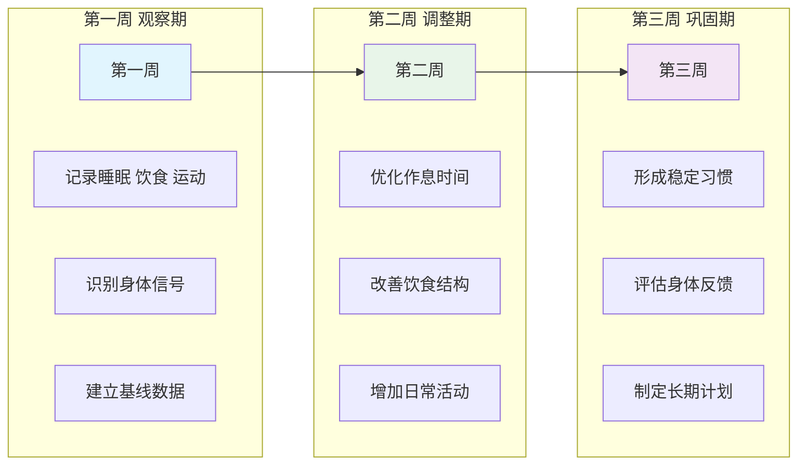
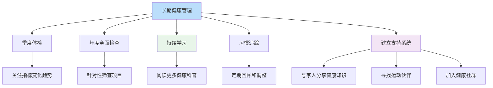

# 21天身体探索挑战：从今天开始，重新认识你的身体

> 知识不行动，等于不知道。用一个月的时间，建立与身体的全新关系。

---

**◆ 为什么要发起这个挑战**

读完《人体运转手册》，如果你只是合上书说了一句真有意思，然后继续熬夜久坐，那这本书的价值就被浪费了90%。

真正的改变发生在行动之后。

这个21天挑战，不是为了让你成为医学专家，而是为了帮你建立三个习惯：

关注身体的信号；
用科学知识指导日常选择；
把健康融入生活的每一个细节。

---

**◇ 挑战总览**



---

**◇ 第一周：观察与记录**

这一周的目标是了解你当前的身体状态，不做评判，只是观察。

**第一天：建立睡眠日志**

记录以下内容：
- 上床时间和入睡时间
- 夜间醒来次数
- 起床时间和清醒感受
- 白天精力变化曲线

**第二天：饮食记录**

记录每一餐的内容、时间和进食后的感受。不需要改变吃什么，只需要如实记录。

**第三天：活动量评估**

估算你今天走了多少步，坐了多久，站了多久，运动了多久。可以用手机或手表辅助记录。

**第四天：身体扫描练习**

找一个安静的时间，从头到脚感受身体的每一个部位。

哪里紧张？哪里疼痛？哪里感觉良好？不需要分析原因，只需要觉察。

**第五天：情绪与身体的关联**

记录今天的情绪变化，以及伴随的身体感受。

焦虑时身体有什么反应？开心时呢？愤怒时呢？

**第六天：姿势觉察**

今天每隔一段时间就检查一下自己的姿势。

坐着的时候背部是否挺直？肩膀是否耸起？头部是否前倾？不要刻意纠正，只是觉察。

**第七天：周总结**

回顾这一周的记录，回答以下问题：
- 你发现了哪些之前没有注意到的身体信号？
- 哪些习惯与《人体运转手册》中的知识相符？
- 哪些习惯可能对你的身体造成负担？

---

**◇ 第二周：小步调整**

这一周，基于第一周的观察，开始做出小的改变。

**第八天：优化入睡时间**

比平时早睡30分钟。睡前一小时放下手机，可以阅读或听轻音乐。

**第九天：改善早餐质量**

吃一顿营养均衡的早餐，包含蛋白质、碳水化合物和蔬果。体会早餐后一上午的精力变化。

**第十天：增加站立时间**

每坐45分钟，站起来活动5分钟。可以伸展、走动、倒水。记录全天的站立次数。

**第十一天：深呼吸练习**

每天安排3次深呼吸练习，每次5分钟。吸气4秒，屏息4秒，呼气6秒。

**第十二天：减少加工食品**

今天的饮食中，尽量减少深度加工食品的比例。选择更接近天然状态的食物。

**第十三天：适度运动**

进行30分钟中等强度的运动，快走、慢跑、瑜伽或骑行都可以。

**第十四天：周总结**

对比第一周，回答以下问题：
- 调整后身体有什么变化？
- 哪些改变让你感觉良好？
- 哪些改变比较困难，原因是什么？

---

**◇ 第三周：形成习惯**

这一周，将第二周的调整固化为可持续的习惯。

**第十五天：固定作息**

设定固定的睡觉和起床时间，今天开始严格执行。

**第十六天：饮食规划**

规划接下来一周的饮食，确保营养均衡。可以提前准备一些健康零食。

**第十七天：运动计划**

制定一个现实可行的运动计划，每周至少3次，每次30分钟。

**第十八天：压力管理**

选择一个压力管理方法，如冥想、写日记、与朋友聊天。今天开始实践。

**第十九天：定期体检意识**

了解你最近一次全面体检的时间。如果超过一年没有体检，预约一次。

**第二十天：知识巩固**

回顾《人体运转手册》中你印象最深的3个知识点，思考它们如何指导你的日常选择。

**第二十一天：制定长期计划**

综合这三周的体验，制定一个长期的健康管理计划。

包括：
- 你决定坚持的3个好习惯
- 你决定减少的3个不良习惯
- 你计划学习的3个人体健康知识

---

**◇ 挑战进阶：长期行动清单**

完成21天挑战后，以下行动可以帮助你将健康意识持续深化：



---

**◆ 挑战注意事项**

**一、量力而行**

这个挑战不是军事训练，不需要完美执行。如果某天没有完成计划，不要自责，第二天继续就好。

**二、关注感受而非数据**

记录数据是为了觉察，不是为了制造焦虑。更重要的是你身体的真实感受。

**三、循序渐进**

不要试图一次性改变所有习惯。每周聚焦一到两个改变，逐步推进。

**四、寻求专业帮助**

如果你在挑战过程中发现身体有持续的不适，请及时就医，不要自行诊断。

---

**◇ 写在最后**

了解人体，最终是为了更好地生活。

这21天只是一个开始。真正的目标，是让你在往后的日子里，每当面对健康相关的选择时，都能基于知识做出更明智的决定。

你的身体陪伴了你每一天，它值得你花时间去了解、去照顾。

---

**○ 系列导航**

```
┌─────────────────────────────────────┐
│     人类文明经典阅读计划            │
│         科学探索系列                │
├─────────────────────────────────────┤
│ 上一篇：人体运转手册_行动挑战       │
│                                     │
│ ◆ 系列完整导航                      │
│ 01 读后感                           │
│ 02 知识图谱图片描述                 │
│ 03 图谱逻辑                         │
│ 04 核心思想                         │
│ 05 职场指南                         │
│ 06 行动挑战                         │
│                                     │
│ ◆ 核心标签                          │
│ 身体认知 | 医学启蒙                 │
│ 健康觉醒 | 人体奥秘                 │
└─────────────────────────────────────┘
```

---

*本文是人类文明经典阅读计划系列文章之一，转载请注明出处。*
