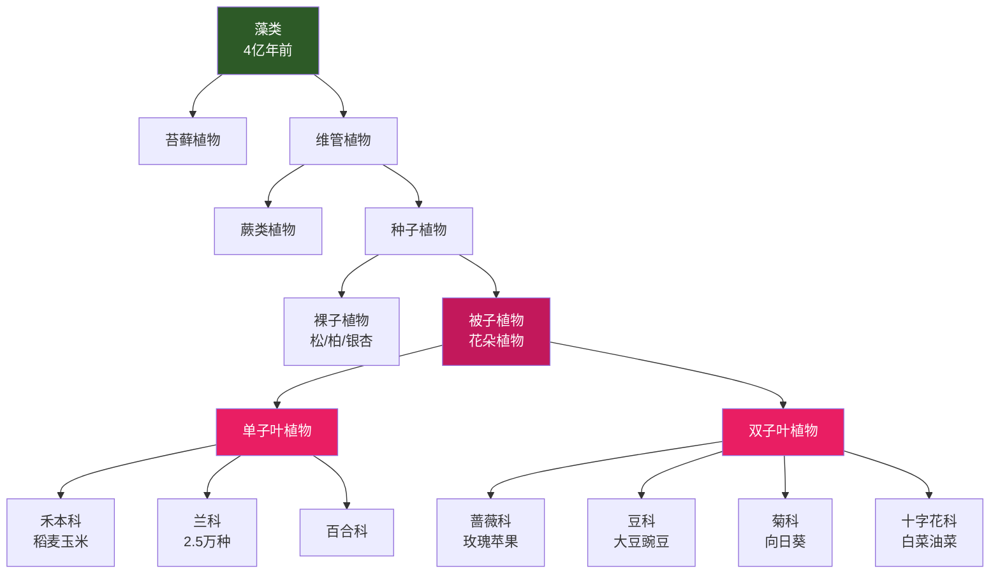
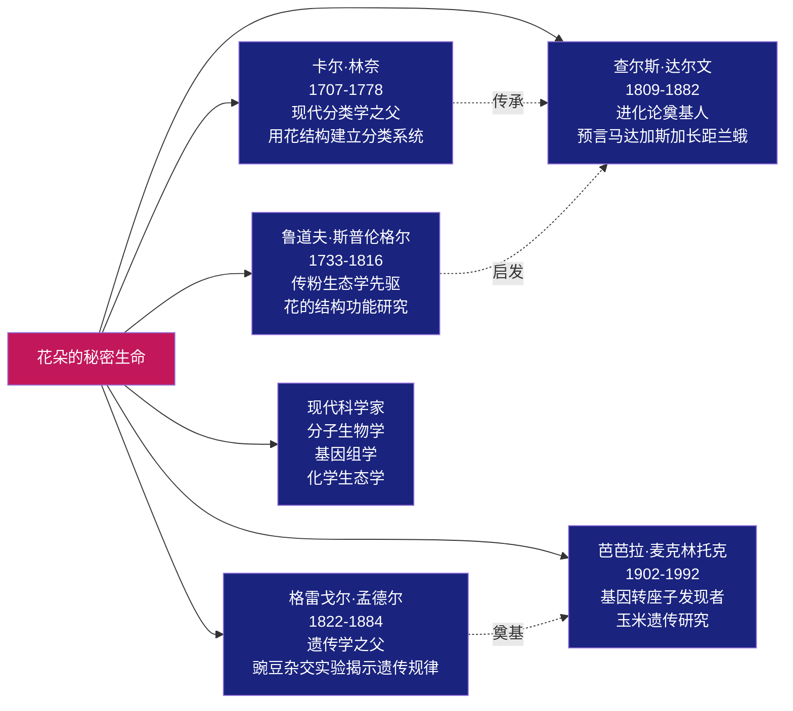
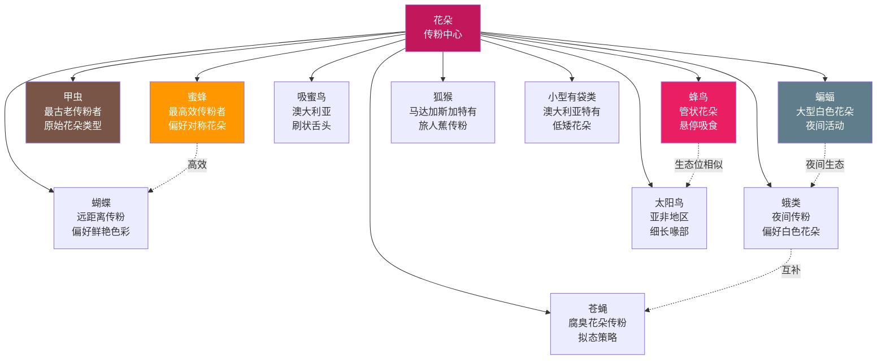

# 知识图谱图片描述：《花朵的秘密生命》

> 本页面提供知识图谱系列图片的文字描述和 Mermaid 图表源码，用于微信公众号排版中的图片生成。

---

## ◇ 图谱一：植物分类演化树

### 图片描述

这是一棵从底部向上生长的进化树。树根位于最下方，代表最古老的植物类群。随着树干向上分叉，每一个分叉点代表一次重要的进化事件。

从下到上依次排列：
- 最底部是"藻类"，用绿色圆点表示
- 向上分出"苔藓植物"和"维管植物"两个主要分支
- 维管植物继续分出"蕨类植物"和"种子植物"
- 种子植物分为"裸子植物"和"被子植物"两大分支
- 被子植物是花朵的归属，这个分支最为繁茂，分出"单子叶植物"和"双子叶植物"，再向下细分到各种目和科

树的整体形态呈现出底部稀疏、顶部繁茂的特点，直观地展示了被子植物（花朵）在进化晚期的爆发式多样化。

### Mermaid 源码

---

## ◇ 图谱二：关键人物关系与贡献

### 图片描述

这是一个以人物为中心的辐射型图谱。中心位置放置"花朵的秘密生命"书名，围绕它分布着六位对花朵研究有重大贡献的历史人物。

每个人物节点旁边标注其核心贡献和活跃年代：
- 卡尔·林奈位于左上方，标注"现代分类学之父，1707-1778"
- 查尔斯·达尔文位于右上方，标注"进化论奠基人，预言长距兰蛾，1809-1882"
- 格雷戈尔·孟德尔位于左侧，标注"遗传学之父，豌豆实验，1822-1884"
- 芭芭拉·麦克林托克位于右侧，标注"玉米基因转座子发现者，1902-1992"
- 鲁道夫·斯普伦格尔位于左下方，标注"传粉生态学先驱，1793"
- 现代分子生物学家群体位于右下方

人物之间用虚线连接，表示他们研究之间的传承和影响关系。

### Mermaid 源码

---

## ◇ 图谱三：传粉路径与协同进化

### 图片描述

这是一个从左到右的流程路径图，展示了一朵花从开放到完成传粉的完整生命周期路径。

路径从左端的"花蕾"开始，经过以下几个关键节点：
- "花蕾形成"：花芽在植物内部发育
- "花朵开放"：花瓣展开，露出花蕊
- "释放信号"：释放香味、展示颜色、分泌花蜜
- "吸引传粉者"：蜜蜂、蝴蝶、蜂鸟、蝙蝠等被吸引
- "花粉传递"：传粉者携带花粉到达另一朵花
- "受精结果"：花粉与胚珠结合，形成果实和种子

每个节点旁边标注了相关的策略和机制。路径的底部标注了时间尺度，从花蕾到结果可能需要数小时到数天不等。

### Mermaid 源码

---

## ◇ 图谱四：花朵-传粉者生态网络

### 图片描述

这是一个中心辐射型网络图，展示花朵与各类传粉者之间复杂的生态关系网络。

图谱中心是"花朵"节点，向外辐射出多条连线，连接到不同类型的传粉者：

**昆虫类传粉者**：
- 蜜蜂：最重要的传粉者，访花效率极高
- 蝴蝶：偏好鲜艳花朵，远距离传粉
- 蛾类：夜间传粉，与白色花朵形成特殊关系
- 甲虫：最古老的传粉者，与原始花朵协同进化
- 苍蝇：被腐臭花朵吸引，模拟腐肉传粉

**鸟类传粉者**：
- 蜂鸟：美洲特有，与管状花朵精准匹配
- 太阳鸟：亚洲和非洲的蜂鸟替代者
- 吸蜜鸟：澳大利亚特有传粉鸟类

**哺乳动物传粉者**：
- 蝙蝠：夜间传粉，与大型白色花朵关联
- 狐猴：马达加斯加特有
- 小型有袋类：澳大利亚特有

每条连线上标注了传粉效率和偏好花朵类型的信息。

### Mermaid 源码

---

## ◇ 图谱使用说明

1. 以上 Mermaid 图表可在支持 Mermaid 的渲染器中直接生成图片
2. 建议使用浅粉色或浅绿色作为图谱的整体背景色
3. 节点颜色已预设，可根据公众号整体配色方案微调
4. 建议在图谱下方添加图注说明来源和参考书目
5. 移动端显示时建议将图表宽度设置为 100%
