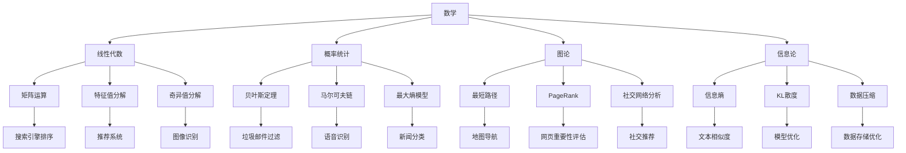
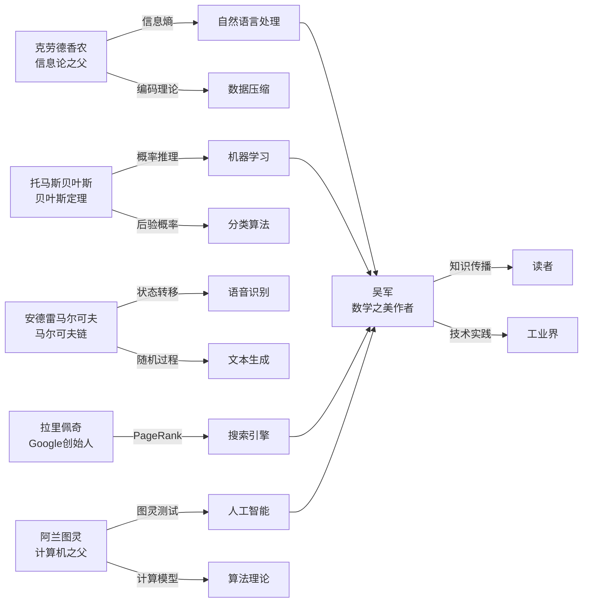
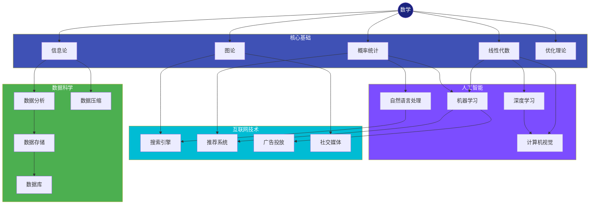

```mermaid
flowchart LR
    subgraph Phase1[问题定义]
        A1[理解业务场景]
        A2[明确输入输出]
        A3[确定评价标准]
    end

    subgraph Phase2[数学建模]
        B1[抽象关键变量]
        B2[建立数学关系]
        B3[验证模型假设]
    end

    subgraph Phase3[算法选择]
        C1[匹配数学工具]
        C2[分析时间复杂度]
        C3[评估空间复杂度]
    end

    subgraph Phase4[工程实现]
        D1[编写核心代码]
        D2[处理边界情况]
        D3[性能调优]
    end

    subgraph Phase5[产品落地]
        E1[用户界面设计]
        E2[A/B测试验证]
        E3[持续迭代优化]
    end

    A1 --> A2 --> A3
    A3 --> B1 --> B2 --> B3
    B3 --> C1 --> C2 --> C3
    C3 --> D1 --> D2 --> D3
    D3 --> E1 --> E2 --> E3

    style Phase1 fill:#e1f5fe
    style Phase2 fill:#f3e5f5
    style Phase3 fill:#fff3e0
    style Phase4 fill:#e8f5e9
    style Phase5 fill:#fce4ec
```

# 《数学之美》知识图谱图片描述

本文档描述《数学之美》系列公众号文章中使用的知识图谱图片，包含 Mermaid 图表代码及详细的设计说明。

---

## 图表一：数学应用领域分类树

### 设计说明

此图采用树状结构，从"数学"这个根节点出发，逐层展开到具体的应用领域。

**视觉层次**：

- 第一层：数学（核心）
- 第二层：四大分支（线性代数、概率统计、图论、信息论）
- 第三层：各分支对应的技术应用
- 第四层：具体产品场景

**配色建议**：根节点使用深色，分支节点使用渐变色，叶子节点使用浅色背景。

### Mermaid 代码

### 图片标注文字

主标题：数学在信息时代的应用全景

副标题：从理论到产品，数学如何驱动现代科技

底部注释：基于《数学之美》核心内容整理

---

## 图表二：关键人物与贡献图谱

### 设计说明

此图展示《数学之美》中提到的重要人物及其贡献，采用网络关系图的形式。

**节点分类**：

- 数学家：理论奠基人
- 计算机科学家：算法发明者
- 工程师：产品实现者

**连线含义**：

- 实线：直接贡献关系
- 虚线：理论影响关系

### Mermaid 代码

### 图片标注文字

主标题：站在巨人的肩膀上

副标题：数学之美背后的关键人物与传承关系

底部注释：箭头方向表示知识或理论的影响方向

---

## 图表三：从问题到解决方案的路径图

### 设计说明

此图展示面对一个实际问题时，如何运用数学思维找到解决方案的完整路径。

**路径阶段**：

1. 问题定义：明确要解决什么
2. 数学建模：将问题转化为数学语言
3. 算法选择：找到合适的数学工具
4. 工程实现：将算法转化为代码
5. 产品落地：最终呈现给用户

### Mermaid 代码

### 图片标注文字

主标题：数学思维的问题解决路径

副标题：从现实问题到优雅方案的五步法

底部注释：每个阶段都可能需要回溯和调整

---

## 图表四：技术生态网络图

### 设计说明

此图展示现代信息技术中各领域的相互关联，突出数学作为底层支撑的地位。

**节点大小**：表示该领域对数学的依赖程度

**连线粗细**：表示两个领域之间的关联强度

### Mermaid 代码

### 图片标注文字

主标题：数学驱动的技术生态网络

副标题：现代信息技术领域的相互关联与数学底座

底部注释：数学是所有上层技术的共同基础

---

## 使用建议

1. 所有图表建议使用专业 Mermaid 渲染工具生成高清 PNG 或 SVG 格式
2. 移动端展示时，建议将复杂图表拆分为多个子图
3. 配色方案需与公众号整体视觉风格保持一致
4. 图表下方应保留标注文字，帮助读者理解
