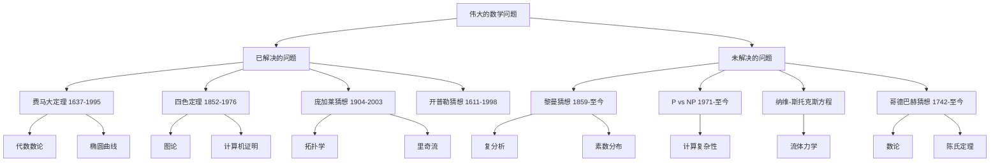
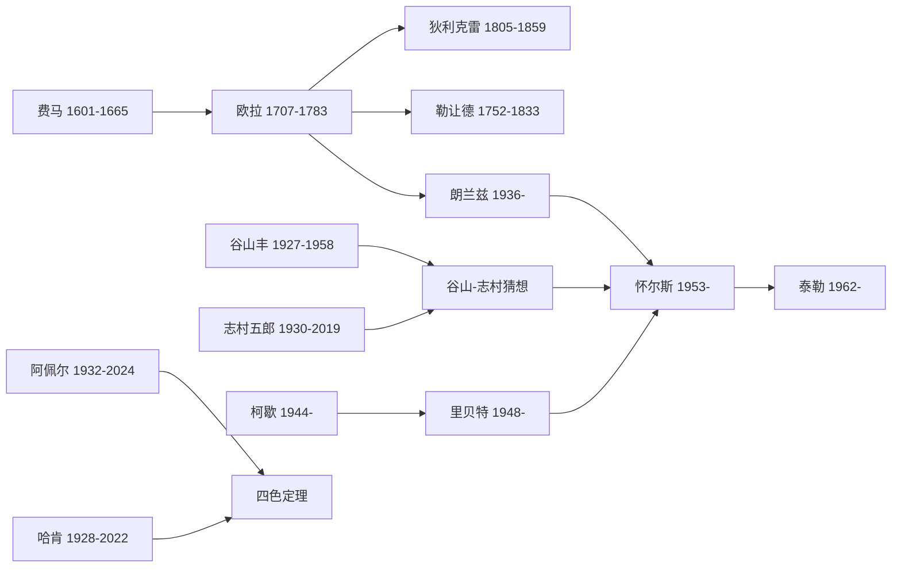
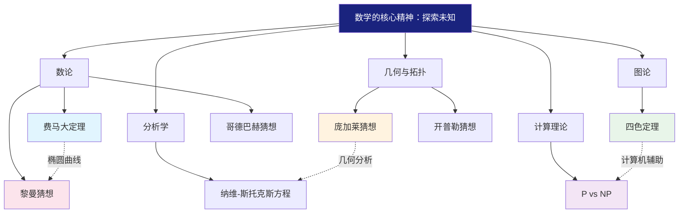

# 知识图谱图片描述

---

## 图一：伟大数学问题分类树

### 图片描述

一张横向展开的树状分类图，从中心节点"伟大的数学问题"向左右两侧分支，展示了数学问题的分类体系。整体采用扁平化设计风格，配色以深蓝、浅蓝、白色为主。

### 节点结构

**根节点：** 伟大的数学问题（深蓝色背景，白色文字）

**一级分支（左侧 - 已解决）：**
- 费马大定理（1637-1995）
  - 代数数论分支
  - 椭圆曲线与模形式
  - 怀尔斯的证明
- 四色定理（1852-1976）
  - 图论
  - 计算机辅助证明
  - 阿佩尔-哈肯方法
- 庞加莱猜想（1904-2003）
  - 拓扑学
  - 佩雷尔曼的证明
  - 里奇流方法
- 开普勒猜想（1611-1998）
  - 几何与堆积问题
  - 黑尔斯的证明

**一级分支（右侧 - 未解决）：**
- 黎曼猜想（1859-至今）
  - 复分析
  - 素数分布
  - 千禧年难题
- P vs NP 问题（1971-至今）
  - 计算复杂性理论
  - 千禧年难题
- 纳维-斯托克斯方程（1822-至今）
  - 流体力学
  - 千禧年难题
- 哥德巴赫猜想（1742-至今）
  - 数论
  - 陈氏定理部分突破

### Mermaid 分类树代码

---

## 图二：数学家关系图谱

### 图片描述

一张网络关系图，展示了解决伟大数学问题的关键人物及其学术传承关系。节点大小代表影响力，连线粗细代表学术关联强度。中心人物是安德鲁·怀尔斯，周围环绕着欧拉、谷山丰、志村五郎、朗兰兹等人。

### 核心人物与关系

**安德鲁·怀尔斯（中心节点）：**
- 师从：约翰·科茨
- 关键灵感来源：谷山-志村猜想
- 合作者：理查德·泰勒
- 证明工具：椭圆曲线、模形式

**谷山丰与志村五郎：**
- 提出谷山-志村猜想
- 连接椭圆曲线与模形式
- 为怀尔斯的证明奠定基石

**朗兰兹：**
- 朗兰兹纲领提出者
- 连接数论与表示论
- 影响深远

**欧拉：**
- 证明 n=3 情况
- 数论奠基人
- 影响了后世无数数学家

**其他关键人物：**
- 费马：提出猜想
- 勒让德：证明 n=7
- 狄利克雷：证明 n=5
- 柯歇：弗赖曲线构造
- 里贝特：证明弗赖曲线非模
- 阿佩尔与哈肯：四色定理证明

### Mermaid 人物关系代码

---

## 图三：费马大定理证明路径图

### 图片描述

一张从左到右的时间线流程图，展示了费马大定理从提出到被证明的358年历程。关键节点用不同颜色的圆形标注，连线表示逻辑推导关系。整体风格为横向时间轴，背景为浅色网格。

### 关键时间节点

**1637年：** 费马在书页空白处写下猜想

**1753年：** 欧拉证明 n=3 的情况

**1825年：** 狄利克雷和勒让德证明 n=5

**1839年：** 拉梅证明 n=7

**1908年：** 沃尔夫斯凯尔设立十万金马克奖金

**1950s：** 谷山-志村猜想提出

**1984年：** 弗赖提出椭圆曲线与费马大定理的联系

**1986年：** 里贝特证明弗赖曲线不可能是模形式

**1993年6月：** 怀尔斯在剑桥宣布证明

**1993年9月：** 审稿发现漏洞

**1994年9月：** 怀尔斯修补漏洞

**1995年：** 论文正式发表

### Mermaid 路径图代码

---

## 图四：数学问题网络关系图

### 图片描述

一张中心辐射状的网络关系图，展示各个伟大数学问题之间的内在联系。中心节点是"数学的核心精神"，向外延伸出数论、拓扑学、图论、分析学等分支，各分支再连接到具体的问题。连线上的文字标注了问题之间的关联方式。

### 网络结构

**中心节点：** 数学的核心精神 - 探索未知

**第一层分支：**
- 数论：研究整数的性质
- 几何与拓扑：研究形状和空间
- 图论：研究关系和连接
- 分析学：研究连续与变化
- 计算理论：研究可计算性

**第二层节点（具体问题）：**
- 数论 --> 费马大定理
- 数论 --> 黎曼猜想
- 数论 --> 哥德巴赫猜想
- 几何与拓扑 --> 庞加莱猜想
- 几何与拓扑 --> 开普勒猜想
- 图论 --> 四色定理
- 分析学 --> 纳维-斯托克斯方程
- 计算理论 --> P vs NP

**横向关联：**
- 费马大定理 -- 椭圆曲线 --> 黎曼猜想
- 四色定理 -- 计算机辅助 --> P vs NP
- 庞加莱猜想 -- 几何分析 --> 纳维-斯托克斯方程

### Mermaid 网络图代码

