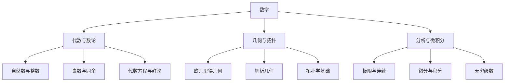
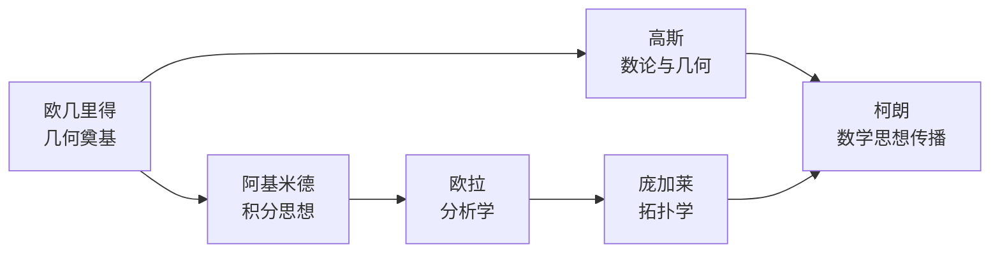
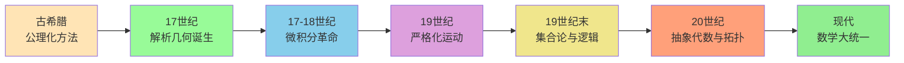
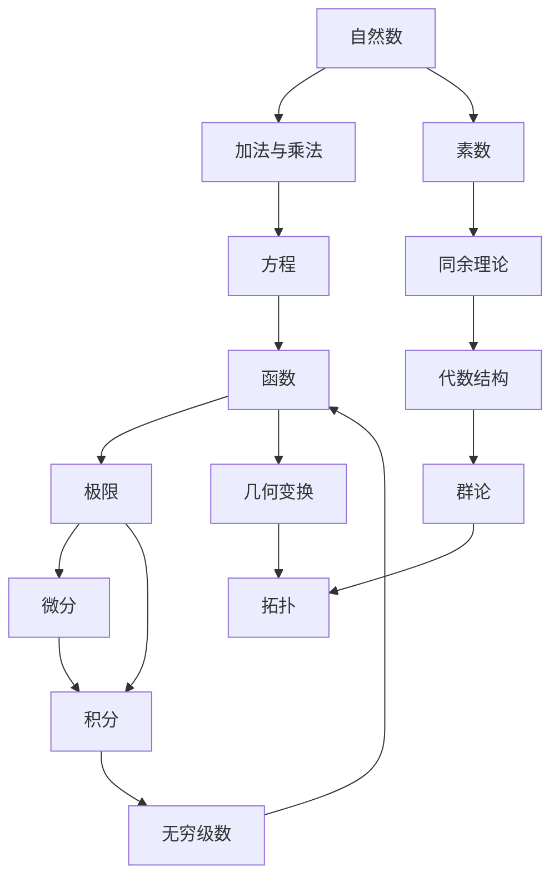

# 《什么是数学》知识图谱图片描述

---

## 图片一：数学分类树

### 图表类型
Mermaid 分类树状图

### 图片描述

这是一张纵向展开的数学知识分类树状图，展示了《什么是数学》一书涵盖的主要数学分支及其层级关系。

**根节点**为"数学"，向下分为三大主干：

**视觉说明：**

- 根节点使用加粗字体，背景色为深蓝色
- 三大主干节点使用圆形图标，分别用红、绿、蓝三色标识
- 子节点使用圆角矩形，文字为黑色
- 连线为灰色箭头，从上至下排列
- 整体布局对称，适合移动端竖屏查看

**排版建议：**

此图适合作为系列文章的"地图"，放在系列开篇或知识图谱逻辑篇中，帮助读者建立全局认知。

---

## 图片二：数学家人物图谱

### 图表类型
Mermaid 人物关系网络图

### 图片描述

这是一张展示《什么是数学》中提到的重要数学家及其贡献与关联的关系图谱。

**核心人物包括：**

- 欧几里得 —— 几何之父
- 阿基米德 —— 微积分先驱
- 高斯 —— 数学王子
- 欧拉 —— 分析大师
- 庞加莱 —— 拓扑学奠基人
- 柯朗 —— 本书作者

**视觉说明：**

- 每个人物节点为矩形，内含姓名和主要贡献
- 箭头方向表示思想传承关系
- 柯朗作为本书作者，节点使用特殊颜色标注
- 整体从左至右排列，体现时间线索

**排版建议：**

此图适合放在"核心思想"篇或"读后感"篇中，帮助读者理解数学思想的历史传承脉络。

---

## 图片三：数学思想演进路径图

### 图表类型
Mermaid 路径图（流程图）

### 图片描述

这是一张展示数学思想从古至今演进路径的流程图，突出关键转折点和思想飞跃。

**视觉说明：**

- 每个阶段使用不同颜色的节点，代表不同历史时期
- 箭头表示时间演进方向
- 节点内包含时期和核心特征
- 配色从暖色到冷色，体现从古典到现代的转变

**关键转折点标注：**

- 古希腊：从直观到公理
- 17世纪：代数与几何的融合
- 17-18世纪：无限小概念的引入
- 19世纪：数学基础的严格化
- 19世纪末：集合论危机与重构
- 20世纪：高度抽象化与统一化

**排版建议：**

此图适合作为"图谱逻辑"篇的核心配图，配合文字解读每个转折点的思想意义。

---

## 图片四：数学概念网络关系图

### 图表类型
Mermaid 网络关系图

### 图片描述

这是一张展示《什么是数学》核心概念之间相互关联的网络图，体现数学知识的内在联系。

**视觉说明：**

- 概念节点为圆形或椭圆形
- 核心概念（极限、函数、几何）节点稍大
- 连线表示概念之间的推导或关联关系
- 布局呈网状，中心区域密集，边缘相对稀疏

**核心关系解读：**

- "极限"是分析学的枢纽，连接微分、积分与级数
- "函数"是贯穿代数与分析的桥梁
- "群论"与"拓扑"代表了现代数学的两大抽象方向
- "素数"到"同余"再到"代数结构"，体现了数论的深化过程

**排版建议：**

此图适合放在"核心概念"篇中，配合文字逐一解读关键概念之间的逻辑关系。

---

## 排版统一规范

### 图片尺寸

- 宽度：750px（适配微信公众号移动端）
- 高度：根据内容自适应，建议不超过 1500px
- 分辨率：72dpi 即可

### 配色方案

| 用途 | 色值 |
|------|------|
| 主色调 | #2C3E50（深蓝灰） |
| 辅助色 | #E74C3C（红）、#27AE60（绿）、#2980B9（蓝） |
| 背景色 | #F8F9FA（浅灰白） |
| 文字色 | #34495E（深灰） |
| 链接色 | #3498DB（亮蓝） |

### 字体建议

- 标题：思源黑体 / PingFang SC，18px，加粗
- 正文：思源宋体 / STSong，15px，行高 1.8
- 注释：13px，浅灰色

---

> **说明：** 以上 Mermaid 图表可直接在支持 Mermaid 的 Markdown 渲染器中生成图片，也可使用在线工具导出为 PNG/SVG 后插入公众号文章。
