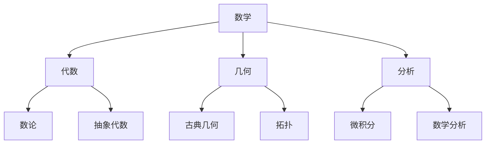
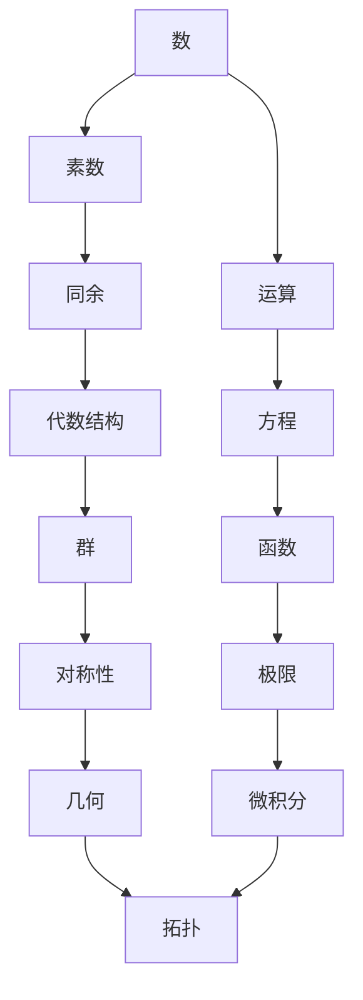

# 《什么是数学》知识图谱逻辑：一张图看懂数学的全貌

> "数学不是孤立的知识点的堆砌，而是一个有机的整体。"

---

## 01 为什么要画知识图谱

很多人学数学的痛苦在于：**只见树木，不见森林。**

你学会了求导，学会了积分，但你可能不知道它们为什么要放在一起学。你背了勾股定理，背了三角函数公式，但你可能没有感受到它们背后的统一逻辑。

柯朗与罗宾写《什么是数学》的初衷，就是要**打破这种碎片化的学习体验**。

知识图谱的作用，就是帮你建立"全局视角"。

---

## 02 图谱的四大维度

本书的知识图谱可以从四个维度来理解：

### 维度一：分类树 —— 数学的骨架

分类树回答的是一个问题：**数学有哪些分支？**

但这只是骨架，不是灵魂。

---

### 维度二：人物谱 —— 思想的传承

数学不是凭空出现的，它是一代代人接力创造的成果。

人物谱回答的是：**这些思想是谁提出的？它们如何传承？**

理解这一点，你就会明白：数学不是冷冰冰的真理，而是**有温度的思想史**。

---

### 维度三：路径图 —— 历史的演进

路径图回答的是：**数学是如何一步步变成今天这个样子的？**

每一个箭头，都是一次思想的飞跃。

---

### 维度四：网络图 —— 概念的关联

网络图回答的是：**这些概念之间有什么关系？**

这是图谱中最有价值的部分。它揭示了数学的内在统一性。

---

## 03 图谱的核心逻辑

四张图看似独立，其实有一条主线贯穿始终：

> **从具体到抽象，从特殊到一般，从直观到严格。**

这就是数学发展的基本规律，也是《什么是数学》一书的编排逻辑。

### 具体到抽象

- 自然数是具体的，群是抽象的
- 三角形是具体的，拓扑空间是抽象的
- 面积计算是具体的，积分是抽象的

### 特殊到一般

- 勾股定理是特殊的，向量空间是一般的
- 二次方程是特殊的，代数方程理论是一般的
- 圆的面积是特殊的，测度论是一般的

### 直观到严格

- 古希腊的几何是直观的，希尔伯特的公理体系是严格的
- 牛顿的微积分是直觉的，魏尔斯特拉斯的极限定义是严格的
- 庞加莱的拓扑猜想是直觉的，后来的严格证明是严密的

---

## 04 图谱对你有什么用

知识图谱不只是"好看"，它有三个实际用途：

### 用途一：建立知识框架

当你面对一个陌生的数学概念时，先看它在图谱中的位置。它是哪个分支的？它的前置知识是什么？它和哪些概念相关？

**有了框架，新知识就不再是孤岛。**

### 用途二：发现认知盲区

对照图谱，你可以快速发现自己哪些地方是薄弱的。是数论基础不够？还是对极限的理解不深？

**图谱就是一张"认知地图"，帮你精准定位。**

### 用途三：培养系统思维

数学图谱的思维方式，可以迁移到任何领域。

- 学编程，也可以画"编程语言知识图谱"
- 学管理，也可以画"管理学概念图谱"
- 做任何事，先建立全局视角，再深入细节

**这就是数学思维的力量。**

---

## 05 互动话题

◆ 你觉得哪个数学概念最难理解？为什么？
◆ 你有没有自己画过某个领域的知识图谱？
◆ 你觉得"从具体到抽象"这个规律在其他领域也适用吗？

欢迎在评论区分享。

---

## 系列导航

| 上篇 | 本篇 | 下篇 |
|------|------|------|
| [06-读后感](#) | **16-知识图谱逻辑** | [16-核心思想](#) |

---

> **核心标签：** #数学本质 #核心概念 #思想启蒙 #逻辑推理 #经典阅读

---

*本文是「人类文明经典阅读计划」系列第16期，解读柯朗与罗宾《什么是数学》的知识图谱逻辑。下期将深入探讨本书的核心思想。*
