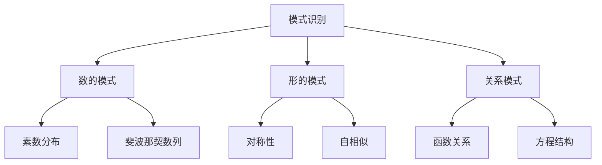
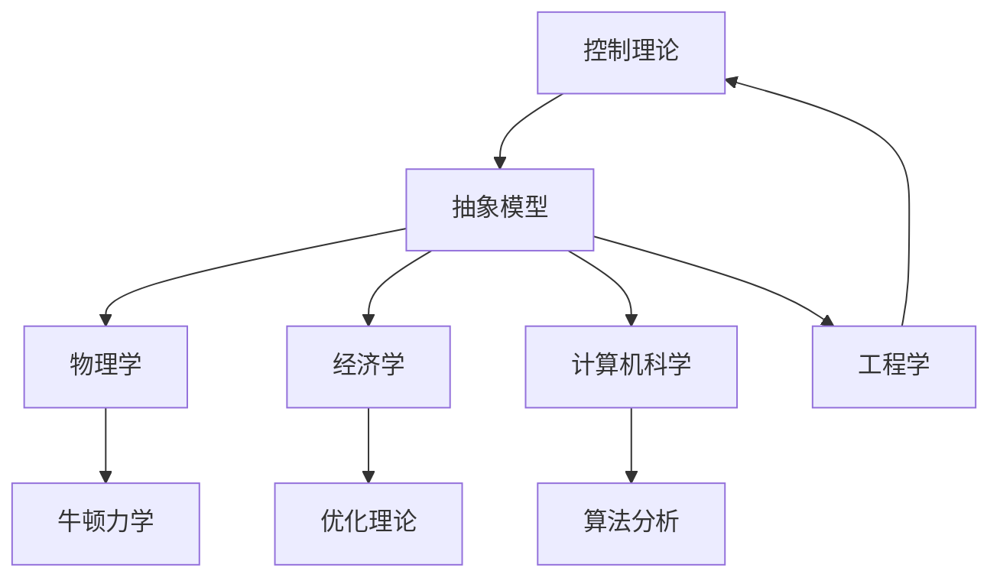

# 《什么是数学》核心思想：数学到底在研究什么

> "数学的核心不在于计算，而在于理解。" —— 理查德·柯朗

---

## 01 一个根本问题

《什么是数学》这本书，从书名开始就在追问一个根本问题：

**数学到底是什么？**

柯朗没有给出一个简单的定义，而是通过一整本书的内容，带读者亲自体验数学的思考过程。

读完之后，你会得到一个属于自己的答案。

---

## 02 核心思想一：数学是关于模式的科学

数学家哈代曾说："数学是模式的科学。"

柯朗在书中反复展示了这一点：

- 数论研究数字之间的模式
- 几何研究空间形状的模式
- 代数研究运算关系的模式
- 拓扑研究结构不变性的模式

**模式，就是重复出现的规律。**

理解这一点，你就理解了数学家的思维方式：

> 他们不是在解题，而是在**发现模式**。

---

## 03 核心思想二：证明是数学的灵魂

数学和其他学科最大的区别是什么？

**是证明。**

物理学家可以通过实验验证理论，但数学家不能靠实验来证明一个定理。他们必须用逻辑推理，从已知的前提出发，一步步推出结论。

柯朗在书中详细展示了几个经典证明：

### 例子一：素数有无穷多个

欧几里得的证明只有几行，但堪称逻辑美的典范：

1. 假设素数只有有限个
2. 把它们全部乘起来，再加一
3. 这个新数要么本身就是素数，要么有新的素因子
4. 无论哪种情况，都出现了新的素数
5. 矛盾。所以素数有无穷多个

**简洁、优雅、无懈可击。**

### 例子二：根号二是无理数

1. 假设根号二是有理数，即可以写成 p/q 的形式
2. 推导得出 p 和 q 都是偶数
3. 但 p/q 应该是最简分数
4. 矛盾。所以根号二不是有理数

这两个证明的共同特点是：

> 用最少的前提，推出最深刻的结论。

---

## 04 核心思想三：抽象是数学的力量

数学之所以能应用于如此广泛的领域，恰恰是因为它的**抽象性**。

柯朗用一个精彩的比喻来说明这一点：

> 抽象就像提炼精华。你把苹果、橘子、香蕉的共同特征抽出来，得到了"水果"这个概念。然后你可以研究"水果"的性质，而不需要每次都从头研究具体的水果。

数学的抽象层次：

- 从具体的数字，抽象出"数"的概念
- 从具体的图形，抽象出"空间"的概念
- 从具体的运算，抽象出"代数结构"的概念

**每抽象一次，适用范围就扩大一次。**

---

## 05 核心思想四：直观与严格的统一

柯朗在书中反复强调一个观点：

> **好的数学教育，应该在直观和严格之间找到平衡。**

太注重直观，会失去数学的严谨性；太注重严格，会让数学变得枯燥难懂。

《什么是数学》的写作风格，正是这种理念的体现：

- 每一个概念都有直观的几何或物理背景
- 每一个定理都有严格的逻辑证明
- 读者既能"看到"数学，也能"理解"数学

这种思维方式，对今天的我们依然有启发：

**做任何事，既要有直觉判断，也要有逻辑验证。**

---

## 06 核心思想五：数学的美

柯朗没有回避一个重要的话题：**数学是美的。**

这种美不是装饰性的，而是内在的、结构性的：

- 欧几里得证明素数无穷多的**简洁之美**
- 欧拉公式 e 的 i 次方加一等于零的**统一之美**
- 分形图形的**自相似之美**
- 对称群的**结构之美**

数学家研究数学，很大程度上是因为**美**。

柯朗写道：

> "数学的美不是外在的装饰，而是内在的和谐。就像一首好诗，它的力量不在于华丽的辞藻，而在于思想与表达的完美统一。"

---

## 07 这些思想对今天的意义

在AI时代，这些思想变得更加重要：

| 思想 | 现代意义 |
|------|----------|
| 模式识别 | 机器学习的核心能力 |
| 逻辑证明 | 程序正确性验证的基础 |
| 抽象思维 | 系统设计的必备能力 |
| 直观与严格 | 数据驱动的决策方法论 |
| 审美判断 | 区分好设计与坏设计的能力 |

**数学思想没有过时，它只是换了个样子，渗透到了每一个领域。**

---

## 08 互动话题

◆ 你觉得数学美吗？如果美，美在哪里？
◆ 你在工作中有没有用到"抽象思维"？能举个例子吗？
◆ 你觉得"直观"和"严格"哪个更重要？

欢迎在评论区讨论。

---

## 系列导航

| 上篇 | 本篇 | 下篇 |
|------|------|------|
| [16-图谱逻辑](#) | **16-核心思想** | [16-职场指南](#) |

---

> **核心标签：** #数学本质 #核心概念 #思想启蒙 #逻辑推理 #经典阅读

---

*本文是「人类文明经典阅读计划」系列第16期，解读柯朗与罗宾《什么是数学》的核心思想。下期将探讨数学思维在职场中的应用。*
