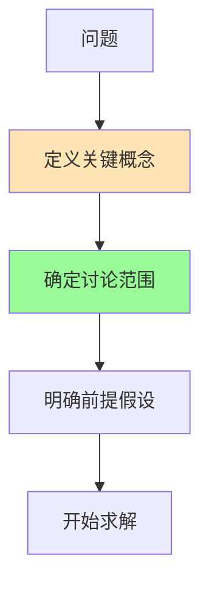

# 从《什么是数学》学到的职场生存法则：理性思维的力量

> "数学教给我们的不是公式，而是一种思考世界的方式。"

---

## 01 数学思维不是数学家的专利

很多人觉得，数学思维是数学家的事情，和自己的工作无关。

但柯朗在《什么是数学》中传递的核心信息是：

> **数学思维是一种通用的理性思维方式，它适用于任何需要分析和决策的场景。**

职场中，你每天都在做决策：

- 这个方案选A还是选B？
- 这个项目的优先级怎么排？
- 这个数据说明了什么趋势？
- 这个问题的根本原因是什么？

每一个决策，都可以用数学思维来提升质量。

---

## 02 法则一：定义清晰，才能讨论

数学家在讨论任何问题之前，都会先做一件事：**明确定义。**



职场中的常见误区：

- 开会讨论半小时，发现大家对"用户增长"的定义不一样
- 两个部门争论"谁该负责"，但"负责"的边界从来没人明确过
- 领导说"提升效率"，但没人问过"效率具体指什么"

**数学思维第一条：先定义，再讨论。**

实操方法：

- 在会议开始时，用两分钟对齐关键概念的定义
- 在写方案时，先写清楚"本文中的XX指的是……"
- 在分工时，明确"完成"的标准是什么

---

## 03 法则二：从假设出发，一步步推导

数学证明的基本结构是：

```
已知条件 + 公理 --> 逻辑推理 --> 结论
```

职场中，这个结构同样适用。

### 好的推理

> "根据上季度的数据，我们的用户留存率下降了15%。假设这个趋势继续，下季度留存率会再降10%。为了扭转这个趋势，我们需要在以下三个方面投入资源……"

这是一个完整的推理链条：数据 --> 假设 --> 推导 --> 建议。

### 不好的推理

> "我觉得我们应该做短视频，因为竞品都在做。"

这里缺少了什么？

- 没有数据支持
- 没有分析"竞品在做"和"我们该做"之间的因果关系
- 没有推导"做了会怎样"

**数学思维第二条：让你的决策过程可追溯、可验证。**

---

## 04 法则三：关注不变量

拓扑学中有一个核心概念：**不变量**。

不管一个形状怎么变形，只要不撕裂、不粘连，它的某些性质是不变的。比如"洞"的数量。

职场中，"不变量思维"极其珍贵：

### 什么是不变的？

- 用户的核心需求是不变的（方便、便宜、好用）
- 商业的本质是不变的（创造价值、获取回报）
- 团队的底层逻辑是不变的（信任、协作、成长）

### 什么是变化的？

- 产品形态在变
- 营销渠道在变
- 管理工具在变

**数学思维第三条：在变化中抓住不变的东西。**

实操方法：

- 做战略规划时，先问"我们的核心竞争力是什么？"
- 面对行业变革时，问"哪些底层逻辑没有变？"
- 个人发展时，问"我的核心能力是什么？哪些能力不会过时？"

---

## 05 法则四：极端情况测试

数学家在验证一个猜想时，会测试它的极端情况：

- 如果 n 等于 0，公式还成立吗？
- 如果数字是负数，结论还成立吗？
- 如果空间是无限维的，定理还适用吗？

职场中，你也可以用这个方法测试方案：

### 压力测试你的方案

- 如果预算砍掉一半，这个方案还可行吗？
- 如果关键人员离职，项目还能推进吗？
- 如果市场突然变化，我们的策略还有优势吗？

### 极端用户测试

- 如果用户完全不懂产品，他们能用吗？
- 如果用户是专业人士，他们会觉得太简单吗？
- 如果并发量增加 10 倍，系统扛得住吗？

**数学思维第四条：好的方案，必须经得起极端情况的检验。**

---

## 06 法则五：用数学家的耐心对待问题

柯朗在书中写道：

> "数学问题往往不能立刻解决，需要耐心和持续的努力。"

职场中，我们太容易急躁：

- 方案被否了，立刻灰心
- 数据不好，立刻放弃
- 学了几天没效果，立刻换方向

但数学家会怎么做？

- 一个问题可能研究几年、几十年
- 费马大定理，被证明了 358 年
- 庞加莱猜想，被研究了近一个世纪

**数学思维第五条：重要的问题，值得花时间去思考。**

实操方法：

- 遇到复杂问题，给自己三天时间深入思考，不要急着给方案
- 每周留出两小时的"深度思考"时间，不被打扰
- 建立一个"问题笔记"，持续记录和追踪重要问题

---

## 07 法则六：追求简洁

数学家追求简洁的证明。一个好的证明，不应该有多余的步骤。

职场沟通也是如此：

### 好的沟通

> "Q2目标：新增用户 10 万。策略：三个渠道各投放 3 万，老用户转介绍 1 万。预算：50 万。风险：渠道成本可能上涨 20%。"

### 不好的沟通

> "嗯，我觉得吧，我们下个季度可能要做一些用户增长的事情，然后呢，可能需要投一些渠道，具体的数字我还没想好，反正大概就是这个意思……"

**数学思维第六条：用最少的词，说清楚最重要的事。**

---

## 08 总结：数学思维的职场清单

| 数学思想 | 职场应用 |
|----------|----------|
| 明确定义 | 开会前先对齐概念 |
| 逻辑推导 | 决策过程可追溯 |
| 不变量 | 在变化中抓住核心 |
| 极端测试 | 方案压力测试 |
| 耐心 | 给复杂问题时间 |
| 简洁 | 沟通精炼高效 |

---

## 09 互动话题

◆ 你在工作中有没有因为"没定义清楚"而浪费时间？
◆ 你觉得"不变量思维"在你的行业里适用吗？
◆ 你有过"用极端情况测试方案"的经历吗？

欢迎在评论区分享。

---

## 系列导航

| 上篇 | 本篇 | 下篇 |
|------|------|------|
| [16-核心思想](#) | **16-职场指南** | [16-行动挑战](#) |

---

> **核心标签：** #数学本质 #核心概念 #思想启蒙 #逻辑推理 #经典阅读

---

*本文是「人类文明经典阅读计划」系列第16期，将柯朗与罗宾《什么是数学》中的数学思维应用于职场。下期将给出阅读本书的行动挑战。*
