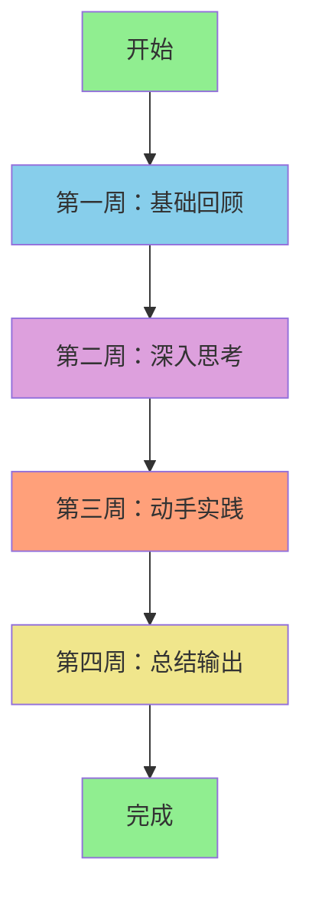
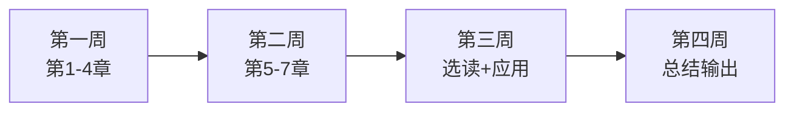

# 《什么是数学》30天阅读挑战：用行动重新认识数学

> "理解数学的最好方式，就是亲自去体验它。"

---

## 01 为什么需要挑战

读一本书，和真正理解一本书，是两回事。

《什么是数学》不是一本可以"刷完"的书。它需要你停下来，思考，甚至动手算一算。

这个 30 天挑战的目的，不是让你"读完"这本书，而是让你**体验数学思维**。

---

## 02 挑战总览

---

## 03 第一周：基础回顾（第1-7天）

### 目标

回顾数学基础概念，重新理解那些你"学过但没真正理解"的东西。

### 每日任务

**第 1 天：自然数的本质**

- 阅读《什么是数学》第一章关于自然数的内容
- 思考：什么是"数"？它是一个具体的东西，还是一个抽象的概念？
- 写下一句话，定义"数"

**第 2 天：数制系统**

- 了解十进制、二进制、十六进制的关系
- 尝试把一个十进制数转换为二进制
- 思考：为什么我们习惯用十进制？

**第 3 天：几何基础**

- 阅读欧几里得几何的公理体系
- 列出你能想到的五条公理
- 思考：这些公理是"显然正确"的吗？

**第 4 天：代数入门**

- 回顾一次方程和二次方程的解法
- 理解"解方程"的本质是什么
- 思考：为什么要用字母代替数字？

**第 5 天：函数概念**

- 重新理解"函数"的定义
- 画出 y 等于 x 平方、y 等于 1/x 的图像
- 思考：函数描述的是什么关系？

**第 6 天：坐标几何**

- 理解笛卡尔坐标系的革命性意义
- 在纸上画一个坐标系，标出几个点
- 思考：几何和代数是如何通过这个工具结合起来的？

**第 7 天：本周总结**

- 回顾前六天的思考笔记
- 写下本周最大的一个"恍然大悟"
- 发到朋友圈或学习群，和他人交流

---

## 04 第二周：深入思考（第8-14天）

### 目标

深入理解数学的核心概念，体验"从具体到抽象"的过程。

### 每日任务

**第 8 天：极限的直觉**

- 阅读关于极限的内容
- 思考：0.999…… 等于 1 吗？为什么？
- 写下你的理解

**第 9 天：微分是什么**

- 理解导数的几何意义（切线斜率）
- 画一个曲线，用手动画出几个点的切线
- 思考：导数描述的是什么？

**第 10 天：积分是什么**

- 理解积分的几何意义（面积）
- 把一个不规则图形分成若干小矩形，估算面积
- 思考：微分和积分为什么是互逆的？

**第 11 天：无穷级数**

- 了解等比数列求和公式
- 验证：二分之一加四分之一加八分之一加…… 等于 1
- 思考：无穷多个数相加，为什么可以等于一个有限的数？

**第 12 天：素数与数论**

- 阅读关于素数的章节
- 列出前 20 个素数
- 思考：素数有规律吗？

**第 13 天：欧几里得算法**

- 理解辗转相除法求最大公约数
- 用 48 和 18 来验证
- 思考：这个算法为什么一定能终止？

**第 14 天：本周总结**

- 回顾本周的思考笔记
- 对比第一周，你的理解有什么变化？
- 写一段话，描述你对"数学是什么"的新认识

---

## 05 第三周：动手实践（第15-21天）

### 目标

把数学思维应用到实际问题中，体验"学以致用"。

### 每日任务

**第 15 天：用函数思维分析工作**

- 把你的工作输出写成一个"函数"
- 输入是什么？输出是什么？中间过程是什么？
- 优化这个"函数"，让它更高效

**第 16 天：用极限思维做决策**

- 选一个你正在犹豫的决策
- 问自己：如果这个决策的效果"趋近于零"，它还值得做吗？
- 如果效果"趋近于无穷大"呢？
- 用这个思路重新评估你的决策

**第 17 天：用几何思维画流程图**

- 把你工作中最复杂的一个流程画出来
- 用图形的直觉来发现流程中的"冗余"和"断点"
- 优化它

**第 18 天：用代数思维做预算**

- 列出你一个月的收入和支出
- 设 x 为某个变量（比如外卖费用）
- 写出你的月度结余公式
- 通过调整 x 来规划下个月的预算

**第 19 天：用概率思维评估风险**

- 列出你当前面临的三个主要风险
- 为每个风险估计"发生概率"和"影响程度"
- 用"概率乘以影响"来排序
- 制定应对策略

**第 20 天：用拓扑思维看组织**

- 把你的团队或公司画成一个"拓扑结构"
- 谁是节点？谁是连接？
- 如果去掉某个节点，结构会怎样？
- 思考：什么样的组织结构是"连通"的？

**第 21 天：本周总结**

- 回顾本周的实践笔记
- 哪个应用场景让你最有收获？
- 写一篇短文，分享你的实践心得

---

## 06 第四周：总结输出（第22-30天）

### 目标

整理一个月的学习成果，形成自己的知识体系。

### 每日任务

**第 22-24 天：制作个人知识图谱**

- 根据这一个月的学习，画出你自己的"数学知识图谱"
- 不需要和书上一模一样，用你自己的理解来组织
- 可以手绘，也可以用工具

**第 25-26 天：写读后感**

- 用 1500 字左右，写下你对《什么是数学》的整体感受
- 重点不是总结内容，而是你的思考和收获
- 参考以下结构：
  - 读之前的认知
  - 读过程中的关键顿悟
  - 读之后的改变
  - 给其他读者的建议

**第 27-28 天：分享给他人**

- 把你的知识图谱或读后感分享给同事、朋友或学习群
- 听一听他们的反馈
- 讨论：数学思维在他们的领域中有什么用？

**第 29 天：制定持续学习计划**

- 数学的世界很大，30 天只是开始
- 列出你接下来想深入了解的三个方向：
  - 方向一：_________
  - 方向二：_________
  - 方向三：_________
- 为每个方向找到一本推荐书目

**第 30 天：庆祝与回顾**

- 回顾这一个月的所有笔记
- 写下一句话，总结这个挑战对你的意义
- 恭喜你，完成了挑战！

---

## 07 挑战工具包

### 推荐阅读顺序

### 辅助资源

- 《什么是数学》原著，柯朗与罗宾著
- 笔记本一支笔（强烈建议手写）
- 一个安静的思考空间
- 一个愿意交流的学习伙伴

### 注意事项

- 每天投入 30-60 分钟即可，不要贪多
- 遇到不理解的地方，不要跳过，停下来思考
- 不需要做完所有数学题，重点在"理解"而非"计算"
- 如果某天没完成，第二天补上，不要因为一天落下就放弃

---

## 08 互动话题

◆ 你准备参加这个 30 天挑战吗？
◆ 你觉得哪一周的任务最有挑战性？
◆ 你希望得到什么样的支持和陪伴？

在评论区留下你的"挑战宣言"，和其他读者一起开始吧。

---

## 系列导航

| 上篇 | 本篇 | 下篇 |
|------|------|------|
| [16-职场指南](#) | **16-行动挑战** | [17-系列收官](#) |

---

> **核心标签：** #数学本质 #核心概念 #思想启蒙 #逻辑推理 #经典阅读

---

*本文是「人类文明经典阅读计划」系列第16期，提供柯朗与罗宾《什么是数学》的 30 天阅读挑战。欢迎加入挑战，一起重新认识数学。*
