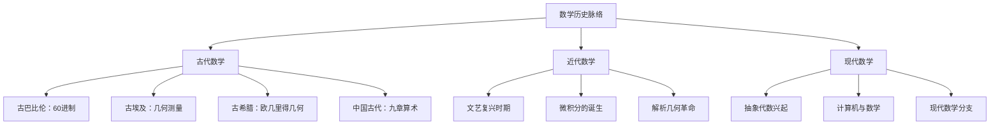
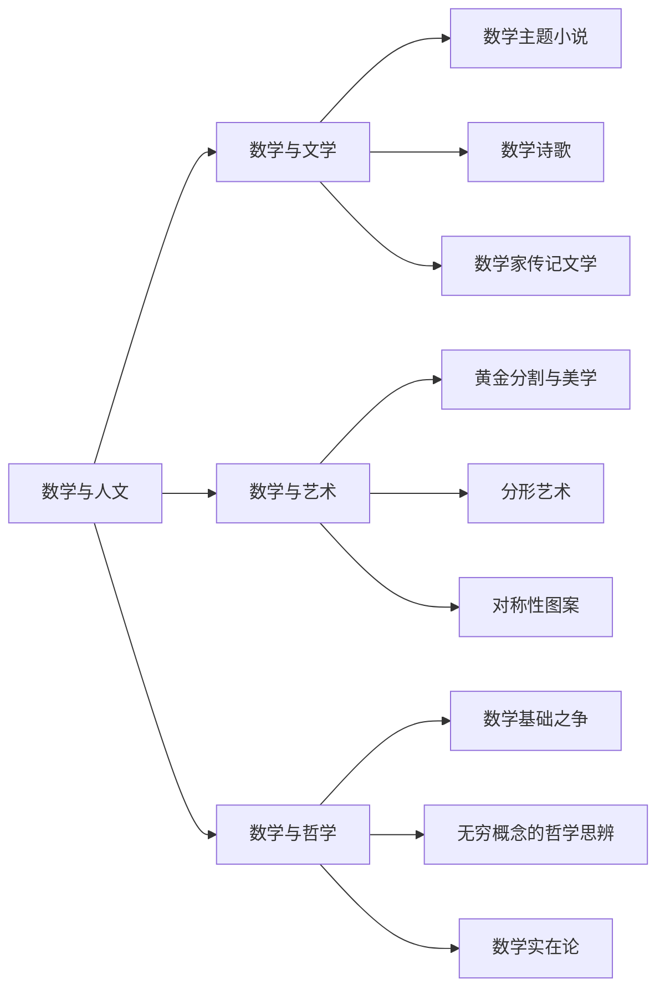
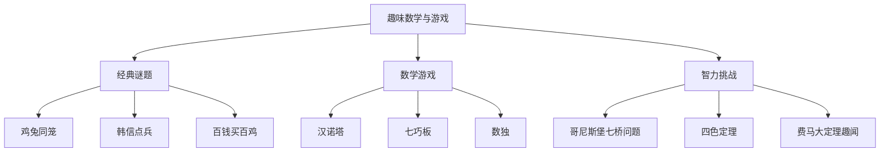
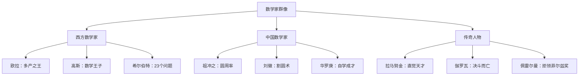
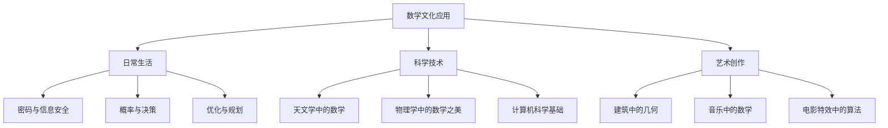

# 一张图读懂数学文化 | 知识图谱图片描述

> 本文用于描述《数学文化透视》知识图谱图片内容，方便视觉障碍读者及 AI 辅助理解。

---

## ◆ 图谱概览

本知识图谱以"数学文化"为核心，向外辐射出五大主题分支，整体呈现为一棵枝繁叶茂的"知识树"形态。

### 整体结构描述

- **中心节点**："数学文化"（用圆形节点表示，位于图谱正中央）
- **五大主干分支**：从中心节点向五个方向延伸，分别用不同颜色区分
- **二级子节点**：每个主干分支下包含 3-5 个子主题
- **三级叶节点**：每个子主题下包含具体的人物、事件、概念或作品

---

## ◆ 分支一：数学历史脉络

**颜色标识**：深蓝色

**结构**：自上而下的时间轴形态

**视觉特征**：时间轴从古代向现代自然延伸，节点大小按历史重要性递减排列。

---

## ◆ 分支二：数学与人文

**颜色标识**：紫红色

**结构**：网状关联图，体现数学与其他学科的交叉

**视觉特征**：三个子领域相互交织，形成网状结构，体现学科间的紧密联系。

---

## ◆ 分支三：趣味数学与游戏

**颜色标识**：翠绿色

**结构**：放射状布局，中心为"趣味数学"，四周环绕各类游戏和谜题

**视觉特征**：色彩明快，用几何图形标注各类游戏类型，增加视觉趣味性。

---

## ◆ 分支四：数学家群像

**颜色标识**：金黄色

**结构**：人物关系图谱，展现数学家之间的师承、合作与竞争关系

**视觉特征**：用圆形头像图标标注每位数学家，用不同连线类型表示师承（实线）、合作（虚线）、竞争（箭头）关系。

---

## ◆ 分支五：数学文化应用

**颜色标识**：橙红色

**结构**：从抽象到具体的层次结构

**视觉特征**：用图标辅助说明每类应用场景，增强直观理解。

---

## ◆ 图谱路径示例

以下路径展示了从"数学游戏"到"严肃数学"的知识演进过程：

这条路径揭示了一个重要观点：**很多深刻的数学理论，都起源于看似简单的趣味问题。**

---

## ◆ 图谱使用说明

1. **中心辐射阅读**：从"数学文化"中心节点出发，沿任一主干分支深入
2. **跨分支联想**：注意观察不同分支间的隐性联系，如"高斯"同时出现在历史和人物分支中
3. **路径追踪**：沿着特定路径（如游戏到理论），理解数学知识的演进逻辑

---

## ◇ 系列导航

| 上一篇 | 下一篇 |
|--------|--------|
| [01-读后感](#) | [03-图谱逻辑](#) |

---

> 本文是「人类文明经典阅读计划」系列第 17 篇的配套图谱描述。
>
> 标签：`#数学文化` `#趣味历史` `#人文数学` `#轶事趣闻`
