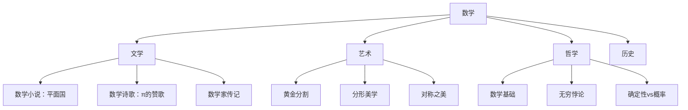
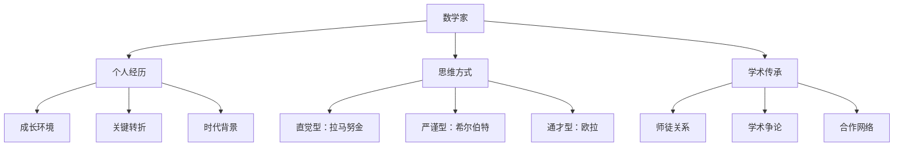

# 数学文化的底层逻辑 | 知识图谱深度解读

> 知识图谱不是简单的信息罗列，它揭示了数学文化的内在结构和演化规律。

---

## ◆ 为什么需要知识图谱

《数学文化透视》涵盖的内容极其丰富：从古巴比伦的泥板文字，到现代计算机算法；从欧几里得的《几何原本》，到拉马努金的手稿笔记。

面对如此庞杂的信息，如何建立清晰的认知框架？

**知识图谱**给出了答案。它将看似散落的知识点，编织成一张有逻辑、有层次、有联系的网络。

---

## ◆ 图谱的五大支柱逻辑

### ◆ 支柱一：历史纵深感

数学不是凭空出现的。每一个概念、每一个定理，都有其诞生的土壤。

这个循环告诉我们：**数学的发展是一个螺旋上升的过程**。旧问题的解决往往催生新问题，新问题的出现又推动新理论的诞生。

**具体案例**：
- 丈量土地的需求催生了几何学
- 贸易计算的需求催生了代数学
- 天体运动的研究催生了微积分
- 密码安全的需求催生了现代数论

---

### ◆ 支柱二：人文交叉性

数学从来不是孤立存在的。它与文学、艺术、哲学、历史深度交织。

理解数学文化，**不能只懂数学本身**，还要了解它与其他学科的互动关系。

---

### ◆ 支柱三：游戏与严肃的统一

趣味数学和严肃数学，表面上看是两个极端，但它们的内在逻辑是一致的。

**这条路径揭示了一个核心观点**：

> 伟大的数学发现，往往始于一个看似幼稚的问题。

**经典案例**：
- 柯尼斯堡七桥问题（散步时的困惑）→ 图论（现代网络科学的基础）
- 汉诺塔游戏（寺庙传说）→ 递归算法（计算机科学核心概念）
- 素数分布猜想（数字游戏）→ 黎曼假设（千禧年难题之一）

---

### ◆ 支柱四：人物与思想的共生

数学的发展离不开人。理解数学家的生平、性格和思想，能帮助我们更好地理解数学本身。

**了解数学家的故事，不是为了八卦，而是为了理解数学思想的来源和演变。**

---

### ◆ 支柱五：应用与反哺

数学源于生活，又反过来改造生活。这种"应用-反哺"的循环，是数学文化持续发展的动力。

**这个循环在历史上反复出现**：
- 航海需求 → 球面三角学 → 现代导航系统 → 太空探索需求
- 战争密码 → 信息论 → 互联网加密 → 量子计算需求
- 音乐和谐 → 比例理论 → 数字音频 → AI 作曲需求

---

## ◆ 图谱的核心洞察

通过这张知识图谱，我们可以提炼出三个关于数学文化的核心洞察：

**洞察一：数学是活的**

它不是死板的公式集合，而是一个不断生长、演变、分叉的有机体。

**洞察二：数学是美的**

这种美不仅是逻辑的严谨，更是思想的优雅、结构的和谐、以及人类智慧的闪光。

**洞察三：数学是人的**

每一个定理背后，都有人在思考、在挣扎、在突破。数学的终极意义，在于它展现了人类理性的力量。

---

## ◆ 如何使用这张图谱

1. **作为阅读指南**：按照图谱的分支结构，有系统地阅读《数学文化透视》
2. **作为思维工具**：将新学到的数学知识，对应到图谱的相应位置
3. **作为创作素材**：从图谱的交叉点寻找灵感，写出有趣的数学故事

---

## ◇ 互动话题

**你觉得图谱中哪个分支最吸引你？为什么？**

欢迎在评论区分享你的想法！

---

## ◇ 系列导航

| 上一篇 | 下一篇 |
|--------|--------|
| [02-知识图谱描述](#) | [04-核心思想](#) |

---

> 本文是「人类文明经典阅读计划」系列第 17 篇的图谱逻辑解读。
>
> 标签：`#数学文化` `#趣味历史` `#人文数学` `#轶事趣闻`
