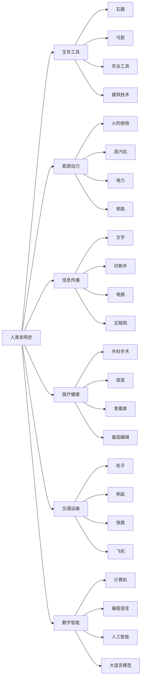
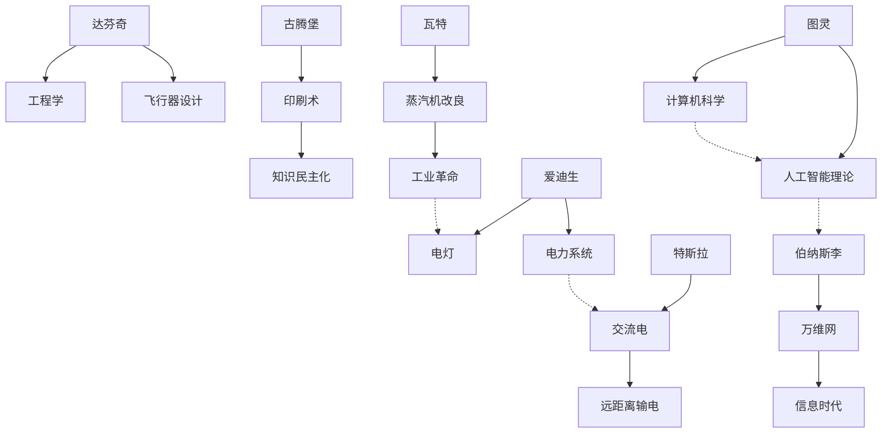
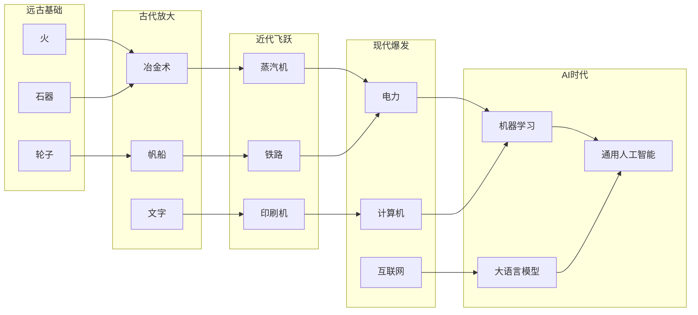
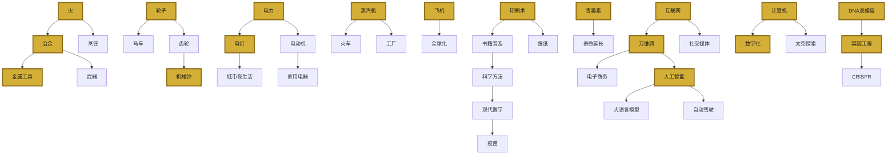

# 《改变人类文明进程的1001项发明》知识图谱图片描述

---

## 图片一：发明史分类树

### 设计说明

采用树状结构，展示人类发明史的六大核心分类及其子分支。整体风格为横向展开的思维导图，背景采用深色系历史感纹理，节点使用金色与白色搭配。

### 图谱结构

### 视觉元素建议

- 主节点"人类发明史"使用较大圆形图标，居中放置
- 六大分类使用六边形节点，均匀分布于主节点周围
- 子分支使用圆角矩形，按层级缩小字号
- 连接线采用渐变色彩，从暖色（远古）过渡到冷色（现代）
- 底部添加时间轴线，标注各分类的主要发明时期

---

## 图片二：关键发明家与推动者人物图谱

### 设计说明

采用网络关系图形式，展示对发明史有重大贡献的代表人物及其关联领域。人物节点大小与其影响力成正比，连线表示合作关系或传承关系。

### 图谱结构

### 视觉元素建议

- 人物头像采用统一风格的线描插画，增强历史感
- 节点之间用不同颜色连线区分关系类型：实线表示直接发明，虚线表示间接影响
- 底部添加图例说明连线含义
- 整体布局按时间从左到右排列，形成"发明传承流"

---

## 图片三：发明演进路径图

### 设计说明

采用桑基图风格的路径图，展示从"基础需求"到"现代发明"的演进路径。每条路径代表一个发明分支的发展脉络，宽度表示影响力大小。

### 图谱结构

### 视觉元素建议

- 五个子区域用不同背景色块区分，从左到右色彩由暖变冷
- 连线宽度反映影响力，重要路径如"火到冶金到蒸汽机到电力"加粗显示
- 每个节点旁标注关键年代，如"火（约100万年前）"、"电力（19世纪末）"
- 底部添加整体时间轴，与上方节点对应

---

## 图片四：发明影响力网络图

### 设计说明

采用力导向网络图，展示 1001 项发明中 30 项最具全球影响力发明之间的相互依赖关系。节点越大表示影响力越强，连线越粗表示依赖关系越直接。

### 图谱结构

### 视觉元素建议

- 核心节点（影响超过100项后续发明的）使用金色填充，突出显示
- 普通节点使用深灰色填充，形成层次对比
- 布局采用放射状，最核心的发明（火、轮子、印刷术、电力、计算机）位于中心区域
- 边缘节点按领域分组，用不同颜色边框区分：绿色代表医疗、蓝色代表信息、橙色代表能源
- 图例标注节点大小与影响力的对应关系
- 可考虑添加动态效果（如果是H5或视频格式），从最古老的发明开始逐层点亮

---

## 图片使用场景建议

| 图片编号 | 适用文章 | 最佳位置 |
|---------|---------|---------|
| 图片一：分类树 | 03-图谱逻辑 | 文章开头，建立整体认知 |
| 图片二：人物图谱 | 04-核心思想 | 论述"人与发明关系"时插入 |
| 图片三：路径图 | 03-图谱逻辑 | 解释发明累积效应时展示 |
| 图片四：网络图 | 02-图谱逻辑扩展 | 作为独立知识卡片发布 |

---

**标签**：#发明史 #知识图谱 #文明进程 #Mermaid图表 #技术演进

---

*本图谱基于《改变人类文明进程的1001项发明》一书内容编制，可作为系列文章配图使用。*
