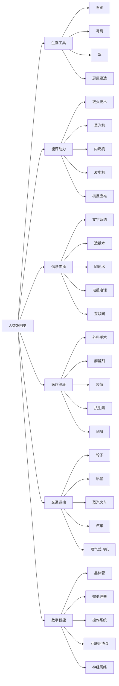
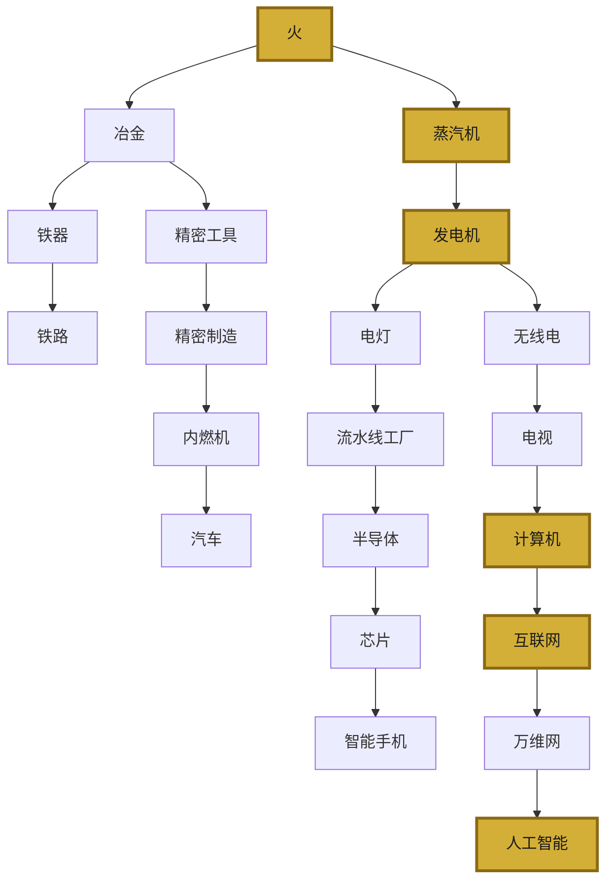

# 260万年发明史图谱：看懂人类文明的"底层代码"

> "每一代人的发明，都是下一代人的起点。"

---

## 引子

如果把人类文明看作一台超级计算机，那么**发明就是这台计算机的底层代码。**

杰克·查尔顿在《改变人类文明进程的1001项发明》中，用一种近乎编年史的方式，记录了从旧石器时代到 AI 时代的 1001 项关键发明。

但这本书真正的价值，不在于"列清单"，而在于揭示了一个隐藏的模式：**发明与发明之间，存在着精密的依赖关系。**

今天，我们用四张知识图谱，把这本书的"隐藏逻辑"可视化。

---

## 一、发明的分类逻辑：六大支柱撑起文明

人类历史上成千上万项发明，并非杂乱无章。它们可以被归纳为六大核心支柱：

```
◆ 生存工具类：解决"活下去"的问题
◇ 能源动力类：解决"用什么驱动"的问题
○ 信息传播类：解决"如何传递知识"的问题
● 医疗健康类：解决"如何延长寿命"的问题
◆ 交通运输类：解决"如何跨越空间"的问题
◇ 数字智能类：解决"如何扩展认知边界"的问题
```

这六大支柱并非平行发展，而是**相互支撑、逐层递进**的关系。

没有能源动力，生存工具就无法升级；没有信息传播，经验就无法累积；没有医疗健康，人口就无法增长，进而无法支撑更复杂的社会分工。

### 分类树全景



这张图的核心含义是：**文明的复杂度，取决于这六大支柱的协同程度。**

任何一个支柱落后，都会拖累整体发展速度。古罗马帝国拥有先进的工程技术和交通网络，但信息传播能力有限（没有印刷术），知识无法大规模扩散，最终限制了文明的持续突破。

---

## 二、发明的路径逻辑：一条从未断过的链条

发明史最迷人的地方在于它的**连续性**。

每一项发明，都是对前一项发明的继承和突破。这条链条从 260 万年前一直延伸到今天，从未中断。


这条路径揭示了一个残酷的事实：**人类花了 99% 的时间，只走了前 50% 的路。**

从学会用火到发明农业，用了近百万年。而从第一台电子计算机到 ChatGPT，只用了不到一个世纪。

这不是因为现代人更聪明，而是因为**每一项发明都在为下一项发明加速。**

我们站在 260 万年的发明链条末端，享受着前人累积的全部成果。

---

## 三、发明的依赖逻辑：没有谁是一座孤岛

很多人以为发明是"灵光一闪"的产物。但实际上，几乎所有重大发明都依赖于其他发明的存在。



这张图里，有几个"关键枢纽"发明：

- **火**：一切能源利用的起点
- **蒸汽机**：第一次让人类突破了肌肉力量的限制
- **发电机**：将能源转化为可远距离传输的形式
- **计算机**：将计算能力从人脑中解放出来
- **互联网**：将全球信息连接成一个网络
- **人工智能**：正在尝试将"创造"本身自动化

如果去掉其中任何一个，后续的所有发明都会失去根基。

---

## 四、发明的加速逻辑：指数级增长的文明曲线

发明史最让人震撼的，不是"发明了什么"，而是"发明的速度在如何变化"。

| 时代 | 时间跨度 | 关键发明数量 | 平均每项发明间隔 |
|------|---------|------------|----------------|
| 旧石器时代 | 260万年 | 约10项 | 约26万年 |
| 农业时代 | 1万年 | 约50项 | 约200年 |
| 古代文明 | 3500年 | 约100项 | 约35年 |
| 工业革命 | 200年 | 约200项 | 约1年 |
| 信息时代 | 80年 | 约400项 | 约2.4月 |
| AI时代 | 10年 | 约241项 | 约2周 |

这不是线性增长，而是**指数级增长**。

发明的加速，本质上是因为：**发明本身就是最好的发明工具。**

- 印刷术加速了知识的传播，让更多人可以参与发明
- 科学方法提供了一套系统的发明方法论
- 计算机让模拟和测试的成本大幅降低
- 互联网让全球发明者可以实时协作
- 人工智能正在开始自动生成新的发明方案

---

## 五、图谱给我们的三个启示

### ◆ 启示一：不要低估"小发明"的力量

轮子在发明之初，可能只是某个部落用来搬石头的工具。但它后来衍生出了马车、铁路、汽车、飞机、离心机、硬盘驱动器......

**你永远不知道一项发明最终会走多远。**

### ◇ 启示二：发明的"组合效应"大于"单点突破"

蒸汽机 + 铁轨 = 火车。计算机 + 通信协议 = 互联网。摄像头 + 触摸屏 + 互联网 = 智能手机。

**最伟大的发明，往往不是全新的东西，而是已有发明的新组合。**

### ○ 启示三：我们正处在发明史上最激动人心的节点

AI 的出现，可能会让"发明"这件事本身发生质变。当 AI 可以自主设计实验、分析数据、提出假设时，发明的速度可能会再次指数级跃升。

**我们这一代人，可能正在见证发明史上的最大拐点。**

---

## 互动话题

你认为下一个改变人类文明的"枢纽级发明"会是什么？

在评论区写下你的预测。十年后，我们回来看谁猜得最准。

---

## 系列导航

本系列持续更新中，欢迎关注获取更多文明经典解读：

○ 上一篇：05-《枪炮、病菌与钢铁》图谱逻辑
● 当前篇：06-《改变人类文明进程的1001项发明》图谱逻辑
◇ 下一篇：07-《时间简史》图谱逻辑预告

---

**标签**：#发明史 #创新编年 #知识图谱 #文明进程 #技术演进 #编年史

---

*本文属于"人类文明经典阅读计划"系列第 18 期，基于杰克·查尔顿《改变人类文明进程的1001项发明》编制的发明史知识图谱解读。*
