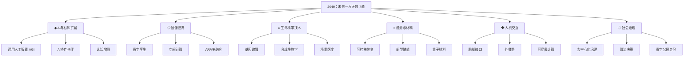
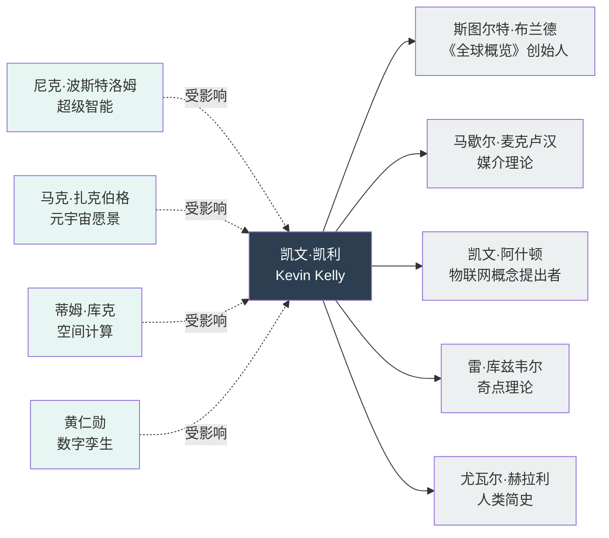
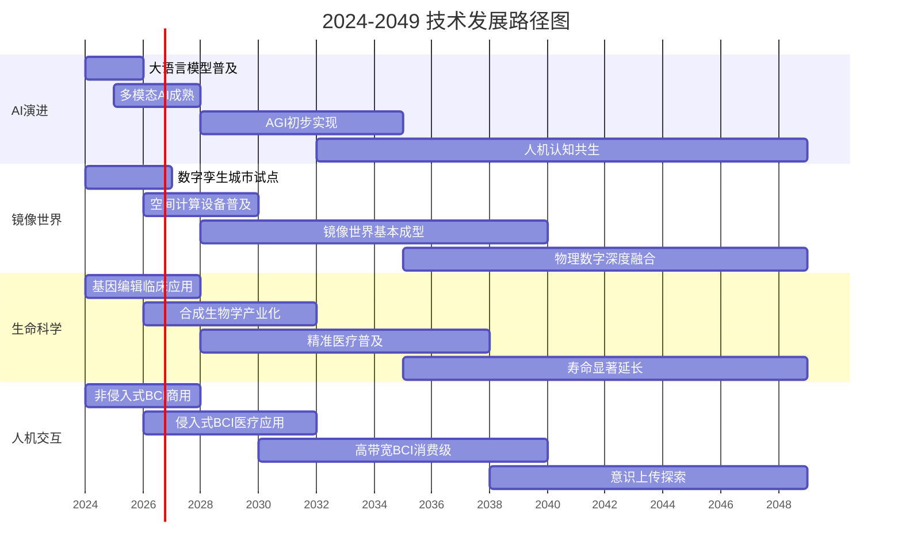
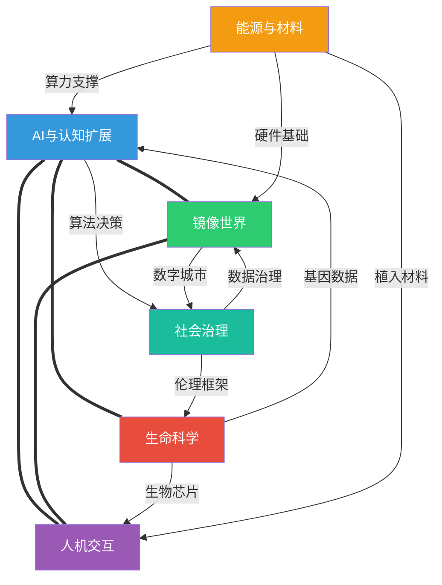

# 知识图谱图片描述：《2049未来一万天的可能》核心概念全景

> 本文是对《2049》知识图谱系列图片的文字描述，便于理解图谱结构与逻辑关系。

---

## 图一：技术趋势分类树

### 图形描述

该图采用自顶向下的树状结构，根节点为「2049未来一万天的可能」，向下分为六大技术分支，每个分支再细分为2-3个子领域。

### 图表说明

- **AI与认知扩展**：聚焦AI从工具向合作伙伴的转变，以及人类认知能力的增强路径
- **镜像世界**：描述物理世界与数字世界的实时映射关系
- **生命科学技术**：涵盖从基因到细胞的底层生命操控技术
- **能源与材料**：支撑所有上层技术的基础设施
- **人机交互**：脑机接口是核心，代表交互方式的根本变革
- **社会治理**：技术变革对组织形态和治理模式的影响

---

## 图二：核心人物与思想谱系

### 图形描述

该图以凯文·凯利为中心节点，向外辐射连接影响其思想的关键人物和理论来源，同时展示他对后世科技思想家的影响。

### 图表说明

- **左侧（思想来源）**：对KK产生直接影响的思想家和理论
- **右侧（影响后世）**：受KK思想启发而推动技术落地的产业领袖
- **中心节点**：凯文·凯利作为连接理论与实践的桥梁

---

## 图三：技术发展时间路径

### 图形描述

该图采用从左到右的时间轴布局，标注2024年至2049年间的关键技术里程碑，以及它们之间的依赖关系。

### 图表说明

- 四条并行路径代表四大技术方向
- 路径之间存在隐含的依赖关系（如镜像世界依赖AI，脑机接口依赖材料科学）
- 2035年是一个关键分水岭，多个技术方向在此交汇

---

## 图四：技术关联网络

### 图形描述

该图采用力导向网络布局，展示六大技术领域之间的相互关联和交叉影响。节点大小代表影响力，连线粗细代表关联强度。

### 图表说明

- **强关联（===）**：AI与镜像世界、生命科学、人机交互之间存在深度耦合
- **中等关联（--）**：社会治理通过伦理和法规影响其他领域，但不直接参与技术实现
- **交叉点**：AI处于网络中心，是所有技术方向的「连接器」
- **基础层**：能源与材料是隐形的底座，支撑所有上层应用

---

## 图谱使用建议

1. **分类树**：适合快速建立全局认知框架
2. **人物谱系**：理解思想传承，追溯概念源头
3. **时间路径**：把握技术节奏，判断当前所处阶段
4. **关联网络**：发现交叉机会，寻找创新切入点

---

**标签：** #知识图谱 #未来趋势 #科技前瞻 #镜像世界 #脑机接口 #凯文凯利

**说明：** 以上图谱基于《2049：未来一万天的可能》核心内容整理，仅供学习交流使用。
