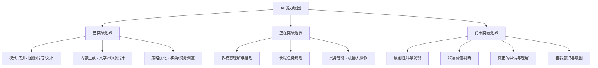
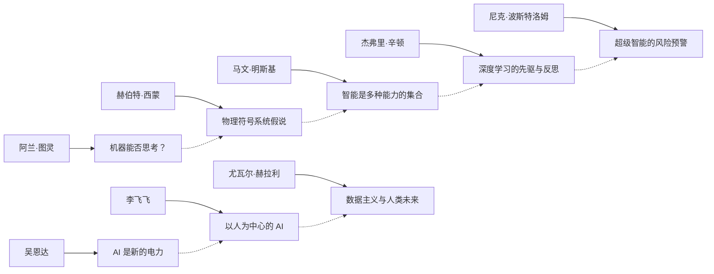
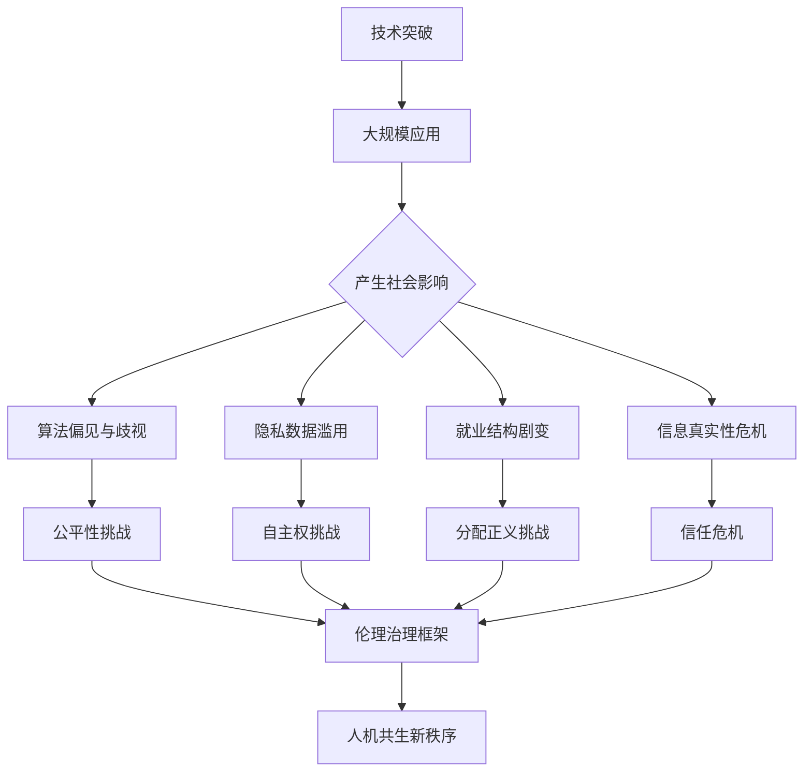
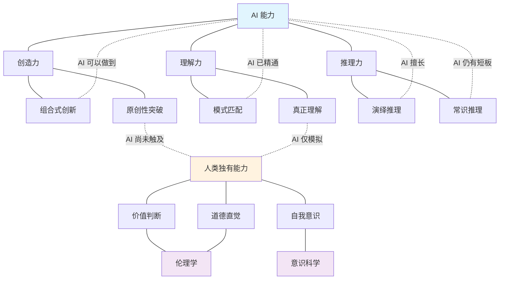

# AI 边界知识图谱：一张图看清全局

> 思辨的起点，是建立清晰的认知框架。

---

**系列导航** | 人类文明经典阅读计划 · 科学探索篇

[01 读后感](#) | [02 知识图谱](#) | [03 图谱逻辑](#) | [04 核心思想](#) | [05 职场指南](#) | [06 行动挑战](#)

---

## ◆ 全景概览

以下是关于"人工智能边界"主题的四张知识图谱，分别从分类体系、关键人物、发展路径和网络关系四个维度展开。

---

## ◇ 图一：AI 边界分类树

从能力维度拆解 AI 的能力版图与边界所在。



**阅读提示**：已突破 = 已达到或超越人类平均水平；正在突破 = 快速发展中但尚未稳定；尚未突破 = 短期内看不到可行性。

---

## ○ 图二：关键人物与思想图谱

围绕 AI 边界讨论的核心人物及其代表观点。



**阅读提示**：左侧代表"AI 能否实现"的技术追问，右侧代表"AI 应该怎样"的伦理追问。两者缺一不可。

---

## ◆ 图三：AI 伦理挑战路径图

从技术发展到伦理危机的演进脉络。



**阅读提示**：这是一条从"发生了什么"到"该怎么办"的逻辑链条。每一层都是可以深入研究的独立课题。

---

## ● 图四：AI 边界核心概念网络图

各关键概念之间的关联与张力。



**阅读提示**：蓝色区域代表 AI 能力域，橙色区域代表人类独有能力，紫色区域代表交叉学科。三者之间的张力就是"AI 边界"的核心议题。

---

## ◇ 图谱使用说明

这四张图构成了一个完整的认知框架：

**分类树**回答"AI 能做什么、不能做什么"
**人物图谱**回答"谁在思考这些问题、他们的观点是什么"
**路径图**回答"技术如何引发伦理挑战、我们该如何应对"
**网络图**回答"各概念之间如何关联、边界在哪里"

建议阅读顺序：先看分类树建立全局观，再看人物图谱理解思想源流，然后用路径图梳理问题链条，最后用网络图深化概念理解。

---

## ○ 互动话题

> **这四张图中，哪一张对你最有启发？为什么？**
>
> 欢迎在评论区分享你的想法，也欢迎提出你希望看到的图谱视角。

---

**核心标签**：#AI边界 #知识图谱 #系统认知 #技术批判

**系列导航卡片**

```
┌──────────────────────────────────────────────┐
│  上一篇：[读后感] AI 的边界在哪里？            │
│  下一篇：[图谱逻辑] 为什么 AI 的创造力有天花板 │
│  ↑ 从全景框架到深度剖析，追问创造力的本质      │
└──────────────────────────────────────────────┘
```

---

*本文是"人类文明经典阅读计划"科学探索篇第 20 期。关注我，一起在技术浪潮中保持清醒。*
