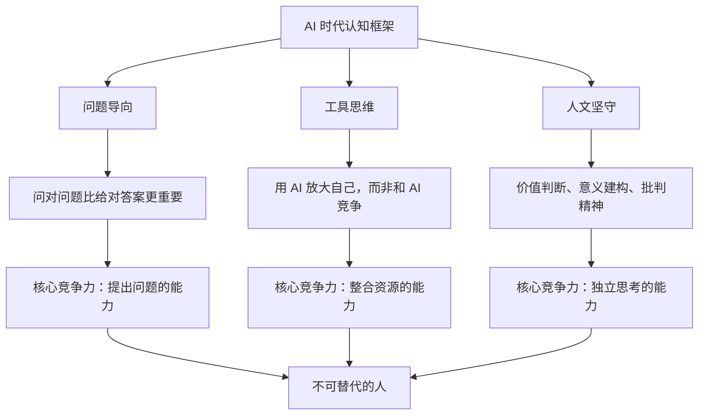

# AI 时代必备的三大认知升级

> 技术改变世界，但决定你位置的是认知。

---

**系列导航** | 人类文明经典阅读计划 · 科学探索篇

[01 读后感](#) | [02 知识图谱](#) | [03 图谱逻辑](#) | [04 核心思想](#) | [05 职场指南](#) | [06 行动挑战](#)

---

## ◆ 认知升级一：从"AI 能做什么"到"我该做什么"

大多数人在面对 AI 时，第一个问题是：

> AI 能做什么？

但真正重要的问题是：

> **在 AI 能做越来越多事之后，我该做什么？**

这两个问题的区别，是被动和主动的区别，是恐惧和清醒的区别。

### ◇ 一个思维转换

过去，我们评价一个人的能力，看他能完成多少任务。
未来，我们评价一个人，看他能提出多少好问题。

因为完成任务这件事，AI 会越来越擅长。但提出问题，依然是人类的特权。

> **好问题比好答案更稀缺。**

### ○ 具体怎么想？

把你的工作拆成两部分：

**执行层**——按既定规则完成任务。这部分 AI 会越来越强。
**决策层**——判断该做什么、为什么做、做到什么程度。这部分 AI 短期内无法替代。

你的任务不是和执行层竞争，而是不断强化决策层的能力。

---

## ◇ 认知升级二：从"和 AI 竞争"到"用 AI 放大"

很多人焦虑的根源，是把 AI 当成了竞争对手。

但 AI 不是对手，是工具。

### ● 两种心态的对比

**竞争心态**：
- "AI 写的文章比我好，我要被淘汰了"
- "AI 画图比我快，我不需要学了"
- 结果：焦虑、抗拒、被动

**放大心态**：
- "AI 能帮我快速生成初稿，我可以把精力放在创意和打磨上"
- "AI 能处理重复性工作，我可以专注于高价值的思考"
- 结果：从容、主动、进化

> **和工具竞争是荒谬的，用工具放大自己才是明智的。**

### ○ 一个判断标准

判断你是在"竞争"还是在"放大"，只需要问一个问题：

**我是在试图比 AI 做得更好，还是在试图让 AI 帮我做得更好？**

如果是前者，你已经在错误的赛道上了。

---

## ◆ 认知升级三：从"技术崇拜"到"人文坚守"

AI 时代最危险的不是技术本身，而是对技术的盲目崇拜。

当算法比你更了解你的偏好，当推荐系统决定了你看到的世界，当 AI 的判断被当作不可质疑的权威——

**我们失去的不是工作，而是自主性。**

### ● 三个需要坚守的人文阵地

**第一，价值判断。**

算法可以告诉你哪种选择概率最高，但无法告诉你哪种选择更"对"。"对"是一个价值判断，不是一个数学问题。

**第二，意义建构。**

AI 可以生成一段感人的文字，但它不感受感动。AI 可以描述一次壮丽的日落，但它不体验震撼。意义，是生命独有的体验。

**第三，批判精神。**

当 AI 的输出越来越权威、越来越不容置疑时，批判精神变得前所未有的重要。

> **技术越强大，批判精神越珍贵。**

---

## ○ 核心思想总结

这三条认知升级，可以浓缩为一句话：

**在 AI 时代，人的价值不在于做 AI 能做的事，而在于做 AI 做不了的事——提出好问题、做出价值判断、保持批判精神。**

让我们用一张图来总结这个认知框架：



---

## ● 一个提醒

认知升级不是读一篇文章就能完成的。

它需要在每次面对 AI 时，有意识地练习新的思维方式。

下次你用 AI 时，试着：

- 不是问"AI 能替我做什么"，而是问"AI 能帮我更好地做什么"
- 不是接受 AI 的输出为最终答案，而是把它当作思考的起点
- 不是迷信算法的推荐，而是保持自己的判断

**认知升级，始于每一次有意识的选择。**

---

## ◇ 互动话题

> **这三条认知升级中，哪一条你觉得最难做到？为什么？**
>
> 欢迎在评论区分享你的真实想法。

---

**核心标签**：#AI边界 #认知升级 #人机关系 #伦理觉醒

**系列导航卡片**

```
┌──────────────────────────────────────────────┐
│  上一篇：[图谱逻辑] AI 创造力的天花板在哪里   │
│  下一篇：[职场指南] AI 时代最值钱的 5 种能力   │
│  ↑ 从认知框架到职场实战，打造不可替代的自己    │
└──────────────────────────────────────────────┘
```

---

*本文是"人类文明经典阅读计划"科学探索篇第 20 期。关注我，一起在技术浪潮中保持清醒。*
