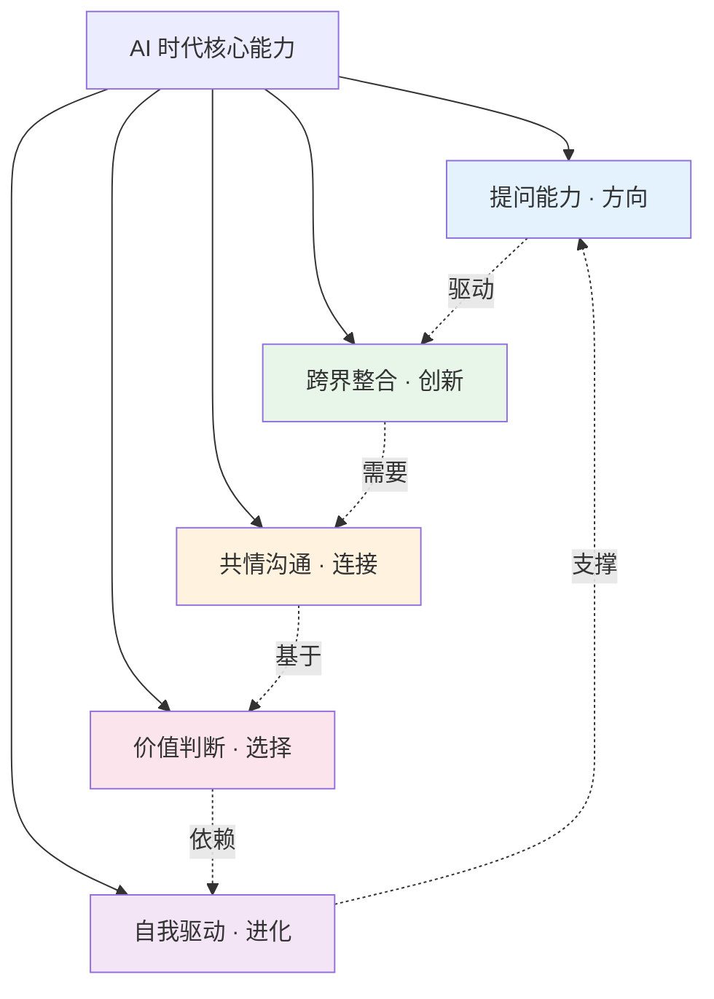

# AI 时代最值钱的 5 种能力

> 当机器能做越来越多事，"人"的价值反而被重新定义。

---

**系列导航** | 人类文明经典阅读计划 · 科学探索篇

[01 读后感](#) | [02 知识图谱](#) | [03 图谱逻辑](#) | [04 核心思想](#) | [05 职场指南](#) | [06 行动挑战](#)

---

## ◆ 一个残酷的事实

世界经济论坛预测，到 2027 年，全球将有 8300 万个工作岗位被自动化替代。

但同时，也会产生 6900 万个新岗位。

问题不在于"有没有工作"，而在于"你的能力是否匹配未来的需求"。

今天这篇文章，我们不谈焦虑，只谈解法。

---

## ◇ 能力一：提问能力

**为什么值钱：**

AI 最擅长回答问题。但它不会自己提出问题。

在 AI 时代，**提出一个好问题，比给出一个好答案更有价值。**

因为好问题决定了方向，而答案只是执行。

### ○ 如何培养？

- 遇到信息时，先问"这个信息的来源是什么？它的前提假设是什么？"
- 面对问题时，先问"这个问题本身问对了吗？有没有更好的问法？"
- 每天花 10 分钟，写下你观察到的三个"为什么"

> **提问不是不懂，而是不满足于表面的答案。**

---

## ◆ 能力二：跨界整合能力

**为什么值钱：**

AI 在垂直领域会越来越强，但跨领域的连接依然是人类的强项。

把不同领域的知识、方法、视角连接起来，产生新的洞见——这种能力在 AI 时代会变得越来越稀缺。

### ● 一个例子

把心理学和产品设计结合，诞生了用户体验设计。
把生物学和工程学结合，诞生了仿生学。
把历史学和数据分析结合，诞生了数字人文。

这些跨界的创新，很难被单一的算法模型替代。

### ○ 如何培养？

- 每个月读一本和你专业完全无关的书
- 主动和不同领域的人交流，了解他们的思维方式
- 尝试用 A 领域的方法解决 B 领域的问题

> **创新往往发生在学科的交叉地带。**

---

## ◇ 能力三：共情与沟通能力

**为什么值钱：**

AI 可以模拟共情，但不能真正共情。

当越来越多的工作被自动化，"人与人之间的连接"反而变得更值钱。销售、管理、教育、医疗——这些需要深度人际互动的领域，是 AI 最难攻克的堡垒。

### ○ 如何培养？

- 在对话中练习"深度倾听"：不打断、不预判、先理解再回应
- 学会用故事而不是数据来传达观点
- 在冲突中练习"换位思考"，而非"证明自己正确"

> **技术越发达，真实的人际连接越珍贵。**

---

## ● 能力四：价值判断能力

**为什么值钱：**

算法可以给出概率，但不能给出"对错"。

当 AI 帮你列出 10 个方案时，最终选择哪一个——这个判断，必须来自你的价值观。

在 AI 时代，**价值观不是虚的东西，而是你的核心竞争力。**

### ○ 如何培养？

- 在做决策时，明确列出你的价值排序：什么最重要？什么可以妥协？
- 阅读哲学和伦理学，思考"什么是好的生活"这个根本问题
- 在团队中，敢于表达自己的价值立场，而不是随波逐流

> **没有价值观的人，最终会成为别人价值观的工具。**

---

## ◆ 能力五：自我驱动与持续学习能力

**为什么值钱：**

这是所有能力的底层能力。

当知识更新的速度超过任何时候，"学习能力"本身就成为最重要的能力。而自我驱动，是持续学习的前提。

AI 不会替你学习，不会替你成长，不会替你进化。

**这些，只能你自己做。**

### ○ 如何培养？

- 建立一个"学习系统"，而不是依赖"学习动力"：固定时间、固定场景、固定方法
- 把学习成果输出出来：写文章、做分享、教别人
- 接受"不舒适感"：真正的学习一定伴随着不适

> **在不确定的时代，唯一确定的是你需要持续进化。**

---

## ○ 能力全景图

这五种能力不是孤立的，它们构成一个相互支撑的系统：



---

## ● 一个行动建议

不要试图同时培养所有能力。

**选择一种你现在最弱的能力，用 30 天时间刻意练习。**

30 天后，你会发现明显的变化。然后选择下一种。

持续进化，就是 AI 时代最好的生存策略。

---

## ◇ 互动话题

> **这 5 种能力中，你觉得自己最强的是哪一种？最弱的是哪一种？**
>
> 欢迎在评论区写下你的自我评估，也欢迎立下你的 30 天挑战。

---

**核心标签**：#AI边界 #职场指南 #不可替代 #人机关系

**系列导航卡片**

```
┌──────────────────────────────────────────────┐
│  上一篇：[核心思想] AI 时代必备的三大认知升级  │
│  下一篇：[行动挑战] 7 天 AI 边界探索行动       │
│  ↑ 从职场能力到实战行动，把认知变成改变        │
└──────────────────────────────────────────────┘
```

---

*本文是"人类文明经典阅读计划"科学探索篇第 20 期。关注我，一起在技术浪潮中保持清醒。*
