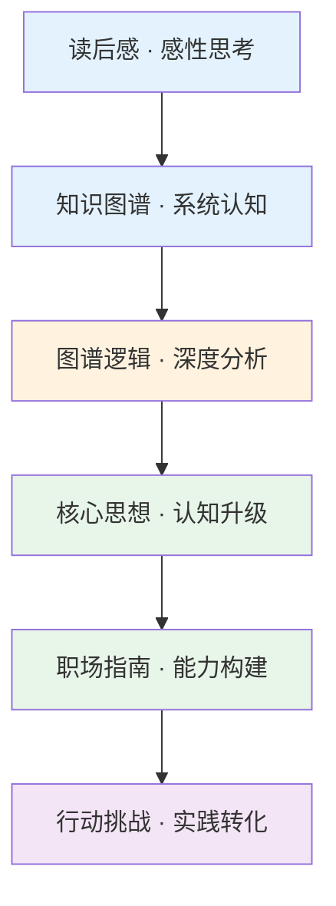

# 7 天 AI 边界探索行动

> 认知只有转化为行动，才有意义。

---

**系列导航** | 人类文明经典阅读计划 · 科学探索篇

[01 读后感](#) | [02 知识图谱](#) | [03 图谱逻辑](#) | [04 核心思想](#) | [05 职场指南](#) | [06 行动挑战](#)

---

## ◆ 为什么需要行动？

这个系列的前五篇文章，从感性思考到系统认知，从创造力分析到职场能力，我们已经建立了一个关于"AI 边界"的完整认知框架。

但认知如果不转化为行动，就只是头脑中的幻觉。

所以最后一篇，我们来做点实际的。

**一个 7 天的行动挑战，帮你把对 AI 边界的思考，变成真实的能力提升。**

---

## ◇ 挑战规则

- 每天一个任务，每个任务耗时不超过 30 分钟
- 建议按顺序进行，后面的任务建立在前面的基础上
- 每天完成后，在评论区打卡或记录在你的笔记中
- 7 天完成后，你会对 AI 边界有一个全新的、基于亲身体验的理解

---

## ◆ Day 1：AI 审计

**任务：盘点你目前在使用哪些 AI 工具，它们在替你做什么？**

列出你正在使用的 AI 工具（ChatGPT、Copilot、AI 绘画、AI 翻译等），并回答：

- 这个工具在替你做什么事？
- 这件事如果不用 AI，你需要花多长时间？
- 在这个过程中，你失去的参与感是什么？

**目的**：建立对你与 AI 关系的清醒认知。

> **不知道自己已经依赖了什么，就无法判断还应该依赖多少。**

---

## ◇ Day 2：边界测试

**任务：让 AI 完成一件你认为它"做不到"的事。**

选一件你觉得需要人类独有能力的任务——比如：

- 对你的个人经历写一篇有深度的反思文章
- 为一个复杂的人际矛盾给出有温度的建议
- 对你的职业规划做出有远见的判断

然后观察 AI 的表现。它做到了什么？没做到什么？没做到的部分，缺失的是什么？

**目的**：亲身体验 AI 的边界，而不是从理论上讨论它。

---

## ● Day 3：偏见发现

**任务：用同一个 AI 工具，用不同身份提问同一个问题。**

比如问 AI："你建议我选择什么职业道路？"

第一次，你说自己是一个刚毕业的文科女生。
第二次，你说自己是一个有十年经验的工科男性。

比较两次回答的差异。是否存在系统性偏差？这些偏差可能来自哪里？

**目的**：认识算法偏见的真实存在，培养对 AI 输出的批判意识。

> **算法没有偏见，但训练数据有。而数据里藏着我们整个社会的偏见。**

---

## ○ Day 4：提问练习

**任务：对你正在做的一件事，连续问五个"为什么"。**

这是丰田公司著名的"五个为什么"方法。

比如：
- 为什么我要写这份报告？因为老板要的。
- 为什么老板要？因为要向上级汇报。
- 为什么需要汇报？因为要让管理层了解进展。
- 为什么管理层需要了解？因为他们要做决策。
- 为什么他们要做这些决策？因为要调整资源分配。

追问到第五层，你会发现事情的真正核心。然后试着用 AI 来回答第五层的"为什么"，看看它和你的答案有什么不同。

**目的**：练习深度提问，体验人类思考的独特价值。

---

## ◆ Day 5：跨界实验

**任务：用一个你不熟悉的领域的方法，解决你熟悉领域的问题。**

如果你是程序员，试着用设计思维来优化你的代码结构。
如果你是设计师，试着用数据分析的方法来做设计决策。
如果你是销售，试着用心理学原理来理解客户行为。

然后让 AI 参与进来，看它能不能帮你建立跨界连接。

**目的**：练习跨界整合能力，这是 AI 时代最稀缺的能力之一。

---

## ◇ Day 6：价值排序

**任务：列出你工作中最重要的 5 个价值观，并排序。**

比如：创造力 > 效率 > 协作 > 稳定性 > 收入

然后思考：如果有 AI 工具能大幅提升效率，但会削弱创造力，你用不用？

再思考：如果有 AI 工具能提升收入，但会降低协作的质量，你用不用？

把你的答案写下来。这就是你的 AI 使用边界。

**目的**：明确你的价值观如何指导你对 AI 的使用，而不是被技术推着走。

> **技术本身没有方向，是你的价值观决定了方向。**

---

## ● Day 7：行动宣言

**任务：写下你的"AI 时代个人行动宣言"。**

基于前 6 天的体验，回答以下问题：

- 我选择让 AI 替我做哪些事？
- 我选择永远不让 AI 替我做哪些事？
- 为了在 AI 时代保持不可替代，我打算重点培养什么能力？
- 我将如何保持对技术的清醒认知和批判精神？

把你的回答整理成一段宣言，可以发在社交媒体上，也可以只是写给自己的承诺。

**目的**：把认知转化为行动承诺，形成持续进化的动力。

---

## ○ 7 天全景路径


**路径说明**：前三天是认知和体验阶段，中间两天是能力练习阶段，最后两天是价值确认和行动承诺阶段。

---

## ◆ 写在最后

这个 7 天挑战，不是一个测试，没有及格或不及格。

它是一面镜子，帮你看到自己和 AI 的真实关系。

**看到，就是改变的开始。**

7 天之后，你不需要变成一个 AI 专家。你只需要变成一个清醒的 AI 使用者。

知道自己该做什么，知道 AI 该做什么，知道边界在哪里——这就够了。

---

## ◇ 互动话题

> **你完成了几天挑战？最大的收获是什么？**
>
> 欢迎在评论区打卡，也欢迎分享你的"AI 时代个人行动宣言"。

---

## ● 系列结语

至此，"人工智能的边界"系列六篇文章全部完结。

回顾整个系列的路径：



从感性到理性，从认知到行动。希望这个系列能让你在面对 AI 时，多一份清醒，少一份焦虑。

**在技术的浪潮中，保持思考，就是保持自由。**

---

**核心标签**：#AI边界 #行动挑战 #认知觉醒 #人机关系

**系列导航卡片**

```
┌──────────────────────────────────────────────┐
│  上一篇：[职场指南] AI 时代最值钱的 5 种能力   │
│                                              │
│  本期是"人工智能的边界"系列完结篇              │
│  感谢阅读，期待在下一期主题中与你重逢          │
└──────────────────────────────────────────────┘
```

---

*本文是"人类文明经典阅读计划"科学探索篇第 20 期。关注我，一起在技术浪潮中保持清醒。*
