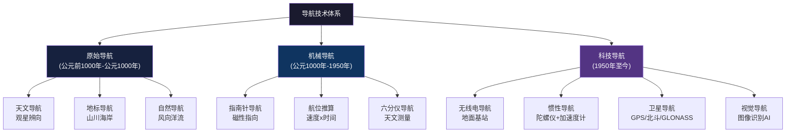
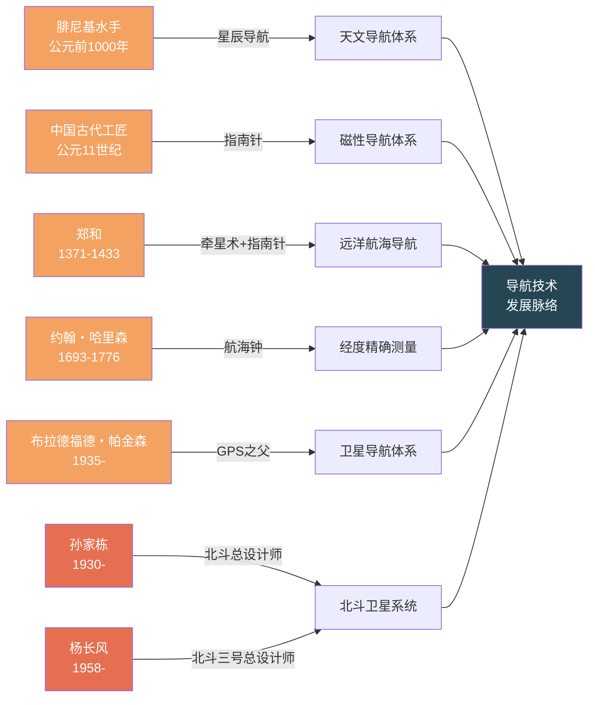
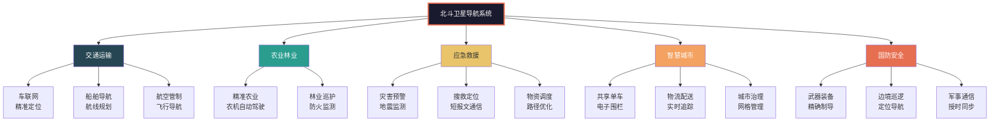

# 知识图谱图片描述 |《导航3000年》

---

## ◇ 图谱一：导航技术分类树

### 描述说明

本图以树状结构展示了人类导航技术的完整分类体系，从古代的原始导航到现代的科技导航，呈现了三大时期、六种主要导航方式的技术谱系。

**图谱解读**：

导航技术经历了从"看天"到"看地"再到"看卫星"的演进过程。

- **原始导航**依赖自然现象，是经验与直觉的结合
- **机械导航**引入了物理工具，让导航变得可量化
- **科技导航**则彻底改变了人类的时空认知，实现了前所未有的精确定位

这张图谱帮助我们理解：导航不是某一项单一技术，而是一个不断进化的技术生态。

---

## ◇ 图谱二：关键人物与贡献关系图

### 描述说明

本图以关系网络的形式，展示了导航史上关键人物及其核心贡献的对应关系。从古代的航海家到现代的科学家，这些人共同推动了导航技术的发展。

**图谱解读**：

这张图谱呈现了导航技术发展的"英雄谱"。

值得注意的是，中国古代的工匠和郑和在导航史上占有重要地位，而现代北斗系统的总设计师们，则是中国在导航领域实现自主可控的关键人物。

从腓尼基水手到北斗工程师，跨越三千年，人类对导航的追求从未停止。

---

## ◇ 图谱三：导航技术发展时间线

### 描述说明

本图以时间路径的形式，展示了导航技术从古至今的关键里程碑。每个节点代表一次技术突破，串联起人类三千年导航史的完整脉络。

**图谱解读**：

这条时间线揭示了一个清晰的趋势：

- **前2000年**：导航技术依赖自然和简单工具，发展缓慢
- **近500年**：大航海时代推动导航技术快速发展
- **近70年**：电子技术让导航发生质的飞跃
- **近30年**：中国北斗从立项到全球组网，仅用26年

中国用一代人的时间，走完了西方国家几十年的路程。

---

## ◇ 图谱四：北斗系统应用生态网络

### 描述说明

本图以网络图的形式，展示了北斗卫星导航系统在各行各业中的应用生态。北斗不仅是一个定位系统，更是赋能千行百业的基础设施。

**图谱解读**：

北斗系统的应用已经渗透到我们生活的方方面面。

你可能不知道：
- 你骑的共享单车，背后有北斗的定位在支撑
- 你点的外卖，配送员的路线规划依赖北斗的精准授时
- 你手机里的地图App，调用的很可能是北斗的数据

北斗不仅仅是一个"导航工具"，它是数字中国的基础设施，是千行百业的"时空底座"。

---

## ◇ 图谱使用说明

以上四张知识图谱，从不同维度解构了《导航3000年》的核心内容：

1. **分类树**：展示导航技术的完整体系
2. **人物图谱**：呈现关键人物的贡献关系
3. **路径图**：勾勒技术发展的时间脉络
4. **网络图**：描绘北斗系统的应用生态

建议在阅读本书或系列文章时，对照图谱理解，可以更直观地把握导航技术的演进逻辑。

---

--- ◆ ◆ ◆ ---

**人类文明经典阅读计划**

**导航3000年 | 李孝辉 著**

○ 导航历史 ○ 北斗之光 ○ 科技中国 ○ 定位觉醒

