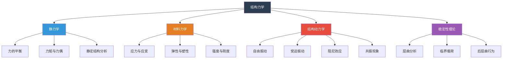
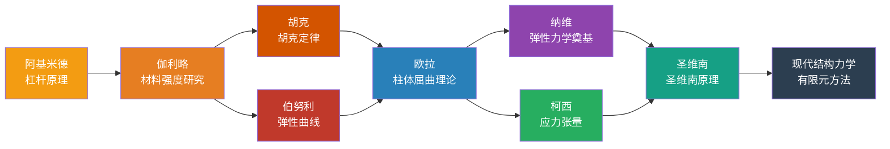
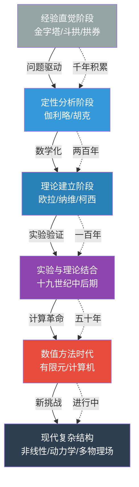
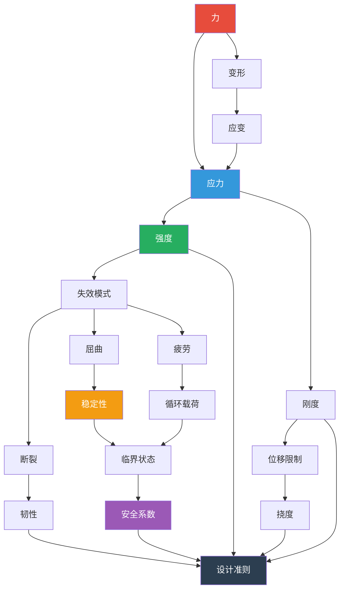

# 知识图谱：人类文明的脊梁

---

## 图谱总览

本图谱围绕《人类文明的脊梁》一书，从四个维度展开：结构力学的知识体系、关键人物及其贡献、思想演进路径、以及各概念之间的网络关系。

---

## 图一：结构力学知识分类树

**图表说明：**
结构力学从静力学出发，研究静止状态下的力平衡；材料力学关注材料内部的应力应变关系；结构动力学处理随时间变化的载荷效应；稳定性理论则研究结构在临界状态下的行为。四个分支相互支撑，构成完整的知识体系。

---

## 图二：关键人物与贡献图谱

**图表说明：**
从阿基米德的杠杆原理开始，结构力学经历了几百年的发展。伽利略是第一个系统研究材料强度的人，他的工作启发了胡克和伯努利。欧拉综合前人成果，建立了柱体屈曲理论，成为稳定性研究的起点。十九世纪，纳维、柯西、圣维南等人奠定了弹性力学的数学基础，最终走向现代有限元方法。

---

## 图三：思想演进路径图

**图表说明：**
结构力学的发展经历了从经验到理论、从定性到定量、从解析到数值的完整过程。古代工匠依靠经验和直觉建造了伟大的建筑；近代科学家开始用数学语言描述力学规律；现代工程师借助计算机解决了以前无法计算的复杂问题。每一步都是在前人基础上的突破。

---

## 图四：概念关系网络图

**图表说明：**
这张网络图展示了结构设计中的核心概念链条。力作用于结构产生应力和变形，应力和应变互为关联。强度和刚度是设计的两个核心指标，它们分别对应不同的失效模式：强度不足导致断裂或疲劳，刚度不足导致过大变形，稳定性不足导致屈曲。所有这些考量最终汇聚到设计准则中，通过安全系数来保证结构的可靠性。

---

## 使用建议

> 在公众号排版中，建议将四张图分置于文章不同位置：
> - 分类树放在"知识体系梳理"部分，帮助读者建立框架
> - 人物图谱放在"历史脉络"部分，串联科学家故事
> - 路径图放在"思想演进"部分，展示认知升级过程
> - 网络图放在"核心概念"部分，揭示概念间的深层联系

---

**系列导航**

◆ 上一篇：22-人类文明的脊梁 | 01-读后感：从榫卯到摩天大楼

● 下一篇：22-人类文明的脊梁 | 03-图谱逻辑：结构思维的五个层次

◇ 返回目录：人类文明经典阅读计划 2026

---

*标签：#结构觉醒 #工程思维 #力学原理 #文明脊梁*
