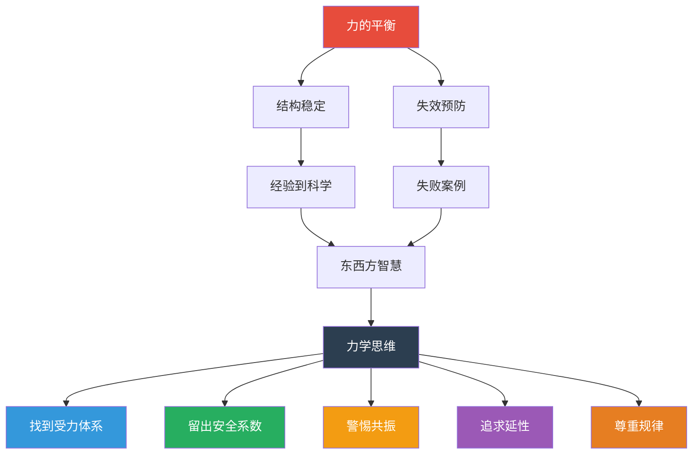

# 万物站立的秘密：力学如何塑造文明

---

> **核心命题**
>
> 武际可在书中提出了一个贯穿全书的命题：
>
> 人类文明的本质，就是不断理解"万物如何站立"的过程。
>
> 从第一根搭在溪流上的木头，到跨越海峡的悬索桥，支撑文明的从来不是材料本身，而是我们对结构规律的认知。

---

## 一、力的平衡：一切结构的基础

书中最基本的原理，可以用四个字概括：力的平衡。

一个结构要"站住"，必须满足两个条件：

- 所有外力的合力为零（不会整体移动）
- 所有外力对任意点的合力矩为零（不会整体转动）

这是静力学的根基，也是阿基米德在两千多年前就明白的道理。

**但真正的难点不在于理解原理，而在于应用。**

一座现代高层建筑，要考虑的力远不止重力：

- 竖向荷载：自重、家具、人员
- 水平荷载：风力、地震力
- 温度变化引起的热胀冷缩
- 地基不均匀沉降产生的附加应力
- 施工过程中的临时荷载

每一种力都需要被考虑，每一种力的传递路径都需要被设计。这就是为什么一栋楼的设计图纸有几百页厚。

---

## 二、从经验到科学：认知的跃迁

武际可梳理了一个清晰的脉络：

**第一阶段：经验积累（古代至十七世纪）**

工匠们通过反复试错，总结出实用的建造方法。他们不知道公式，但知道"这样做不会塌"。应县木塔、赵州桥、巴黎圣母院，都是这个阶段的产物。

**第二阶段：理论萌芽（十七至十八世纪）**

伽利略第一个试图用数学方法研究材料强度。虽然他的一些结论后来被证明是错误的，但他开创了一个全新的方向：用科学而非经验来指导结构设计。

胡克发现了应力与应变的线性关系（胡克定律）。欧拉解决了柱体屈曲问题。这些成果让结构设计从"大概靠谱"走向了"精确计算"。

**第三阶段：体系建立（十九世纪）**

纳维出版了第一部弹性力学教材。柯西定义了应力张量。圣维南提出了著名的圣维南原理。结构力学在这个时期形成了完整的理论体系。

**第四阶段：计算革命（二十世纪至今）**

有限元方法的出现，让工程师可以计算任意复杂形状的结构。计算机的普及，让以前需要几个月的手工计算缩短到几秒钟。

**这个演进过程告诉我们：文明的进步，本质上是从"知其然"走向"知其所以然"。**

---

## 三、失败的教训：比成功更有价值

书中大量篇幅用于分析结构失败的案例。这并非偶然。

武际可写道：

> 每一个倒塌的建筑，都在诉说着人类对自然规律认识的不足。

**几个经典案例：**

**魁北克大桥两次坍塌**
1907 年第一次坍塌，82 名工人遇难。原因是设计师低估了桥梁自重，导致受压弦杆屈曲。重建后，1916 年又发生了第二次事故，原因是提升中央跨度时支撑失效。两次失败，最终让这座桥成为工程教育中的经典反面教材。

**波士顿糖蜜储罐爆炸**
1919 年，一个巨大的糖蜜储罐破裂，230 万加仑的糖蜜以 56 公里每小时的速度涌向街道，造成 21 人死亡。事故原因是储罐设计时没有充分考虑疲劳效应，加上当时波士顿气温异常升高导致内部压力增大。

**韩国三丰百货倒塌**
1995 年，一栋运营中的百货大楼在 20 秒内完全坍塌，502 人遇难。直接原因是业主擅自拆除承重柱、增加楼层重量，导致结构超载。深层原因是监管缺失、利益驱动、对工程规律的漠视。

**这些案例的共同点是：都不是因为"不知道原理"，而是因为"明知故犯"或"疏忽大意"。**

结构不会原谅傲慢。

---

## 四、东西方结构智慧的对比

武际可在书中对比了东西方在结构认知上的不同路径。

**西方：从理论出发**

古希腊的阿基米德用数学方法研究杠杆和浮力。伽利略用实验和推导研究材料强度。西方的结构认知从一开始就与数学和逻辑紧密相连。

**东方：从实践出发**

中国古代的建筑师们没有发展出系统的力学理论，但他们在实践中积累了丰富的经验。斗拱、榫卯、拱券，每一种构造形式都经历了千年的优化。

应县木塔经历了 40 多次地震、200 多次炮击，依然屹立不倒。它的秘密在于柔性结构：榫卯节点允许一定的变形，这种变形吸收了地震能量。

**两种路径殊途同归。** 西方用数学语言描述了结构规律，东方用实践经验验证了这些规律。今天的结构工程，正是两者的结合。

---

## 五、力学思维对现代人的启示

读完这本书，我总结了力学思维对现代人的五点启示：

**启示一：找到你的"受力体系"**
每个人在生活中都承受着各种"力"：工作压力、家庭责任、经济负担、人际关系。你需要搞清楚：这些力从哪里来？你的"承重构件"是什么？哪里是薄弱环节？

**启示二：留出"安全系数"**
工程学中，设计承载能力通常是实际载荷的 1.5 到 3 倍。你的生活也应该如此——不要把每一分钟都排满，不要把每一分钱都花光，不要把每一段关系都逼到极限。

**启示三：警惕"共振"**
塔科马大桥的坍塌是因为风的频率与桥梁的固有频率一致，产生了共振。生活中也有类似的情况：当外部节奏与你的内在节奏"共振"时，小问题会被放大成大危机。学会调整自己的"固有频率"。

**启示四：追求"延性"而非"脆性"**
好的结构在破坏前有预警。好的人生也应该如此——在崩盘之前有信号，在崩溃之前有缓冲。保持弹性，就是保持韧性。

**启示五：尊重规律，敬畏边界**
结构力学最基本的态度是尊重规律。力怎么传递，材料怎么响应，都有确定的规律。违背规律，迟早要付出代价。这个态度放在任何领域都适用。

---

## 核心思想图谱

---

> **互动话题**
>
> 力学思维的五点启示中，哪一点最触动你？
> 你生活中有没有经历过"结构失效"的时刻？
> 欢迎在评论区分享。

---

**系列导航**

◆ 上一篇：22-人类文明的脊梁 | 03-图谱逻辑：结构思维的五个层次

● 下一篇：22-人类文明的脊梁 | 05-职场指南：用工程思维做职场设计

◇ 返回目录：人类文明经典阅读计划 2026

---

*标签：#结构觉醒 #工程思维 #力学原理 #文明脊梁*
