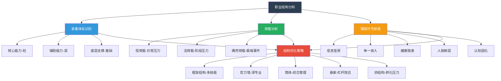

# 用工程思维做职场设计：从结构力学到职业发展

---

> **引言**
>
> 结构力学教我们一件事：一个结构能不能站稳，不取决于它用了多少材料，而取决于力的传递路径是否合理。
>
> 职场也是如此。你的职业发展能不能"站稳"，不取决于你加了多少班、考了多少证，而取决于你的能力结构是否合理、成长路径是否清晰。

---

## 一、你的"承重体系"是什么？

结构工程师设计一栋建筑，首先要确定承重体系：是框架结构？剪力墙结构？还是筒体结构？

不同的承重体系，决定了建筑能做到多高、跨度能有多大、抗震性能如何。

**你的职场也有一个"承重体系"。**

它由三个部分组成：

**核心能力（柱）**
这是你安身立命的根本。可能是编程能力、数据分析能力、项目管理能力、沟通能力。就像建筑的柱子一样，它承担着你职业发展的大部分荷载。

**辅助能力（梁）**
这些能力本身不足以支撑你，但能把核心能力连接起来，形成完整的体系。比如技术人员的学习能力、业务人员的表达能力、管理人员的决策能力。

**底层支撑（基础）**
这是你的价值观、职业操守、身体健康、心理素质。看不见，但决定了你能走多远。

**自检问题：**

- 你的"柱"是什么？它够不够粗壮？
- 你的"梁"有没有把能力有效连接起来？
- 你的"基础"牢不牢固？

---

## 二、荷载分析：职场中的各种"力"

在结构设计中，荷载分析是关键步骤。你需要考虑所有可能作用在结构上的力。

职场中的荷载可以分为三类：

**恒荷载（持续存在的压力）**
- 日常工作任务
- 家庭责任
- 经济压力
- 持续学习的压力

这些力一直存在，就像建筑的自重。你必须确保你的结构能够长期承受。

**活荷载（阶段性或突发性的压力）**
- 项目截止期限
- 考试和晋升
- 突发事件和危机
- 人际关系冲突

这些力时有时无，但峰值可能很高。你需要有足够的储备来应对。

**偶然荷载（极端事件）**
- 行业剧变
- 公司裁员
- 健康危机
- 家庭变故

这些力发生的概率低，但一旦发生，影响巨大。工程中用"安全系数"来应对，职场中则需要"Plan B"。

**一个合理的职业结构，应该能够同时承受这三类荷载。**

---

## 三、结构优化：五种职场设计策略

根据结构力学的原理，我总结了五种职场设计策略：

**策略一：框架结构型——多技能支撑**

框架结构的特点是：多根柱子和多根梁组成网格，荷载分散到多个构件上。

职场对应：拥有多项可迁移能力，不依赖单一技能。比如既懂技术又懂业务，既会执行又会管理。

**适合人群：** 通才型选手、跨领域工作者、创业者

**策略二：剪力墙结构型——核心能力突出**

剪力墙结构的特点是：几面强大的墙体承担主要水平荷载，效率高但对墙体质量要求极高。

职场对应：在某一领域有极深的专业壁垒，成为不可替代的专家。

**适合人群：** 深度思考者、技术专家、学者型人才

**策略三：筒体结构型——综合管理能力**

筒体结构的特点是：外围一圈墙体形成封闭的"筒"，整体性强，适合超高层建筑。

职场对应：具备全局视野和资源整合能力的管理者，能够协调多方、驱动团队达成目标。

**适合人群：** 管理者、项目负责人、团队 leader

**策略四：悬索结构型——杠杆效应**

悬索结构的特点是：用缆索把力传递到远处的锚点，用较少的材料实现很大的跨度。

职场对应：善于利用杠杆效应——用平台的影响力、人脉的资源、工具的效率，放大个人产出。

**适合人群：** 资源整合者、平台运营者、自媒体创作者

**策略五：拱结构型——转化压力为优势**

拱结构的特点是：把竖向荷载转化为沿拱轴线的压力，让材料充分发挥抗压能力。

职场对应：善于把压力和挫折转化为成长动力，在逆境中找到机会。

**适合人群：** 韧性强者、连续创业者、逆境翻盘者

---

## 四、薄弱环节排查：你的"塔科马大桥"在哪？

塔科马大桥的教训是：即使整体看起来坚固，一个薄弱环节也可能导致全面崩溃。

职场中的薄弱环节通常有以下几种：

**薄弱环节一：信息茧房**
只在熟悉的领域深耕，对外界变化缺乏感知。当行业发生变革时，毫无准备。

**薄弱环节二：单一收入来源**
全部收入来自一份工资。一旦失业，生活立刻陷入困境。

**薄弱环节三：忽视身体健康**
长期加班、熬夜、饮食不规律。身体这座"建筑"的"基础"正在被侵蚀。

**薄弱环节四：人脉断层**
只在当前公司建立关系，离开这个平台后，发现自己"一无所有"。

**薄弱环节五：认知固化**
拒绝学习新东西，认为"我以前就是这样成功的"。但环境变了，旧方法不再适用。

**排查建议：**

每隔半年，对自己的职业结构做一次"安全检测"，找出薄弱环节并优先加固。

---

## 五、冗余设计：给自己的职业留出安全系数

结构工程师设计时，承载能力通常是实际需求的两到三倍。

**你的职业发展也应该有冗余。**

**时间冗余：** 不要把每一分钟都排满。留出 20% 的时间用于学习和思考。

**能力冗余：** 在核心能力之外，培养一两项"备用技能"。它们可能在某个关键时刻成为你的救命稻草。

**财务冗余：** 保持至少六个月的应急资金。这笔钱让你在面对职业选择时有底气说"不"。

**人脉冗余：** 主动维护跨行业、跨公司的人脉关系。不要等到需要帮忙时才想起别人。

**冗余不是浪费，是对不确定性的尊重。**

---

## 职场结构设计图

---

> **互动话题**
>
> 你的职场"承重体系"是什么类型？
> 你排查出了哪些薄弱环节？
> 欢迎在评论区分享你的职业结构设计。

---

**系列导航**

◆ 上一篇：22-人类文明的脊梁 | 04-核心思想：万物站立的秘密

● 下一篇：22-人类文明的脊梁 | 06-行动挑战：建造你的能力结构

◇ 返回目录：人类文明经典阅读计划 2026

---

*标签：#结构觉醒 #工程思维 #力学原理 #文明脊梁*
