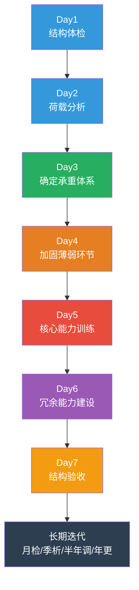

# 建造你的能力结构：7 天行动挑战

---

> **挑战宣言**
>
> 读了这么多，思考了这么多，是时候行动了。
>
> 结构力学告诉我们：一个结构的价值不在于它被设计得多么完美，而在于它能否真正承受住现实的考验。
>
> 接下来的 7 天，我们用工程学的方法，亲手建造自己的能力结构。

---

## 挑战总览

---

## Day 1：结构体检

**目标：** 客观评估自己当前的能力结构

**任务：**

拿出一张纸，画一个三层的金字塔：

- 底层（基础）：你的价值观、身体健康、心理状态、财务状况
- 中层（辅助能力）：学习能力、沟通能力、执行力、协作能力
- 顶层（核心能力）：你在职业中最依赖的 1-3 项专业技能

对每一层打分（1-10 分），诚实面对自己。

**自检清单：**

- 我的核心能力在市场上是否还有竞争力？
- 我的身体健康是否足以支撑我未来三年的工作强度？
- 我的财务状况是否有至少三个月的安全垫？
- 我的心理状态是积极向上的，还是在慢性消耗中？

**输出：** 一份完整的个人结构体检报告

---

## Day 2：荷载分析

**目标：** 识别当前承受的各种压力

**任务：**

列出你当前承受的三类荷载：

**恒荷载（持续存在的）：**
写下每天都需要面对的责任和压力，按影响程度排序。

**活荷载（阶段性的）：**
写下近三个月内需要完成的任务和可能出现的压力事件。

**偶然荷载（小概率但影响大的）：**
写下你最担心的"黑天鹅"事件，以及如果发生，你的应对方案是什么。

**思考：**

- 哪些荷载是你可以控制的？哪些不能？
- 当前的结构能否承受所有恒荷载加上峰值活荷载？
- 如果偶然荷载真的发生了，你的"安全系数"够不够？

**输出：** 一份个人荷载分析报告

---

## Day 3：确定承重体系

**目标：** 选择适合你的职场结构设计策略

**任务：**

回顾上一篇中提到的五种结构类型：

- 框架结构型（多技能支撑）
- 剪力墙结构型（核心能力突出）
- 筒体结构型（综合管理能力）
- 悬索结构型（杠杆效应）
- 拱结构型（转化压力为优势）

选择最适合你的一种作为主体系，并写出理由。

**行动计划：**

- 如果你的核心能力还不够突出，先花三个月时间深耕一项技能
- 如果你已经有核心能力但过于单一，开始培养第二技能
- 如果你走向管理路线，开始有意识地训练全局视野和资源整合能力

**输出：** 一份个人职业结构设计方案

---

## Day 4：加固薄弱环节

**目标：** 找出并加固最危险的结构薄弱点

**任务：**

回顾上一篇提到的五种薄弱环节：

- 信息茧房
- 单一收入来源
- 忽视身体健康
- 人脉断层
- 认知固化

选出你最严重的一个，制定一个具体的加固计划。

**示例：**

如果薄弱环节是"信息茧房"，加固计划可以是：
- 每周阅读一篇跨行业的深度文章
- 每月参加一次跨领域的交流活动
- 关注三个不同行业的优质信息源

**原则：**

工程加固的原则是"优先加固最薄弱、最危险的部位"。不要试图同时解决所有问题，先解决最致命的那个。

**输出：** 一份薄弱环节加固计划

---

## Day 5：核心能力训练

**目标：** 为你的"承重柱"做一次强化

**任务：**

选择你的核心能力，进行一次深度学习或实践：

- 如果核心能力是编程，花 3 小时深入研究一个你一直想学的技术栈
- 如果核心能力是写作，尝试写一篇完整的高质量文章
- 如果核心能力是数据分析，用真实数据集完成一次完整分析
- 如果核心能力是项目管理，复盘一个你负责过的项目，总结得失

**要求：**

这次训练要有一定的"挑战性"——不能太简单，否则没有成长；也不能太难，否则会产生挫败感。工程学上叫"屈服强度"——在弹性变形范围内尽可能大地加载。

**输出：** 一份核心能力训练记录和心得体会

---

## Day 6：冗余能力建设

**目标：** 开始建设你的"安全系数"

**任务：**

选择一项"冗余能力"开始建设：

**能力冗余：** 学习一项与当前工作不直接相关、但可能在未来有用的技能。比如：
- 技术人员学习商业思维
- 业务人员学习基础编程
- 管理者学习数据分析

**人脉冗余：** 主动联系一位三个月以上没有联系的同行或跨行业朋友，约一次咖啡或线上交流。

**财务冗余：** 如果你还没有应急资金，从今天开始制定储蓄计划。

**时间冗余：** 在日程表中留出至少一小时的"自由时间"，用于阅读、思考和学习。

**输出：** 冗余能力建设的启动记录

---

## Day 7：结构验收与迭代

**目标：** 回顾 7 天的成果，制定长期迭代计划

**任务：**

**第一步：验收**
对照 Day 1 的体检报告，看看经过 7 天的行动，哪些方面有改善，哪些方面还没有变化。

**第二步：总结**
回答以下问题：
- 这 7 天最大的收获是什么？
- 哪一个任务最有价值？为什么？
- 哪一个任务最难完成？障碍在哪里？
- 如果重新开始，你会做出什么调整？

**第三步：迭代**
结构不是一次设计就完成的，而是需要持续的监测和维护。制定你的长期迭代计划：

- 每月做一次结构体检
- 每季度做一次荷载分析
- 每半年调整一次承重体系
- 每年回顾并更新职业结构设计方案

**输出：** 一份结构验收报告和长期迭代计划

---

## 行动路线图

---

## 写在最后

武际可在《人类文明的脊梁》结尾处写道：

> 结构力学的意义，不在于让我们计算得更精确，而在于让我们理解：万物之所以能站立，是因为有人一直在思考力的来龙去脉。

这 7 天的挑战，本质上也是一次"力的来龙去脉"的梳理。

你的能力结构、你的职业路径、你的人生规划——它们都不是凭空存在的，而是由各种"力"塑造的结果。

当你开始用结构的眼光看待自己，你就会发现：

**你不需要变得完美，你只需要让你的结构足够合理。**

留下安全系数，加固薄弱环节，找到承重体系，然后——

**稳稳地站住，向上生长。**

---

> **互动话题**
>
> 你完成了 7 天挑战中的哪几天？
> 你的结构体检结果如何？
> 欢迎在评论区打卡，我们一起建造各自的能力结构。

---

**系列导航**

◆ 上一篇：22-人类文明的脊梁 | 05-职场指南：用工程思维做职场设计

◇ 返回目录：人类文明经典阅读计划 2026

---

*标签：#结构觉醒 #工程思维 #力学原理 #文明脊梁*
