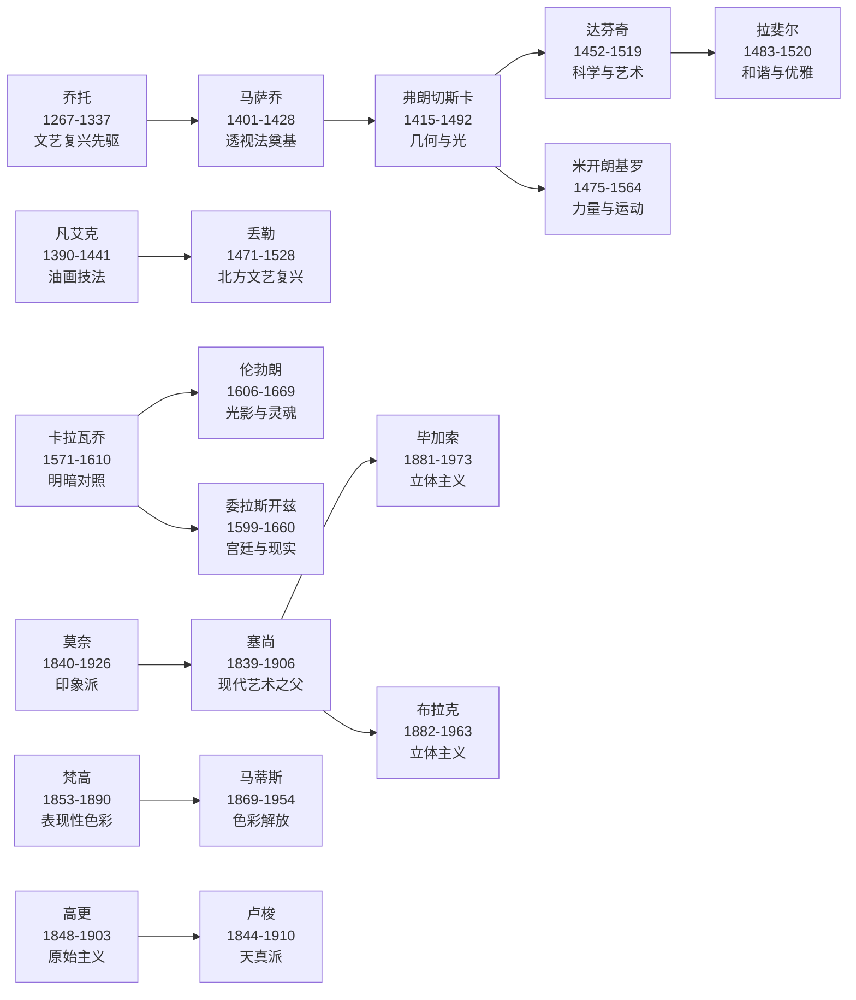
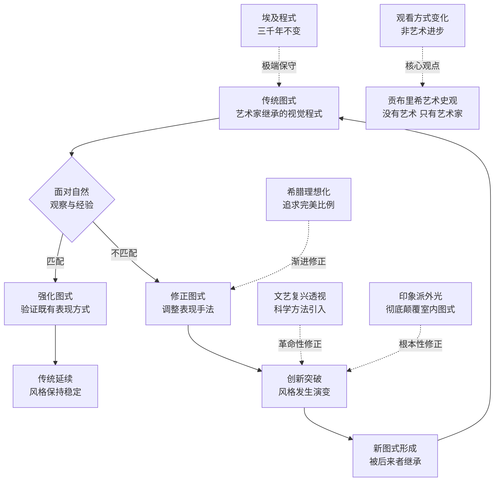
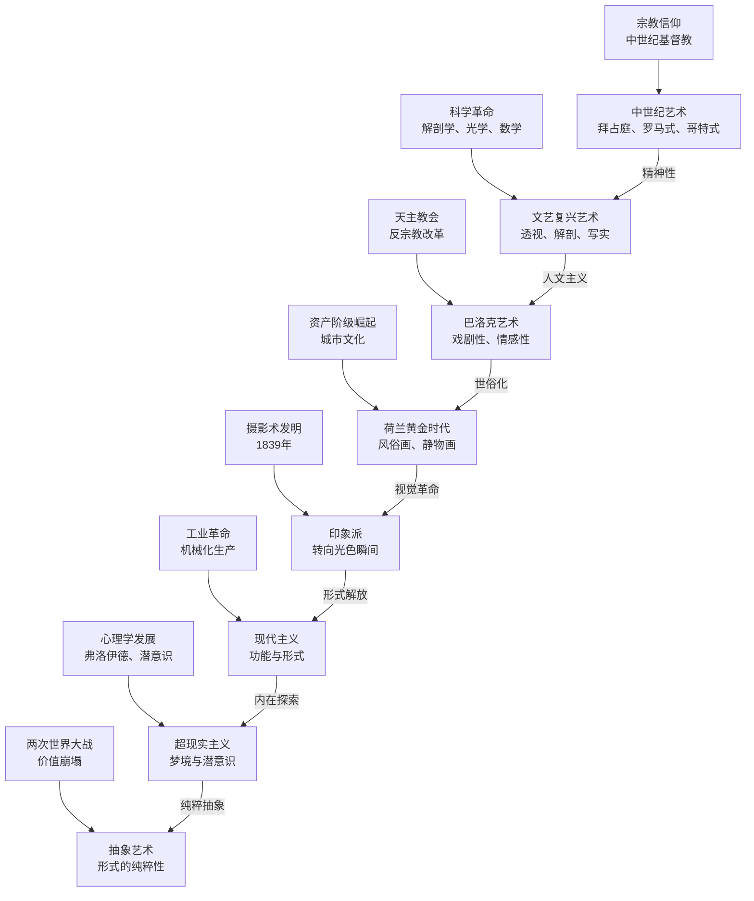

# 02 知识图谱 | 《艺术的故事》视觉化知识体系

> "艺术史不是风格的演进史，而是人类观看方式的演变史。"
> —— 基于贡布里希《艺术的故事》

---

## ◇ 图谱说明

本文整理了《艺术的故事》的核心知识体系，通过四张 Mermaid 图表，将贡布里希的艺术史观可视化为：

◆ **分类树**：艺术史的时间轴与核心命题
◆ **人物图谱**：关键艺术家及其传承关系
◆ **路径图**：图式与修正的理论路径
◆ **网络图**：艺术风格与社会文化的互动关系

建议在电脑端全屏查看图表，移动端可左右滑动。

---

## ◇ 图一：艺术史分类树

```mermaid
graph TD
    ROOT["《艺术的故事》<br/>E.H. 贡布里希"]

    ROOT --> P1["史前与古代<br/>艺术的起源"]
    ROOT --> P2["古典传统<br/>希腊罗马的理想"]
    ROOT --> P3["中世纪<br/>信仰与象征"]
    ROOT --> P4["文艺复兴<br/>透视与人文"]
    ROOT --> P5["巴洛克与洛可可<br/>运动与装饰"]
    ROOT --> P6["19世纪<br/>革命与反叛"]
    ROOT --> P7["20世纪<br/>实验与解放"]

    P1 --> P1A["洞穴壁画<br/>拉斯科、阿尔塔米拉"]
    P1 --> P1B["古埃及艺术<br/>永恒程式"]
    P1 --> P1C["美索不达米亚<br/>权力与叙事"]

    P2 --> P2A["古希腊雕塑<br/>理想人体"]
    P2 --> P2B["古罗马建筑<br/>工程与美学"]

    P3 --> P3A["拜占庭艺术<br/>金色圣像"]
    P3 --> P3B["罗马式建筑<br/>厚重与坚固"]
    P3 --> P3C["哥特式建筑<br/>光线与高度"]

    P4 --> P4A["早期文艺复兴<br/>乔托、马萨乔"]
    P4 --> P4B["盛期文艺复兴<br/>达芬奇、米开朗基罗、拉斐尔"]
    P4 --> P4C["北方文艺复兴<br/>凡艾克、丢勒"]

    P5 --> P5A["巴洛克<br/>卡拉瓦乔、贝尼尼、伦勃朗"]
    P5 --> P5B["洛可可<br/>华托、布歇"]

    P6 --> P6A["新古典主义<br/>大卫、安格尔"]
    P6 --> P6B["浪漫主义<br/>德拉克洛瓦、戈雅"]
    P6 --> P6C["印象派<br/>莫奈、雷诺阿"]
    P6 --> P6D["后印象派<br/>塞尚、梵高、高更"]

    P7 --> P7A["立体主义<br/>毕加索、布拉克"]
    P7 --> P7B["表现主义<br/>蒙克、康定斯基"]
    P7 --> P7C["超现实主义<br/>达利、马格利特"]
    P7 --> P7D["抽象表现主义<br/>波洛克、罗斯科"]
```

---

## ◇ 图二：艺术家传承人物图谱

---

## ◇ 图三：图式与修正理论路径图

---

## ◇ 图四：艺术风格与社会文化网络图

---

## ◇ 图谱使用指南

### 分类树的使用方法

分类树展示了《艺术的故事》全书的时间线结构。贡布里希将艺术史分为 7 个主要阶段，每个阶段都有其核心的视觉命题。

**阅读建议**：沿着时间轴从上到下阅读，理解每个时期的艺术家面临的核心问题是什么。

### 人物图谱的使用方法

人物图谱展示了关键艺术家之间的传承关系。箭头表示影响和启发，而非直接的师徒关系。

**阅读建议**：找到你最感兴趣的艺术家，沿着箭头追溯其影响来源，理解风格如何在代际间传递和演变。

### 理论路径图的使用方法

这张图是贡布里希"图式与修正"理论的核心逻辑。理解了这个循环，就理解了整本书的理论框架。

**阅读建议**：重点关注"修正"这个环节。每一次艺术的重大变革，都是艺术家对既有图式的修正。

### 网络图的使用方法

网络图揭示了艺术风格变化背后的社会、文化、技术因素。艺术不是孤立存在的，它与人类文明的方方面面紧密相连。

**阅读建议**：思考你最喜欢的艺术风格，它背后的社会条件是什么？

---

## ◆ 互动话题

这四张图谱中，哪一张最让你有启发？

在评论区告诉我：**"你最想深入了解图谱中的哪个节点？"**

---

## ◆ 系列导航

本文是 **「人类文明经典阅读计划」** 系列第 7 辑第 2 篇。

| 上一篇 | 下一篇 |
|--------|--------|
| 01 读后感 · 艺术的故事 | 03 图谱逻辑 · 艺术的故事 |

---

> 标签：#审美觉醒 #艺术史观 #风格认知 #图式修正 #知识图谱 #贡布里希
