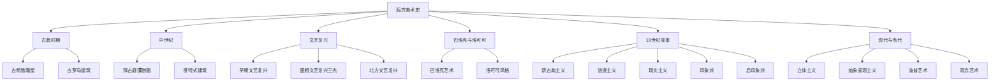
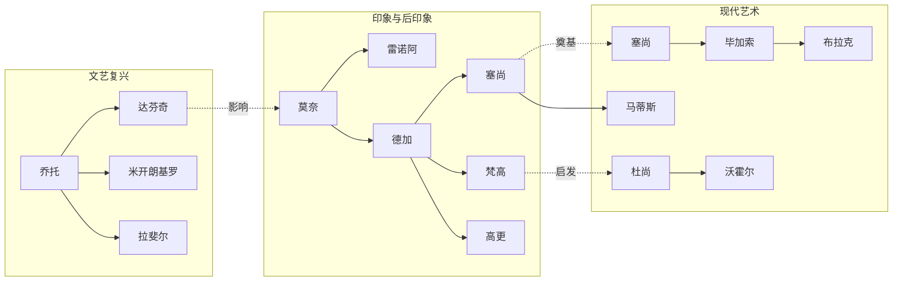
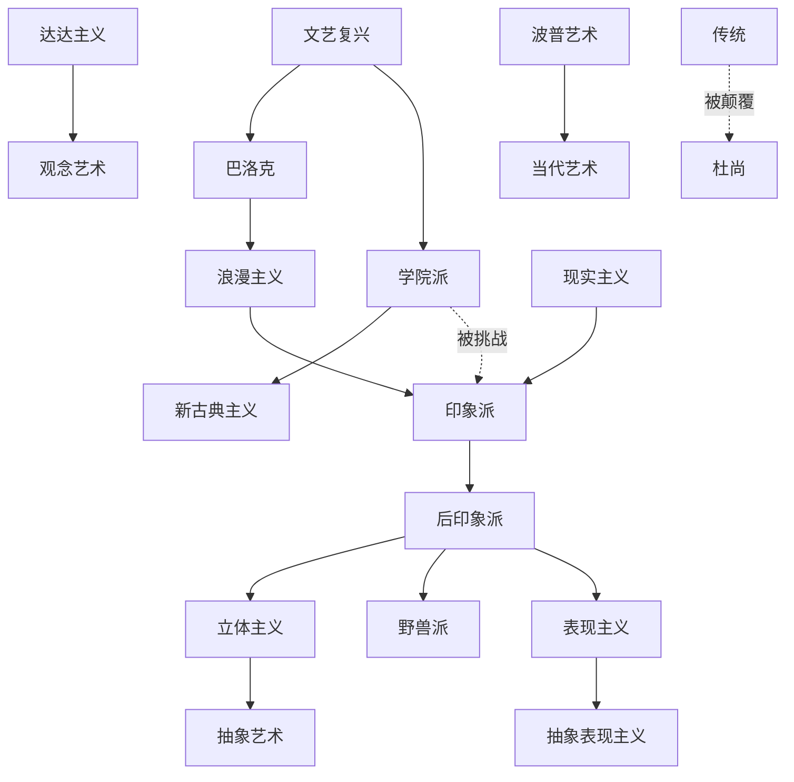

# 知识图谱 | 一张图看懂西方美术史脉络

---

> "理解艺术史，不是记住一堆名字和年代，而是看到一条文明的河流。"

---

## 一、西方美术史全景分类树

---

## 二、大师人物关系图谱

---

## 三、审美观念演进路径图

---

## 四、流派影响网络图

---

## 五、时间轴：关键转折点

| 时期 | 大约年代 | 核心命题 | 代表作品 |
|------|----------|----------|----------|
| 古希腊 | 公元前5世纪 | 人体即完美 | 掷铁饼者、断臂维纳斯 |
| 文艺复兴 | 14-16世纪 | 人的觉醒 | 蒙娜丽莎、创世纪 |
| 巴洛克 | 17世纪 | 戏剧与动感 | 夜巡、宫娥 |
| 印象派 | 19世纪后期 | 光与瞬间 | 日出印象、睡莲 |
| 后印象派 | 19世纪末 | 内心与结构 | 星空、大碗岛的星期天 |
| 现代艺术 | 20世纪 | 打破一切 | 亚维农少女、泉 |

---

## 六、读懂图谱的三个关键

### ◆ 脉络比细节更重要

不要试图记住每一个画家的生平。你要看到的是：**艺术史是一条河流，每一个流派都是河流中的一段。**

### ◆ 变化背后是时代的巨变

为什么文艺复兴会发生？因为中世纪的信仰体系开始松动，人开始重新发现"自己"的价值。

为什么印象派会诞生？因为照相机的发明让"画得像"不再重要，艺术家被迫去寻找新的表达方式。

**每一次艺术的变革，背后都是一次世界观的颠覆。**

### ◆ 审美标准永远在变

希腊人觉得完美的裸体雕塑是美，中世纪的人觉得那是对神的亵渎；

文艺复兴的人觉得透视和比例是美，印象派的人觉得那是僵死的教条；

到了杜尚那里，连"美"本身都被质疑了——艺术一定要"好看"吗？

理解了这一点，你就不会再问"这画的是什么""这也叫艺术"这类问题了。

---

## ◆ 互动话题

图谱中哪个时期最吸引你？为什么？

欢迎在评论区告诉我们，我们一起深入聊聊。

---

## ◇ 系列导航

**人类文明经典阅读计划** | 艺术美学系列

| 上一篇 | 下一篇 |
|--------|--------|
| [《艺术的故事》| 西方艺术的终极地图](../01-艺术的故事/) | [《美的历程》| 中国美学千年巡礼](../../03-美的历程/) |

---

**标签**：#通俗艺术史 #审美培养 #蒋勋美学 #知识图谱 #西方美术史
