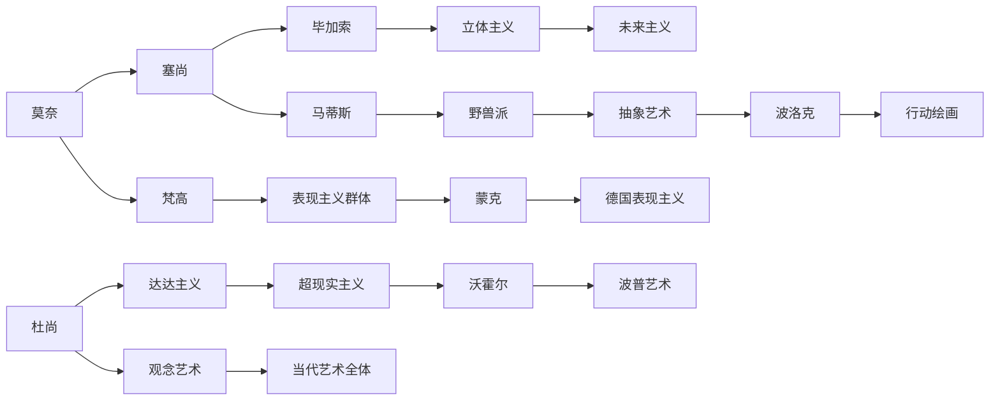
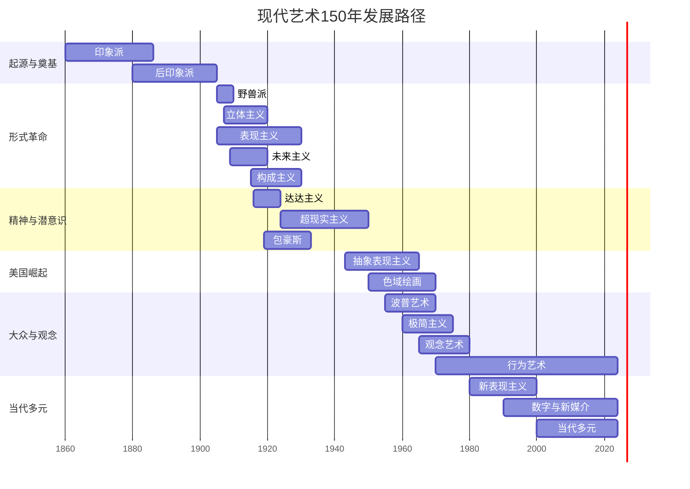
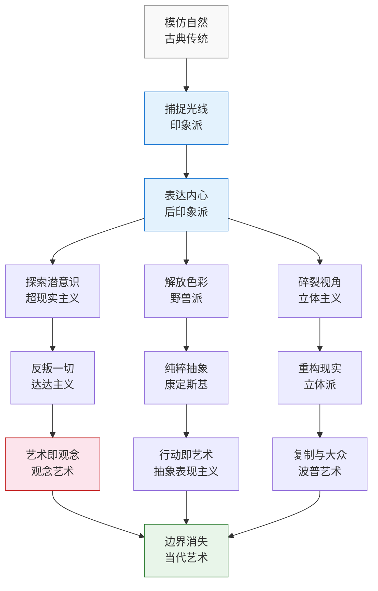

# 知识图谱图片描述：《现代艺术150年》核心脉络图

> 本文包含四组 Mermaid 图表，用于公众号排版中的知识图谱可视化。可直接渲染为图片嵌入文章。

---

## 图表一：现代艺术流派分类树

**用途**：展示从印象派到当代艺术的主要流派层级关系。

```mermaid
graph TD
    A["现代艺术 (1860s-至今)"]
    A --> B["印象派 1860s-1880s"]
    A --> C["后印象派 1880s-1900s"]
    A --> D["二十世纪早期"]
    A --> E["二战后"]
    A --> F["当代艺术 1960s-至今"]

    B --> B1["莫奈 - 光与色彩"]
    B --> B2["雷诺阿 - 人物与生活"]
    B --> B3["德加 - 运动与瞬间"]

    C --> C1["塞尚 - 形式与结构"]
    C --> C2["梵高 - 情感与表现"]
    C --> C3["高更 - 原始与象征"]

    D --> D1["野兽派 - 马蒂斯"]
    D --> D2["立体主义 - 毕加索/布拉克"]
    D --> D3["表现主义 - 蒙克/康定斯基"]
    D --> D4["达达主义 - 杜尚"]
    D --> D5["超现实主义 - 达利/马格利特"]

    E --> E1["抽象表现主义 - 波洛克/罗斯科"]
    E --> E2["极简主义 - 贾德"]
    E --> E3["波普艺术 - 沃霍尔/利希滕斯坦"]

    F --> F1["观念艺术 - 科苏斯"]
    F --> F2["行为艺术 - 阿布拉莫维奇"]
    F --> F3["装置艺术"]
    F --> F4["数字与新媒介艺术"]
```

---

## 图表二：艺术家影响关系图谱

**用途**：展示关键艺术家之间的影响与传承关系。

---

## 图表三：现代艺术发展路径图

**用途**：以时间轴形式展示各流派的历史演进路径。

---

## 图表四：艺术观念演变网络图

**用途**：展示艺术核心观念如何从传统走向当代的演变关系。

---

## 图表使用说明

- 图表一至图表四可按需拆分到不同文章中
- 推荐使用 Mermaid 在线渲染工具生成高清 PNG 后嵌入公众号
- 配色方案已在图四中示例，其余图表可按公众号主色调统一调整
- 移动端建议每张图宽度不超过 900px，确保竖屏完整显示

---

**核心标签**：#现代艺术 #流派演变 #印象派 #当代认知 #知识图谱 #Mermaid图表
