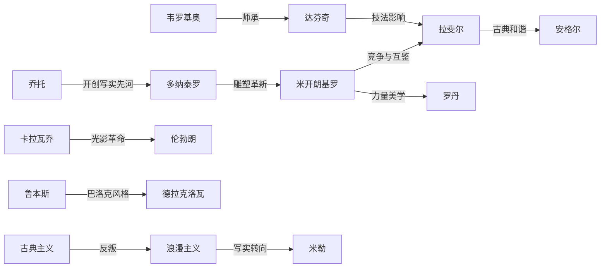
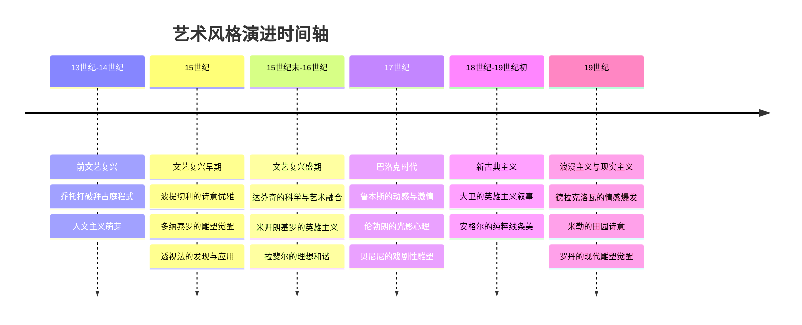
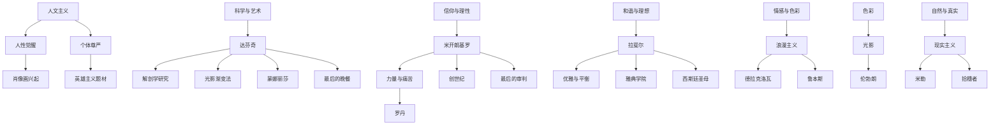

# 世界美术名作二十讲 · 知识图谱

原创：人类文明经典阅读计划  ·  系列导航：艺术美学

---

## ◇ 图谱总览

《世界美术名作二十讲》涵盖从文艺复兴早期到十九世纪的重要美术作品。以下知识图谱以四种维度呈现傅雷先生的讲授体系：分类树状图、人物关系图、时代路径图、风格网络图。

---

## ◇ 分类树：二十讲名作体系

```mermaid
graph TD
    A[世界美术名作二十讲] --> B[文艺复兴早期]
    A --> C[文艺复兴盛期]
    A --> D[巴洛克与新古典]
    A --> E[十九世纪变革]

    B --> B1[波提切利: 春]
    B --> B2[波提切利: 维纳斯的诞生]
    B --> B3[多纳泰罗: 大卫像]
    B --> B4[乔托: 逃往埃及]

    C --> C1[达芬奇: 最后的晚餐]
    C --> C2[达芬奇: 蒙娜丽莎]
    C --> C3[米开朗基罗: 创世纪]
    C --> C4[米开朗基罗: 最后的审判]
    C --> C5[米开朗基罗: 摩西像]
    C --> C6[拉斐尔: 西斯廷圣母]
    C --> C7[拉斐尔: 雅典学院]

    D --> D1[鲁本斯: 劫夺留西帕斯的女儿]
    D --> D2[伦勃朗: 夜巡]
    D --> D3[贝尼尼: 阿波罗与达芙妮]
    D --> D4[大卫: 荷拉斯兄弟之誓]
    D --> D5[安格尔: 泉]

    E --> E1[德拉克洛瓦: 自由引导人民]
    E --> E2[罗丹: 思想者]
    E --> E3[罗丹: 加莱义民]
    E --> E4[米勒: 拾穗者]
    E --> E5[透纳: 暴风雪]
```

---

## ◇ 人物关系：大师之间的传承与影响

---

## ◇ 时代路径：艺术风格演变路线

---

## ◇ 风格网络：核心审美概念的关联

---

## ◇ 图谱使用说明

以上四张图谱从不同维度解构《世界美术名作二十讲》的内容体系：

**分类树** 帮助你快速了解二十讲的整体框架与名作分布。

**人物关系图** 揭示了大师之间的师承、竞争与风格影响，理解艺术史并非孤立的天才闪耀，而是一条绵延不绝的传承之河。

**时代路径图** 以时间顺序展现艺术风格的演进逻辑，从人文主义萌芽到现代雕塑觉醒，跨越六个世纪。

**风格网络图** 将核心审美概念与代表作品相连，呈现傅雷讲授中反复出现的主题线索。

---

## ◆ 系列导航

<strong>◆ 世界美术名作二十讲 · 系列导航</strong>  
<a href="#">01 | 读后感</a> — 在画布前照见灵魂 
<a href="#">02 | 知识图谱</a> — 名作全景地图 <strong>(本篇)</strong> 
<a href="#">03 | 图谱逻辑</a> — 二十讲的编排密码 
<a href="#">04 | 核心思想</a> — 傅雷的美学观 
<a href="#">05 | 职场指南</a> — 从大师身上学到的事 
<a href="#">06 | 行动挑战</a> — 今天就开始“慢看”

---

— 人类文明经典阅读计划 · 艺术美学系列 —

