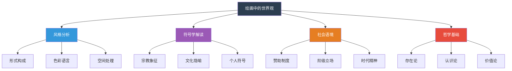
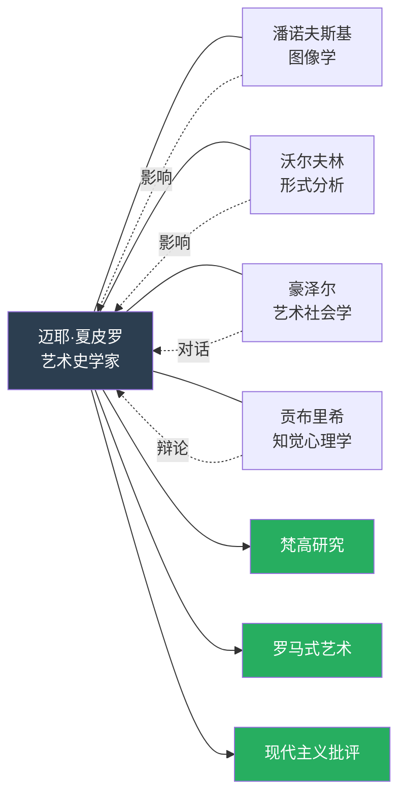
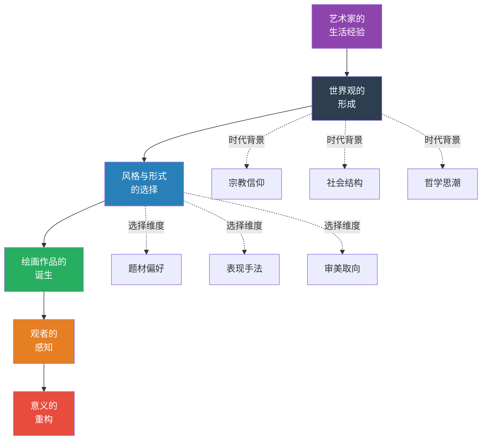
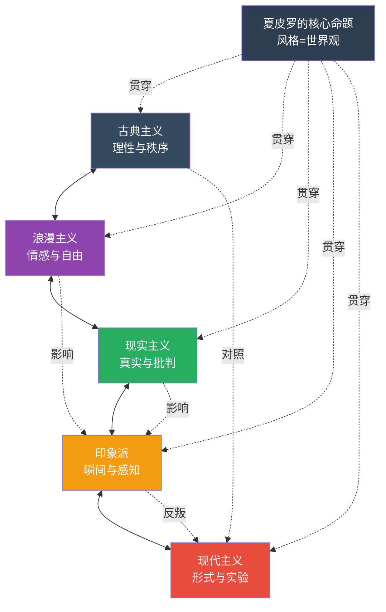

# 《绘画中的世界观》知识图谱 -- 图片描述与逻辑说明

> 本文包含四张知识图谱的 Mermaid 源码与详细说明，用于公众号配图生成。

---

## 图一：艺术哲学的分类体系树

### Mermaid 源码

### 图表说明

本图以树状结构呈现夏皮罗研究方法论的四大维度：

- **风格分析**：关注绘画的形式要素，包括构图的几何逻辑、色彩的情感表达、空间的处理方式
- **符号学解读**：挖掘画面中的象征意义，从宗教符号到文化隐喻，再到艺术家个人的视觉密码
- **社会语境**：将艺术置于具体的历史情境中，考察赞助制度、阶级立场与时代精神的交织
- **哲学基础**：追溯艺术作品背后的哲学根基，涉及存在论的追问、认识论的反思和价值论的判断

这张图谱帮助读者建立理解艺术作品的多维框架，避免单一视角的局限。

---

## 图二：核心人物思想关系网

### Mermaid 源码

### 图表说明

本图展示夏皮罗在学术谱系中的位置：

- **潘诺夫斯基**的图像学方法为夏皮罗提供了符号解读的工具，但夏皮罗更进一步，将符号与社会语境相连
- **沃尔夫林**的形式分析是夏皮罗的起点，但他拒绝将形式与社会意义割裂
- **豪泽尔**的艺术社会学与夏皮罗形成对话，两者都关注艺术与社会的关系，但路径不同
- **贡布里希**与夏皮罗曾就罗马式艺术展开著名论战，焦点在于形式选择是否必然反映世界观

夏皮罗的三大研究领域 -- 梵高研究、罗马式艺术、现代主义批评 -- 构成了他学术版图的支柱。

---

## 图三：世界观表达的路径图

### Mermaid 源码

### 图表说明

本图描绘了世界观从艺术家内心到绘画作品再到观者理解的完整传递链条：

1. **生活经验**：艺术家的个人经历是起点，包括成长环境、教育背景、社会阶层
2. **世界观形成**：在时代背景（宗教信仰、社会结构、哲学思潮）的塑造下，艺术家形成对世界的基本理解
3. **风格选择**：世界观通过题材偏好、表现手法、审美取向三个维度转化为具体的风格选择
4. **作品诞生**：风格选择最终凝结为具体的绘画作品
5. **观者感知**：作品被观者观看，触发感知与情感反应
6. **意义重构**：观者基于自身的文化背景，对作品意义进行再创造

---

## 图四：艺术史思潮网络关系图

### Mermaid 源码

### 图表说明

本图呈现了夏皮罗"风格即世界观"这一核心命题在艺术史脉络中的贯穿性：

- **古典主义**追求理性与秩序，反映的是对宇宙和谐性的信念
- **浪漫主义**强调情感与自由，体现的是个体意识的觉醒
- **现实主义**关注真实与批判，对应的是对社会不公的反思
- **印象派**捕捉瞬间与感知，暗含的是对确定性知识体系的怀疑
- **现代主义**专注形式与实验，表达的是对传统价值体系的彻底质疑

夏皮罗的命题如同一根红线，将这些看似对立的思潮串联起来，揭示它们共同的本质：每一种风格，都是艺术家对世界的一种理解方式。

---

## 使用建议

1. 将上述 Mermaid 代码复制到支持 Mermaid 的渲染工具中生成图片
2. 建议使用深色背景主题以匹配本文的学术气质
3. 图片尺寸建议适配微信公众号的宽度限制（建议宽度不超过 750px）
4. 每张图下方可附上对应的图表说明文字

---

---

**系列导航**

《人类文明经典阅读计划》第七辑 -- 艺术美学

上一篇：《艺术的故事》 | 下一篇：《观看之道》

[◇ 读后感] [◆ 知识图谱] [○ 核心思想] [○ 职场指南] [○ 行动挑战]

---

**核心标签**

#艺术哲学 #世界观 #深层阅读 #思想艺术

