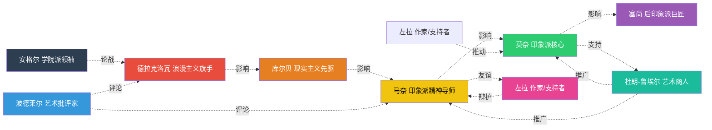
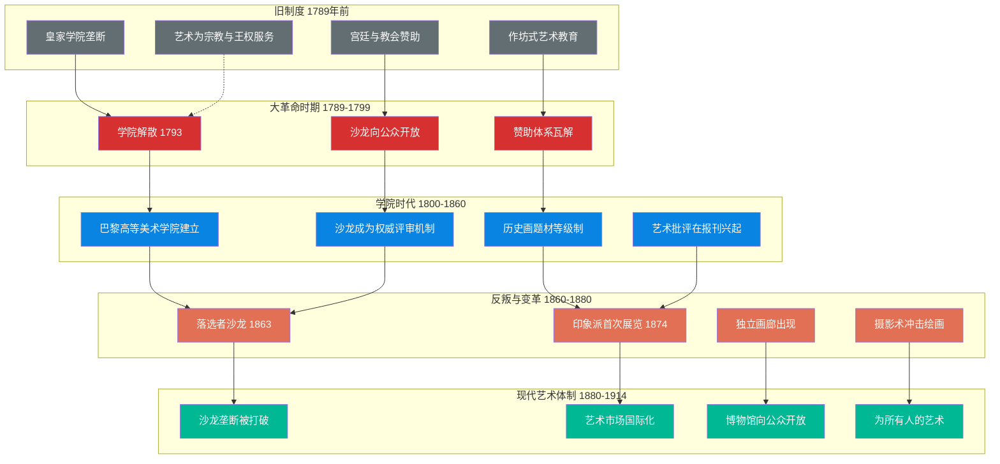
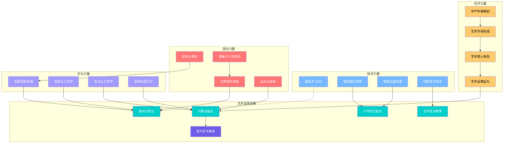

# 知识图谱图片描述：《走向现代》全景知识图谱

> 本图谱以《走向现代：西方艺术1789-1914》为核心，呈现19世纪艺术革命的社会脉络、流派演变与关键人物关系。

---

## 图谱一：19世纪艺术流派演变分类树

本图以树状结构展示从新古典主义到现代主义前夜的艺术流派演变脉络。

**视觉说明：**
- 整体布局为自顶向下的层级树，根节点居中
- 根节点采用深色背景，七大流派分支以不同颜色区分
- 颜色从冷色调（新古典主义、浪漫主义）渐变到暖色调（印象派、后印象派），隐喻艺术从理性走向感性、从规范走向自由的演进
- 每个流派下列出2-3位代表性艺术家
- 移动端显示时，建议横向滑动查看完整树形结构

---

## 图谱二：关键人物社会关系网络

本图呈现19世纪法国艺术界核心人物之间的师承、论战、支持与合作关系。

**视觉说明：**
- 实线表示直接影响或支持关系，虚线表示论战或间接影响
- 箭头上标注关系类型：论战、影响、友谊、支持、推广、评论、辩护
- 人物节点按时间顺序从左至右排列
- 艺术商人杜朗-鲁埃尔位于图中央偏右，体现其连接艺术家与市场的枢纽地位
- 批评家波德莱尔和作家左拉作为"外部力量"，标注为不同颜色，显示文学界对艺术界的深度介入

---

## 图谱三：艺术体制变革路径图

本图展示从旧制度到现代艺术体制的演进路径，涵盖沙龙制度、艺术教育、市场机制与公共文化空间四大维度。

**视觉说明：**
- 图表按时间分为五个阶段：旧制度、大革命时期、学院时代、反叛与变革、现代艺术体制
- 每个阶段用子图包裹，内部节点采用统一颜色
- 颜色编码：灰色（旧制度）- 红色（大革命）- 蓝色（学院时代）- 橙色（反叛）- 绿色（现代体制），隐喻从僵化到解放的历程
- 箭头表示制度演进的因果关系，虚线表示间接影响
- 终点"为所有人的艺术"用最大字号突出，呼应全书核心命题

---

## 图谱四：社会力量与艺术变革关联网络

本图展示技术、经济、政治、文化等社会力量如何共同推动19世纪艺术的现代化转型。

**视觉说明：**
- 图表分为五大板块：技术力量（蓝色）、经济力量（黄色）、政治力量（红色）、文化力量（紫色）、艺术变革结果（青色）
- 最终指向"现代艺术萌芽"，作为所有社会力量交汇的产物
- 实线表示直接因果关系，虚线表示间接影响或挑战关系
- 排版建议：在移动端可采用纵向滚动布局，五大板块自上而下排列，最终汇聚到结果区域

---

## ◆ 使用指南

1. **知识图谱一**（分类树）：适合用于梳理艺术流派脉络，帮助读者建立19世纪艺术的整体框架
2. **知识图谱二**（人物网络）：适合用于理解艺术家之间的思想传承与社会关系，揭示艺术变革的人际网络
3. **知识图谱三**（体制路径）：适合用于展示制度演进的宏观进程，呼应书中"从为艺术而艺术到为所有人的艺术"的核心命题
4. **知识图谱四**（社会力量）：适合用于跨学科分析，体现蒂利耶跨学科研究方法的特点

---

## ◆ 互动话题

这四张知识图谱中，哪一张对你理解19世纪艺术变革帮助最大？你认为还有哪个维度值得补充？欢迎在评论区留言讨论。

---

## ◆ 系列导航

| 上一篇 | 下一篇 |
|:--:|:--:|
| ◇ 01-读后感 | ○ 03-图谱逻辑 |

---

*本文是"人类文明经典阅读计划"系列知识图谱配套说明。图谱可使用 Mermaid 渲染工具在线生成，也可用专业绘图工具重新绘制为静态图片。*
