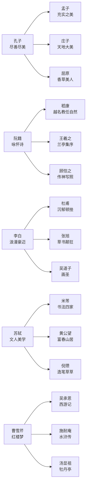
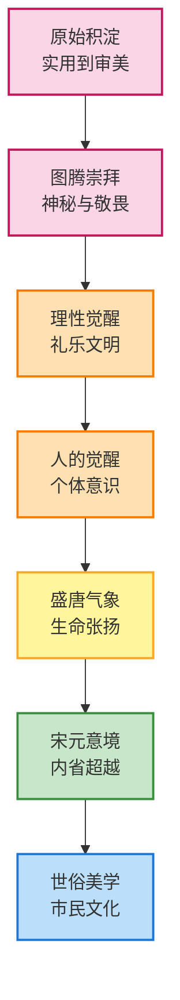
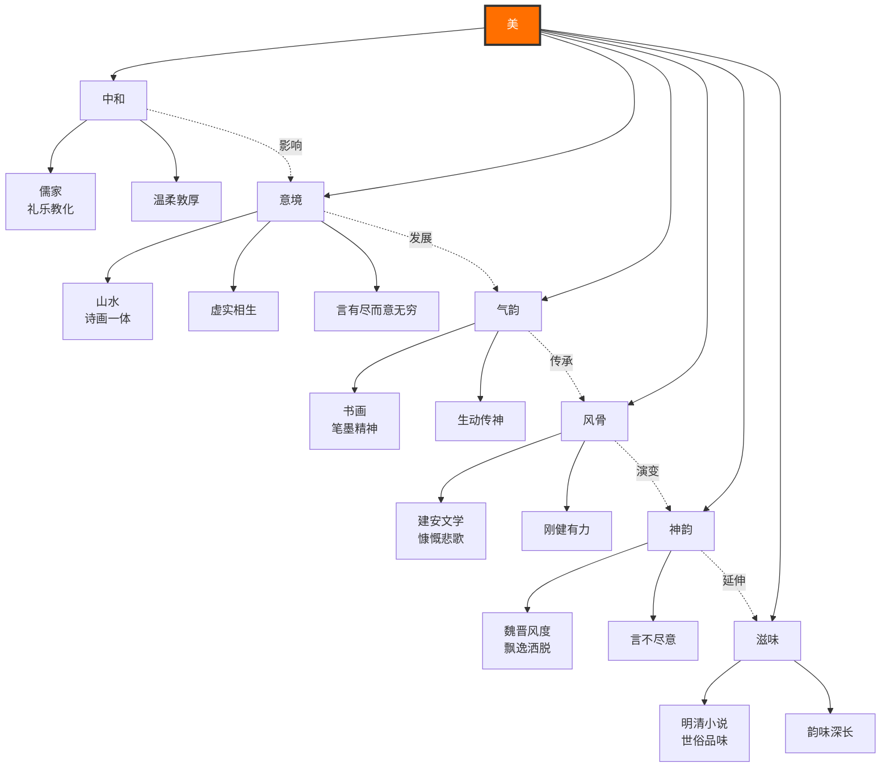

# 知识图谱 | 《美的历程》中国美学发展全景图

> "一部美学史，就是一部民族精神的演变史。"

---

## ◆ 图谱说明

本文包含四张知识图谱，分别呈现《美的历程》中的时代脉络、代表人物、思想演进和美学网络。建议横屏查看，以获得最佳阅读体验。

---

## ◆ 图一：中国美学时代分类树

```mermaid
graph TD
    A["中国美学发展脉络"] --> B["远古时期<br/>图腾与彩陶"]
    A --> C["夏商周<br/>青铜时代"]
    A --> D["春秋战国<br/>理性觉醒"]
    A --> E["魏晋南北朝<br/>人的觉醒"]
    A --> F["隋唐<br/>盛唐之音"]
    A --> G["宋元<br/>意境巅峰"]
    A --> H["明清<br/>世俗繁华"]

    B --> B1["彩陶纹样<br/>鱼纹/蛙纹/几何纹"]
    B --> B2["龙飞凤舞<br/>原始图腾崇拜"]
    B --> B3["巫史传统<br/>神话与仪式"]

    C --> C1["饕餮纹<br/>狞厉之美"]
    C --> C2["青铜礼器<br/>王权象征"]
    C --> C3["诗经<br/>现实主义源头"]

    D --> D1["儒家美学<br/>中和之美"]
    D --> D2["道家美学<br/>自然之美"]
    D --> D3["楚辞<br/>浪漫主义源头"]

    E --> E1["魏晋风度<br/>人的觉醒"]
    E --> E2["书法绘画<br/>传神写照"]
    E --> E3["山水诗<br/>自然审美"]

    F --> F1["唐诗<br/>青春豪迈"]
    F --> F2["草书绘画<br/>气势磅礴"]
    F --> F3["音乐舞蹈<br/>胡汉融合"]

    G --> G1["宋词<br/>婉约豪放"]
    G --> G2["山水画<br/>意境至上"]
    G --> G3["文人画<br/>诗书画印"]

    H --> H1["明清小说<br/>世俗美学"]
    H --> H2["园林艺术<br/>精致典雅"]
    H --> H3["戏曲艺术<br/>综合之美"]
```

---

## ◆ 图二：代表人物思想谱系

---

## ◆ 图三：美学思想演进路径

---

## ◆ 图四：中国美学概念网络

---

## ◆ 图谱解读

### ◇ 时代脉络

从远古到明清，中国美学经历了**从神秘到理性、从集体到个体、从外放到内敛、从高雅到世俗**的完整演变。每一个时代都有其独特的美学气质，同时又与前代血脉相连。

### ◇ 人物谱系

中国美学的发展，离不开那些伟大的灵魂。孔子的"尽善尽美"、庄子的"天地大美"、苏轼的"文人美学"——他们不仅是思想家、艺术家，更是**民族审美心理的塑造者**。

### ◇ 思想演进

美学思想的演进不是断裂的，而是**积淀式的**。每一个新阶段都在前人的基础上生长，就像一棵树，根深才能叶茂。

### ◇ 概念网络

"中和""意境""气韵""风骨""神韵""滋味"——这些概念构成了中国美学的**核心话语体系**。它们彼此关联，相互渗透，共同塑造了东方美学的独特品格。

---

## ◇ 互动话题

> 这四张图谱中，哪一张最让你有启发？
>
> 你对中国美学的哪个时代最感兴趣？
>
> 欢迎在评论区分享你的看法。

---

## ◇ 系列导航

| 上一篇 | 下一篇 |
|--------|--------|
| [《美的历程》读后感](#) | [图谱逻辑解析](#) |

---

**核心标签**：`#中国美学` `#时代精神` `#审美心理` `#东方框架`

---

*本文为"人类文明经典阅读计划"系列第 07 期，更多精彩内容请关注公众号。*
