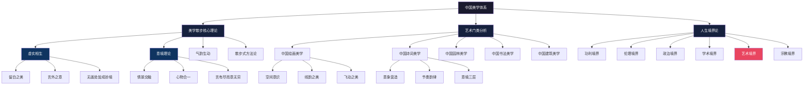
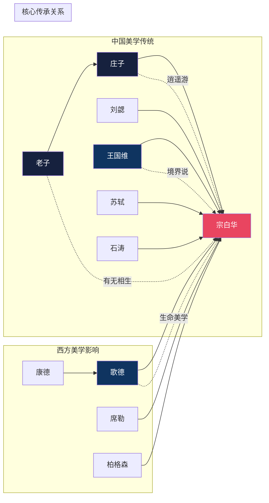
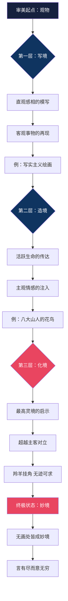
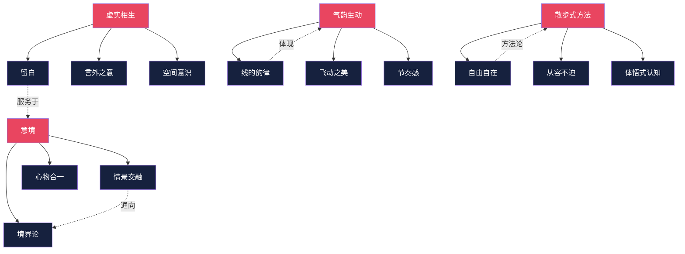

# 《美学散步》知识图谱 | 可视化解读宗白华的美学宇宙

---

> **系列导航**
> 
> ◆ 《人类文明经典阅读计划》第 7 辑 · 艺术美学
> ◇ 本期书目：宗白华《美学散步》
> ○ 上一篇：《在快节奏时代，学会诗意地栖居》| 下一篇：《图谱逻辑：散步式美学的内在理路》

---

## ◆ 知识图谱概览

本图谱从四个维度呈现《美学散步》的核心框架：

○ 分类树：美学体系的全景扫描
◇ 人物图谱：中西美学思想的交汇
● 路径图：意境生成的三重进阶
◆ 网络图：核心概念的关联网络

---

## ◇ 一、美学体系分类树

**解读**：
- 宗白华的美学体系以"虚实相生"和"意境理论"为双核
- 艺术门类分析是理论的具体展开
- 人生境界论是美学的终极指向
- 艺术境界居于六重境界的核心位置

---

## ◆ 二、人物思想图谱

**解读**：
- 宗白华美学是中西交融的产物
- 中国源头：老庄的虚实观、王国维的境界说
- 西方影响：歌德的生命美学、柏格森的直觉主义
- 宗白华的独特贡献在于将二者熔铸为具有中国特色的美学体系

---

## ● 三、意境生成路径图

**解读**：
- 意境的生成是一个层层递进的过程
- 第一层重在"再现"，第二层重在"表现"，第三层重在"超越"
- 化境是最高境界，达到物我两忘、情景交融
- 妙境是化境的自然延伸，"无画处皆成妙境"

---

## ◆ 四、核心概念网络图

**解读**：
- 四大核心概念相互支撑，构成完整的美学网络
- "虚实相生"是宇宙观，"意境"是审美目标
- "气韵生动"是艺术标准，"散步式方法"是认知路径
- 所有概念最终指向：在审美中实现生命的自由与超越

---

> **互动话题**
> 
> ◇ 四个维度中，哪个让你最有共鸣？
> ○ 在评论区留下你的想法
> ◆ 下期将深入解读图谱背后的逻辑理路

---

> **系列导航卡片**
> 
> ┌─────────────────────────────────┐
> │ ◆ 《人类文明经典阅读计划》系列导航 │
> │                                  │
> │ ◇ 第07辑 · 艺术美学 ◄ 当前所在    │
> │                                  │
> │ 本期书目：                        │
> │ ◇ 《美学散步》宗白华              │
> │ ◆ 《美的历程》李泽厚              │
> │ ○ 《艺术的故事》贡布里希          │
> │                                  │
> │ 图谱说明：                        │
> │ ● 分类树  ● 人物图谱              │
> │ ● 路径图  ● 网络图                │
> └─────────────────────────────────┘

---

**标签**：#诗意美学 #虚实相生 #意境理论 #人生境界 #知识图谱 #Mermaid #宗白华
